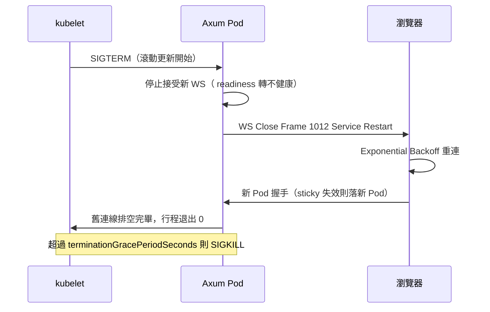

# 7.1 WS 優雅停機：SIGTERM 來時體面說再見

## 從一個問題開始

`kubectl rollout restart` 一按，幾千條 WS 瞬間全斷，前端滿屏紅色報錯，老闆的 demo 聊天室直接歸零。HTTP 服務滾動更新明明無感，為什麼 WS 每次發版都像斷電？

因為預設行為是：kubelet 發 SIGTERM 後 30 秒發 SIGKILL，而你的 Axum 直接跟著行程陪葬，連一句「我要走了」都沒說。優雅停機要做的就是：**攔截 SIGTERM → 發 Close Frame 請客戶端重連 → 給新連線拒絕、舊連線排空 → 從容退出**。

## 停機協議總覽



| 階段 | 動作 | 超時建議 |
|---|---|---|
| 收到 SIGTERM | 廣播 shutdown 旗標，Endpoint 停止接新連線 | 立即 |
| 通知客戶端 | 全員發 Close Frame（code 1012） | 5s 內 |
| 排空 | 等舊連線自己 close 或處理完手頭訊息 | 20～25s（小於 grace 30s） |
| 強制退出 | 剩餘連線 abort，行程 return | grace 到點前 |

## Rust：完整 main.rs 優雅停機

```rust
use axum::{extract::{ws::{Message, WebSocket}, State},
    routing::get, Router};
use std::sync::Arc;
use tokio::{sync::{broadcast, Notify}, signal};

#[derive(Clone)]
struct AppState {
    tx: broadcast::Sender<String>,
    shutdown: Arc<Notify>, // 全域停機旗標
}

async fn shutdown_signal(shutdown: Arc<Notify>) {
    // 同時監聽 SIGTERM（K8s）和 Ctrl+C（本機）
    let mut term = signal::unix::signal(
        signal::unix::SignalKind::terminate()).unwrap();
    tokio::select! {
        _ = term.recv() => {},
        _ = signal::ctrl_c() => {},
    }
    shutdown.notify_waiters(); // 叫醒所有 WS 任務
}

async fn handle_socket(mut socket: WebSocket, state: Arc<AppState>) {
    let mut rx = state.tx.subscribe();
    loop {
        tokio::select! {
            // 停機通知：發 Close Frame 請客戶端搬家
            _ = state.shutdown.notified() => {
                let _ = socket.send(Message::Close(Some(
                    axum::extract::ws::CloseFrame {
                        code: 1012, // Service Restart
                        reason: "rolling update".into(),
                    }
                ))).await;
                break;
            }
            msg = socket.recv() => {
                match msg {
                    Some(Ok(Message::Text(t))) => {
                        let _ = state.tx.send(t.to_string());
                    }
                    _ => break,
                }
            }
            Ok(text) = rx.recv() => {
                if socket.send(Message::Text(text.into()))
                    .await.is_err() { break; }
            }
        }
    }
}

#[tokio::main]
async fn main() {
    let (tx, _rx) = broadcast::channel::<String>(1024);
    let shutdown = Arc::new(Notify::new());
    let state = Arc::new(AppState { tx, shutdown: shutdown.clone() });
    let app = Router::new().route("/ws", get(
        |ws: axum::extract::ws::WebSocketUpgrade,
         State(s): State<Arc<AppState>>|
        async move { ws.on_upgrade(|skt| handle_socket(skt, s)) }
    )).with_state(state);
    let listener = tokio::net::TcpListener::bind("0.0.0.0:3000").await.unwrap();
    axum::serve(listener, app)
        .with_graceful_shutdown(shutdown_signal(shutdown))
        .await.unwrap();
}
```

配套 Deployment 別忘了：`terminationGracePeriodSeconds: 30`，`lifecycle.preStop.sleep 5`（等 Endpoint 摘除），`readinessProbe` 在停機期轉失敗。

## React：Exponential Backoff 自動重連

```ts
// 自動重連的 WS 封裝：1012 來了就體面搬家
export class ReconnectingWS {
  private ws: WebSocket | null = null;
  private retries = 0;
  private closedByUs = false;

  constructor(private url: string, private onMsg: (d: string) => void) {
    this.connect();
  }

  private connect() {
    this.ws = new WebSocket(this.url);
    this.ws.onopen = () => { this.retries = 0; };
    this.ws.onmessage = (e) => this.onMsg(e.data);
    this.ws.onclose = (e) => {
      if (this.closedByUs) return;
      // 1012 滾動更新立即回；異常則指數退避 + 抖動防驚群
      const delay = e.code === 1012 ? 500
        : Math.min(1000 * 2 ** this.retries, 30000);
      this.retries++;
      setTimeout(() => this.connect(),
        delay * (0.8 + Math.random() * 0.4));
    };
  }
  send(d: string) { this.ws?.send(d); }
  close() { this.closedByUs = true; this.ws?.close(); } }
```

退避公式 `min(1s × 2^n, 30s)` + 抖動是業界標準：第一次 1 秒、第二次 2 秒……既不對新 Pod 造成驚群，也不會讓用戶等太久。

## 本節小結

- WS 滾動更新必斷，優雅停機把「斷電」變成「請搬家」：SIGTERM → Close 1012 → 排空退出
- Rust 用 `Notify` 廣播停機 + `with_graceful_shutdown`，grace 留 30 秒
- 前端用 Exponential Backoff + 抖動重連，1012 立即回、異常則退避
- 下一節補最後一塊拼圖：探針設計錯誤會讓優雅停機形同虛設——長連線阻塞了 liveness 怎麼辦

## 想一想

1. 為什麼收到 SIGTERM 後要先讓 readiness 失敗、等幾秒才發 Close Frame？直接全斷會有什麼問題？
2. Close code 1012 和 1001 有什麼語義差別？前端收到不同 code，重連策略應該有什麼不同？
3. 如果某條 WS 正在傳 1GB 檔案（沒做 6.3 解耦），排空期 25 秒不夠，你會延長 grace、強制中斷，還是從架構上根治？
