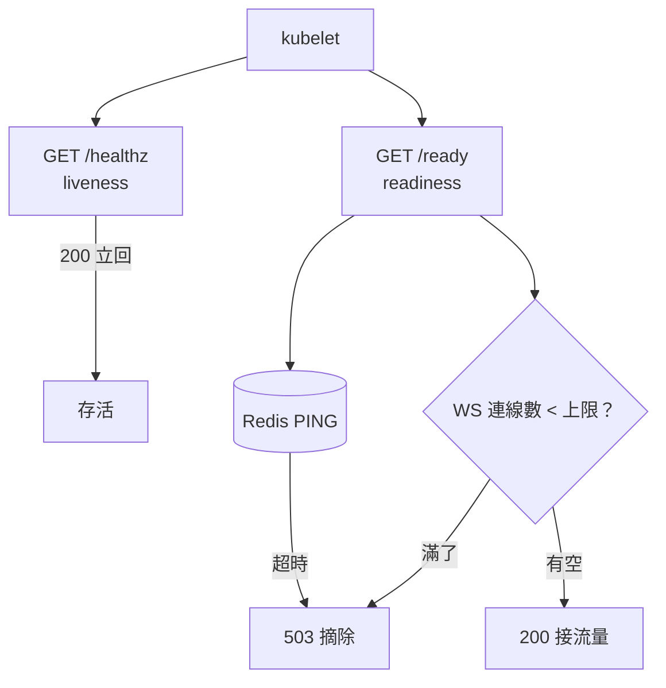

# 7.2 健康檢查設計：別讓長連線害死你的 Pod

## 從一個問題開始

WS 服務上線後出現靈異現象：流量一高，Pod 被頻繁重啟，重啟後更扛不住，進入死亡循環。查日誌沒有 panic，真相是：**liveness 探針去打 `/ws`，探針自己也變成長連線，超時後 kubelet 認為 Pod 已死，直接殺掉**。探針本來是救生員，結果變成兇手。

核心原則：**HTTP 探針走短連線輕量路徑，WS 健康另起爐灶，兩者絕不混用**。

## 三種探針分工表

| 探針 | 問題 | WS 服務該查什麼 | 失敗後果 |
|---|---|---|---|
| **liveness**（存活） | 行程死鎖了嗎？ | `/healthz`：只回 200，零依賴、不查 DB | 重啟 Pod（最危險，誤判即誤殺） |
| **readiness**（就緒） | 能接流量了嗎？ | `/ready`：查 Redis、查 WS 槽位、停機期回 503 | 從 Endpoint 摘除（可恢復） |
| **startup**（啟動） | 啟動完了嗎？ | 同 `/ready`，給慢啟動寬限 | 啟動期不殺 Pod |



記住口訣：**liveness 要「傻」，readiness 要「精」，WS 探針要「分開」**。

## Rust：輕量 /healthz vs 嚴格 /ready

```rust
use axum::{extract::State, http::StatusCode, routing::get, Router};
use std::sync::{Arc, atomic::{AtomicUsize, Ordering}};

#[derive(Clone)]
struct HealthState {
    redis: redis::Client,
    ws_count: Arc<AtomicUsize>, // 目前 WS 連線數
    draining: Arc<std::sync::atomic::AtomicBool>, // 停機中？
}

// liveness：什麼都不查，活著就 200
async fn healthz() -> &'static str { "ok" }

// readiness：查 Redis + 容量 + 停機旗標
async fn ready(
    State(s): State<HealthState>,
) -> Result<&'static str, StatusCode> {
    if s.draining.load(Ordering::Relaxed) {
        return Err(StatusCode::SERVICE_UNAVAILABLE);
    }
    if s.ws_count.load(Ordering::Relaxed) > 9000 {
        return Err(StatusCode::SERVICE_UNAVAILABLE); // 滿載摘除
    }
    let mut conn = s.redis.get_multiplexed_async_connection()
        .await.map_err(|_| StatusCode::SERVICE_UNAVAILABLE)?;
    let _: String = redis::cmd("PING").query_async(&mut conn)
        .await.map_err(|_| StatusCode::SERVICE_UNAVAILABLE)?;
    Ok("ready")
}
```

`healthz` 連 Redis 都不碰——Redis 抖一下不該導致全網 Pod 被重啟，那是 readiness 的工作（摘除等恢復）。

## 探針 YAML：數字都是血淚

```yaml
livenessProbe:          # 傻探針：慢而寬容，絕不誤殺
  httpGet: { path: /healthz, port: 3000 }
  periodSeconds: 20
  timeoutSeconds: 3
  failureThreshold: 3   # 60s 連續失敗才重啟
readinessProbe:         # 精探針：快而敏感，快速摘除
  httpGet: { path: /ready, port: 3000 }
  periodSeconds: 5
  timeoutSeconds: 2
  failureThreshold: 2
startupProbe:           # 啟動寬限：冷啟動 2 分鐘內不殺
  httpGet: { path: /ready, port: 3000 }
  periodSeconds: 10
  failureThreshold: 12
terminationGracePeriodSeconds: 30
```

WS 額外建議：活躍連線數、訊息延遲做成 Prometheus metrics（見 7.3），不要做成探針——指標是給人看的，探針是給 kubelet 殺 Pod 的，誤殺代價天差地別。

## 誤區表：這些坑不要再踩

| 誤區 | 症狀 | 正解 |
|---|---|---|
| liveness 打 `/ws` 做真實握手 | 探針連線堆積，超時即誤殺，重啟風暴 | liveness 只打 `/healthz` 純記憶體回應 |
| liveness 查 DB/Redis | 下游抖動 → 全網 Pod 被重啟，雪崩 | 下游檢查只放 readiness |
| readiness 與 liveness 同路徑同閾值 | 啟動慢被殺、滿載被殺，分不清 | 三探針分離，閾值按上表 |
| WS 連線數無上限 | 單 Pod 記憶體爆掉，liveness 跟著超時 | `/ready` 限流 + broadcast 容量告警 |

## 本節小結

- liveness 只答「行程活著」，零依賴；readiness 才查 Redis 與容量；WS 健康看 metrics 不看探針
- 探針打 WS 握手、liveness 查下游，是兩大重啟風暴元兇
- 停機期 readiness 轉 503，配合 7.1 的 preStop，才能體面排空
- 下一節讓這一切可觀測：tracing JSON 日誌 + trace_id 貫穿 WS 與 HTTP

## 想一想

1. 為什麼 liveness 查 Redis 是危險的？描述一次「Redis 抖 10 秒 → 全網 Pod 重啟」的雪崩鏈路。
2. 你的 WS 服務啟動要預熱 90 秒（載入模型），startupProbe、readinessProbe、livenessProbe 該怎麼配才不會被誤殺？
3. 如果單 Pod WS 上限 9000，HPA 應該看 CPU 還是看「每 Pod 連線數」擴容？自訂 metrics 要怎麼接？
