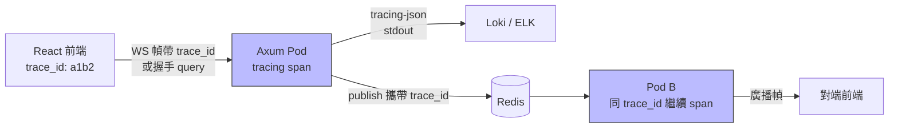

# 7.3 雲原生可觀測性：讓每條 WS 都有跡可循

## 從一個問題開始

線上用戶說「剛剛聊天室卡了 3 秒」，你打開日誌，幾千條 WS 交織在一起，根本分不清哪條是哪個用戶、卡在哪一跳。HTTP 有 request id、日誌有狀態碼，WS 一連幾小時，傳統「一行 access log」徹底失靈。

解法是三件套：**結構化日誌（JSON stdout）+ 分散式追蹤（trace_id）+ 指標（metrics）**。本節講前兩者，metrics 點到為止——目標是：任何一條 WS 訊息，都能從前端一路追到 Redis 再回來。

## 架構：trace_id 貫穿全鏈路



| 層 | 做法 | 關鍵欄位 |
|---|---|---|
| 前端 | 每次 `send` 生成或沿用 trace_id，寫進訊息 envelope | `trace_id, user_id, ts` |
| WS 握手 | query `?trace_id=` 或首幀認證，建立 root span | `conn_id, pod, user_id` |
| Rust | `tracing` JSON 輸出到 stdout，Fluent Bit 收走 | `level, trace_id, span, latency_ms` |
| 跨 Pod | Redis payload 包一層 envelope 帶 trace_id | 同上，下游 span 接力 |

## Rust：tracing JSON stdout

```rust
use tracing::{info, instrument};
use tracing_subscriber::{fmt, EnvFilter};

// main() 開頭初始化：JSON + 行號 + 環境變數控級別
fn init_tracing() {
    tracing_subscriber::fmt()
        .json()                    // 雲原生標配：stdout JSON
        .with_current_span(true)
        .with_span_list(true)
        .with_filter(EnvFilter::from_default_env())
        .init();
}

#[instrument(skip(socket, state),
    fields(conn_id = %conn_id, user_id = %user_id))]
async fn handle_socket(
    mut socket: WebSocket,
    state: Arc<AppState>,
    conn_id: String,
    user_id: String,
) {
    // 一條訊息一個 span，latency 自動記錄
    while let Some(Ok(Message::Text(t))) = socket.recv().await {
        let span = tracing::info_span!("ws_msg",
            trace_id = tracing::field::Empty);
        let _g = span.enter();
        span.record("trace_id", &extract_trace(&t));
        info!(bytes = t.len(), "ws recv");
        let _ = state.tx.send(t.to_string());
    }
    info!("ws closed");
}
```

輸出範例（Fluent Bit 直接收走丟 Loki）：

```json
{"timestamp":"2026-09-16T08:00:01Z","level":"INFO",
 "span":{"name":"ws_msg"},"fields":
 {"trace_id":"a1b2c3","conn_id":"c-9182","user_id":"42",
  "bytes":128,"message":"ws recv"},
 "target":"ws_app"}
```

## 前端結構化日誌：別再 console.log 字串

```ts
// 統一 envelope：每個動作都帶 trace_id
type Envelope = {
  trace_id: string;
  type: "chat" | "ping" | "ack";
  payload: unknown;
  ts: number;
};

function newTrace(): string {
  return crypto.randomUUID().replaceAll("-", "").slice(0, 16);
}

export function sendTraced(
  ws: WebSocket, type: Envelope["type"], payload: unknown,
  trace_id = newTrace(),
) {
  const env: Envelope = { trace_id, type, payload, ts: Date.now() };
  ws.send(JSON.stringify(env));
  // 同時送一份給日誌後端（取樣 1%，避免爆量）
  if (Math.random() < 0.01) {
    navigator.sendBeacon("/api/client-log",
      JSON.stringify({ ...env, user_agent: navigator.userAgent }));
  }
}
```

心跳建議：客戶端每 25 秒發 `ping` envelope，服務端回 `pong` 並記 `latency_ms` histogram——5.1 的 60 秒超時陷阱，靠這個指標第一時間現形。

## 日誌欄位規範表

| 欄位 | 必填 | 說明 |
|---|---|---|
| `timestamp` | 是 | RFC3339 UTC，跨 Pod 對齊唯一依據 |
| `level` | 是 | `TRACE/DEBUG/INFO/WARN/ERROR`，生產預設 INFO |
| `trace_id` | 是 | 16 位隨機，全鏈路同一值，前後端共用 |
| `conn_id` | WS 必填 | 單條連線唯一，握手時生成 |
| `user_id` | 有則填 | 脫敏：只記 id 不記個資 |
| `latency_ms` | 效能點必填 | recv→send 耗時，P99 告警源 |
| `pod` | 是 | `POD_NAME` 環境變數注入，定位到具體 Pod |

## 本節小結

- WS 可觀測性 = JSON 結構化日誌 + trace_id 貫穿 + 心跳延遲指標
- Rust 用 `tracing` JSON 到 stdout，交給 Fluent Bit/Loki，不要自己寫檔案
- 前端用 envelope 包 trace_id，`sendBeacon` 取樣回傳，避免日誌反壓
- 第 2 部分完結：5 章馴服長連線、6 章無狀態化、7 章優雅運維——下一部分進入流量治理與安全

## 想一想

1. 為什麼容器裡的日誌要打到 stdout 而不是寫檔案？寫檔案在 K8s 裡會遇到什麼麻煩（想想 Pod 重啟與磁碟）？
2. trace_id 應該在前端生成還是後端生成？WS 重連後應該換新 trace 還是沿用舊的？為什麼？
3. 前端日誌全量回傳會打爆後端，取樣 1% 又怕漏掉關鍵報錯，你會怎麼設計「正常取樣 + 出錯全量」的策略？
