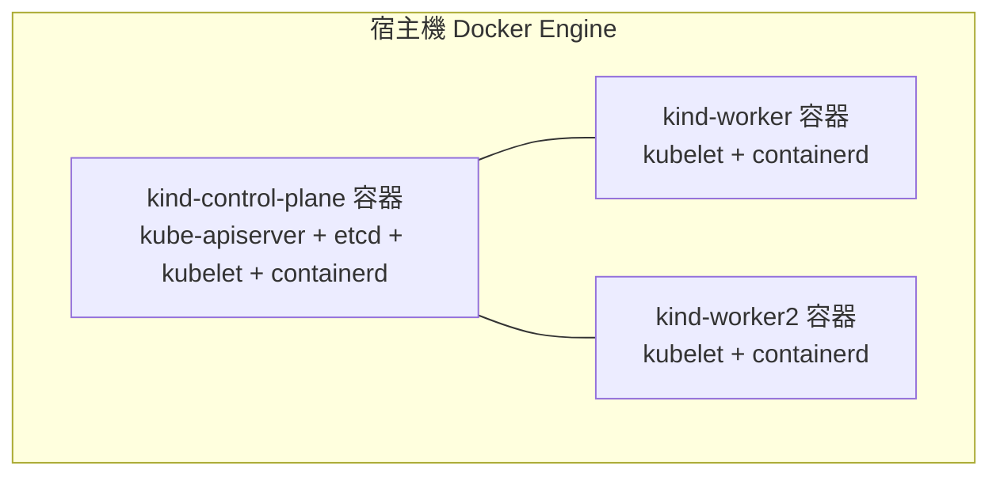
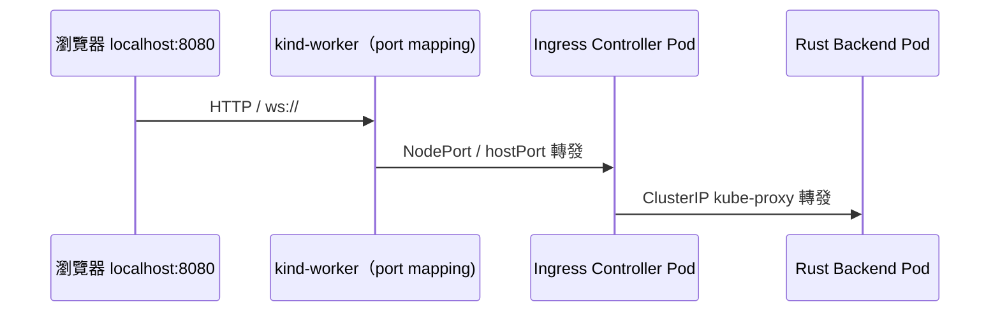

# 8.1 Kind 的 DinD 原理：把 Kubernetes 裝進 Docker

本節把 Kind（Kubernetes in Docker）的底層原理一次講透：為何一個 `docker run` 就能長出一座叢集，以及這對本書 Rust WebSocket / SSR 實驗有何意義。

## 為何需要本地叢集

學到第 7 章，你的 Rust Backend、SSR Frontend、SPA 都已容器化。但 Docker Compose 只能表達「一組容器」，無法表達 Kubernetes 的 Deployment、Service、Ingress。本機需要一座便宜、可丟棄、與正式環境 API 相容的叢集。

| 方案 | 節點載體 | 啟動速度 | 多節點 | 適合情境 |
|---|---|---|---|---|
| minikube | VM / Docker driver | 中 | 支援但較重 | 單機體驗 kubectl |
| k3d（k3s in Docker） | Docker 容器 | 快 | 支援 | 輕量發行版測試 |
| **Kind** | **Docker 容器** | 快 | 支援，CNCF 一致性佳 | CI、本書主力 |
| 雲端 GKE / EKS | 真實 VM | 慢、要錢 | 原生 | 正式環境 |

本書選 Kind：官方 SIG-testing 維護、kubeadm 部署的標準 kubelet，與雲端行為最接近。

## DinD：容器裡跑 systemd 與 kubelet？

Kind 的核心戲法是 **Docker in Docker（DinD）** 的變體——更精確說是「容器扮演整台機器」：



每個 Kind 節點都是一個特權容器，裡面跑 `systemd`（或直接跑 entrypoint）、`kubelet`、`containerd`，再用 `kubeadm` 把它們組成叢集。`docker ps` 會看到 `kind-control-plane` 這種巨大容器——它本質是一台「假 VM」。

關鍵掛載與權限：

```yaml
# kind node 容器背後的等效概念（示意，非手寫）
 privileged: true
 volumes:
   - /lib/modules:/lib/modules  # kubelet 需要的 kernel 模組視圖
 tmpfs:
   - /run
   - /tmp
```

## Kind 的網路模型

所有節點容器掛在同一個 Docker bridge 網路（預設 `kind`）上，彼此用容器 IP 直連。Pod 網路（預設 kindnet CNI）再疊一層 overlay。這帶來兩個實務含義：

1. **從宿主機看不到 Pod IP**：只能經由節點的 Port Mapping 或 Ingress 進入（8.4 節實作）。
2. **跨節點 Pod 通訊走 Docker 網路**：效能略低於真機，但驗證 WebSocket 路由、Ingress 超時已足夠。



## Kind 映像的祕密：node-image

`kindest/node:v1.29.x` 不是普通映像，它預裝了該版本的 kubelet、kubeadm、containerd 與 CNI。`kind create cluster --image` 實際就是選 Kubernetes 版本：

```bash
kind create cluster --image kindest/node:v1.29.2 --name rust-lab
kubectl get nodes -o wide
docker exec kind-control-plane crictl images | head
```

| 元件 | 位置 | 說明 |
|---|---|---|
| kube-apiserver / etcd | control-plane 容器內 static pod | 只存在 control-plane 節點 |
| kubelet / containerd | 各節點容器內的 daemon | 直接跑在容器 PID 空間 |
| kindnet CNI | DaemonSet | 提供 Pod IP 分配 |

## 本節小結

- Kind 用**特權容器扮演整台節點**，再以 kubeadm 組成標準叢集，與雲端 API 相容。
- 所有節點共享 Docker bridge 網路，Pod IP 從宿主機不可直達，必須靠映射進入。
- `kindest/node` 映像版本即 Kubernetes 版本，升級即換映像重建。

## 想一想

1. 為何 Kind 節點容器需要 `--privileged`？若拿掉會壞掉哪個環節？
2. Kind 的 Pod 跨節點封包經過幾層封裝？這對 WebSocket 延遲測量有何影響？
3. 比較 Kind 與 minikube 的節點載體差異，各適合哪種 CI 情境？
