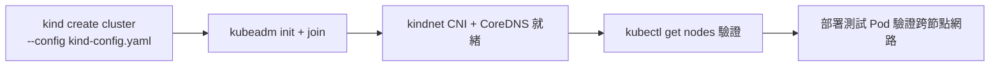

# 8.2 Kind YAML 實戰：1 Control-Plane + 2 Workers

上一節懂了原理，本節動手：用一份宣告式 YAML 建出全書通用的實驗叢集——1 個控制面、2 個工作節點，並驗證到可部署狀態。

## 叢集規格設計

| 角色 | 數量 | 用途 |
|---|---|---|
| control-plane | 1 | API Server、etcd、scheduler（實驗不做 HA） |
| worker | 2 | 跑 Rust Backend、SSR Frontend、SPA、Ingress |
| ingress 預留 | 見 8.4 節 | worker 需開 port mapping，本節先建骨架 |

> 筆電記憶體 < 8GB 者可先用 1 worker；但 2 workers 才能演示 Pod 分散與 Rolling Update，本書以 2 個為準。

## 完整 kind-config.yaml

```yaml
kind: Cluster
apiVersion: kind.x-k8s.io/v1alpha4
name: rust-lab
nodes:
  - role: control-plane
    image: kindest/node:v1.29.2
    kubeadmConfigPatches:
      - |
        kind: InitConfiguration
        nodeRegistration:
          kubeletExtraArgs:
            node-labels: "ingress-ready=true"
  - role: worker
    image: kindest/node:v1.29.2
    extraPortMappings:
      - containerPort: 80
        hostPort: 8080
        protocol: TCP
      - containerPort: 443
        hostPort: 8443
        protocol: TCP
  - role: worker
    image: kindest/node:v1.29.2
```

`kubeadmConfigPatches` 的 `ingress-ready=true` 是給 Ingress Controller 做 nodeSelector 用的（8.4 節）；`extraPortMappings` 把宿主機 8080/8443 刺進 worker，瀏覽器才能進入。

## 建立與驗證流程



```bash
kind create cluster --config kind-config.yaml
kubectl cluster-info --context kind-rust-lab
kubectl get nodes -o wide
kubectl wait --for=condition=Ready nodes --all --timeout=120s
```

預期輸出要點：

| 檢查 | 指令 | 通過標準 |
|---|---|---|
| 節點 Ready | `kubectl get nodes` | 3 節點皆 Ready，ROLES 正確 |
| 系統 Pod | `kubectl get pods -n kube-system` | CoreDNS、kindnet Running |
| 跨節點網路 | 部署兩個 busybox 分處不同 worker 互 ping | Pod IP 可通 |

跨節點驗證小實驗：

```bash
kubectl run net-a --image=busybox --overrides='{"spec":{"nodeName":"rust-lab-worker"}}' -- sleep 3600
kubectl run net-b --image=busybox --overrides='{"spec":{"nodeName":"rust-lab-worker2"}}' -- sleep 3600
kubectl exec net-a -- ping -c 3 $(kubectl get pod net-b -o jsonpath='{.status.podIP}')
```

## 常見失敗排除

| 症狀 | 原因 | 解法 |
|---|---|---|
| `port is already allocated` | 8080 被佔用 | 改 hostPort 或停用本機服務 |
| 節點 NotReady 久 | 映像未拉取完、記憶體不足 | `docker pull kindest/node:v1.29.2` 預拉，關閉重型 App |
| `kind` 叢集殘留 | 重複 create | `kind delete cluster --name rust-lab` 後重建 |

## 本節小結

- 一份 `kind-config.yaml` 即叢集即程式碼：版本、拓撲、port mapping 全宣告。
- 建完必做三驗證：節點 Ready、系統 Pod、跨節點 Pod 互通。
- `ingress-ready` 標籤與 port mapping 是為第 10 章 Ingress 鋪路。

## 想一想

1. 為何 control-plane 只用 1 個？正式環境 HA 需要幾個 control-plane，為什麼？
2. `extraPortMappings` 綁定的是哪個 worker？若 Ingress Pod 被调度到另一個 worker 會發生什麼？
3. Kind 叢集刪除後，裡面的 Pod 資料去哪了？這對照出什麼樣的環境定位？
