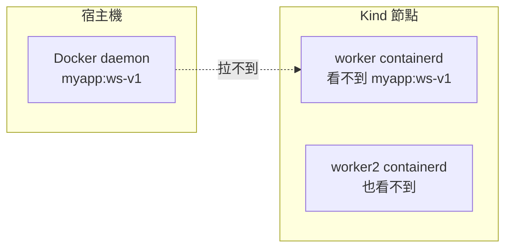
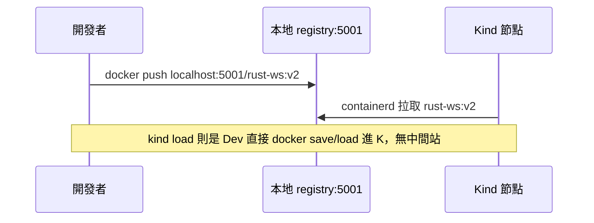

# 8.3 kind load docker-image：把本機映像送進叢集

Kind 節點是隔離的 containerd，宿主機 `docker build` 好的 Rust 映像，叢集內 Pod 預設拉不到。本節解決「映像怎麼進去」。

## 問題：兩個鏡像倉庫的世界



直覺解法有兩條路線：

| 方案 | 做法 | 優點 | 缺點 |
|---|---|---|---|
| `kind load` | 把 tar 包打進各節點 containerd | 無需 registry、最快 | 每重建叢集要重 load，不適合多人 |
| 本地 registry | 起 `registry:2` 容器並聯入 `kind` 網路 | 接近正式流程、可推播版本 | 要多維護一個服務與 hosts 解析 |

本書策略：**開發期用 `kind load`，第 11 章後切 registry 練 CI 流程**。

## kind load 實戰

```bash
# 1. 本機建好 Rust Backend 映像（第 4 章 Dockerfile）
docker build -t rust-ws-backend:v1 ./backend
docker build -t rust-ssr-frontend:v1 ./ssr
docker build -t spa-nginx:v1 ./spa

# 2. 灌進叢集各節點
kind load docker-image rust-ws-backend:v1 --name rust-lab
kind load docker-image rust-ssr-frontend:v1 --name rust-lab
kind load docker-image spa-nginx:v1 --name rust-lab

# 3. 驗證節點真的有
docker exec rust-lab-worker crictl images | grep rust
docker exec rust-lab-worker2 crictl images | grep rust
```

對應 Pod 必須設 `imagePullPolicy: Never`（或 `IfNotPresent`），否則 kubelet 會去遠端拉 `v1` 而失敗：

```yaml
apiVersion: apps/v1
kind: Deployment
metadata:
  name: ws-backend
spec:
  template:
    spec:
      containers:
        - name: backend
          image: rust-ws-backend:v1
          imagePullPolicy: Never  # 關鍵：只用節點本地的 load 結果
```

## 與 Registry 流程對比



本地 registry 啟動骨架（進階練習）：

```yaml
# registry 容器接到 kind 網路
# docker run -d --name kind-registry -p 5001:5000 \
#   --network kind registry:2
# kind 配置需加 containerdConfigPatches 指向 kind-registry:5000
```

| 維度 | kind load | registry |
|---|---|---|
| 速度 | 最快（tar 直灌） | 多一次 push/pull |
| 版本管理 | 手動 tag，易混亂 | tag + digest 可追溯 |
| 多人協作 | 差 | 好 |

## 本節小結

- Kind 節點的 containerd 與宿主機 Docker 彼此隔離，看不到對方映像。
- `kind load docker-image` 是開發期最快橋樑，記得配 `imagePullPolicy: Never`。
- 要練 CI / 多人協作，盡早切到本地 registry，對接正式 Harbor / ECR 心智相同。

## 想一想

1. `kind load` 背後是 `docker save` + `ctr import` 嗎？去查文件驗證你的猜測。
2. 為何 `imagePullPolicy: Always` 會讓 load 來的 `:v1` 部署失敗？
3. 若 worker 有 5 個，load 要灌幾次？這暗示了什麼擴展性問題？
