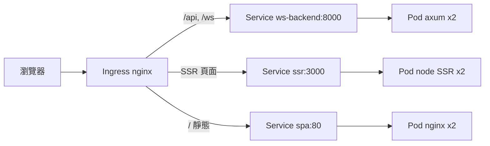

# 9.1 Deployment 部署三種前端架構：Rust Backend、SSR、SPA

本節把第 5–7 章的三種 Web 形態一起搬上 Kubernetes：Rust WebSocket 後端、Node SSR 前端、靜態 SPA，各給 Deployment + Service 要點。

## 三者部署總覽

| 應用 | 映像特性 | 副本數建議 | Service 類型 |
|---|---|---|---|
| Rust Backend（axum + WS） | 靜態編譯、體積極小、無狀態 | 2–3 | ClusterIP（只給 Ingress 用） |
| SSR Frontend（Node/Nuxt/Next） | 需 Node runtime、記憶體大戶 | 2 | ClusterIP |
| SPA（nginx 託管 dist/） | 純靜態、最省資源 | 2 | ClusterIP |



## Rust Backend Deployment 要點

```yaml
apiVersion: apps/v1
kind: Deployment
metadata:
  name: ws-backend
spec:
  replicas: 3
  selector:
    matchLabels: { app: ws-backend }
  template:
    metadata:
      labels: { app: ws-backend }
    spec:
      containers:
        - name: backend
          image: rust-ws-backend:v1
          imagePullPolicy: Never
          ports:
            - containerPort: 8000
          env:
            - name: REDIS_URL
              value: "redis://redis:6379"
          readinessProbe:
            httpGet: { path: /healthz, port: 8000 }
            periodSeconds: 5
---
apiVersion: v1
kind: Service
metadata:
  name: ws-backend
spec:
  selector: { app: ws-backend }
  ports:
    - port: 8000
      targetPort: 8000
```

Rust 二進位啟動快、失憶也無妨（連線狀態放 Redis，見 9.3），故可放心多副本 + 快速滾動。

## SSR Frontend：記得給記憶體

```yaml
apiVersion: apps/v1
kind: Deployment
metadata:
  name: ssr-frontend
spec:
  replicas: 2
  selector:
    matchLabels: { app: ssr }
  template:
    metadata:
      labels: { app: ssr }
    spec:
      containers:
        - name: ssr
          image: rust-ssr-frontend:v1
          imagePullPolicy: Never
          ports:
            - containerPort: 3000
          resources:
            requests: { memory: "512Mi", cpu: "250m" }
            limits: { memory: "1Gi", cpu: "1000m" }  # 警示：Node SSR 務必設 memory limit
          readinessProbe:
            httpGet: { path: /, port: 3000 }
            periodSeconds: 10
---
apiVersion: v1
kind: Service
metadata:
  name: ssr
spec:
  selector: { app: ssr }
  ports:
    - port: 3000
      targetPort: 3000
```

> ⚠️ SSR 是 Node 進程，每請求都跑渲染，記憶體膨脹是常態。不設 `limits.memory`，一個慢頁面就能拖垮整個 worker；設了則觸發 OOMKilled 早發現。11.1 節有配額警示表。

## SPA Deployment：最單純

```yaml
apiVersion: apps/v1
kind: Deployment
metadata:
  name: spa
spec:
  replicas: 2
  selector:
    matchLabels: { app: spa }
  template:
    metadata:
      labels: { app: spa }
    spec:
      containers:
        - name: web
          image: spa-nginx:v1
          imagePullPolicy: Never
          ports:
            - containerPort: 80
---
apiVersion: v1
kind: Service
metadata:
  name: spa
spec:
  selector: { app: spa }
  ports:
    - port: 80
      targetPort: 80
```

## 本節小結

- 三種架構皆用 Deployment + ClusterIP Service，統一由 Ingress 對外。
- Rust 後端無狀態可多副本；SSR 務必設 memory limit；SPA 資源需求最低。
- `readinessProbe` 是滾動更新不踢掉正常流量的前提（11.3 節延伸）。

## 想一想

1. 為何三個 Service 都用 ClusterIP 而非 NodePort？入口統一有什麼好處？
2. SSR 的 memory limit 設太小會發生什麼？如何從 `kubectl describe pod` 看出？
3. Rust Backend 為何敢設 3 副本？有狀態的 WebSocket 連線資訊放哪了？
