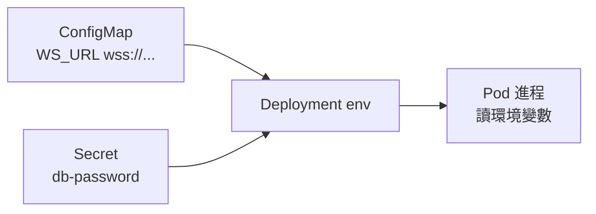

# 9.2 ConfigMap 與 Secret：把 run-time 配置動態注入

映像應該 build 一次、到處運行；環境差異（API 位址、WS 位址、金鑰）要在 run-time 注入。本節用 ConfigMap 放明文配置、Secret 放敏感值。

## 配置分層心智模型

| 類型 | 放什麼 | 範例 | 掛載方式 |
|---|---|---|---|
| ConfigMap | 非敏感、會隨環境變的字串 | `WS_URL`、`API_BASE`、`RUST_LOG` | env / volume |
| Secret | 密碼、token、TLS key | `DATABASE_URL` 含密碼、`JWT_SECRET` | env / volume（base64） |
| 映像內建 | 不變的預設 | 預設 port 8000 | 直接寫程式碼 |



反模式：把 `WS_URL=wss://prod.example.com` 烘進前端映像——結果 dev、staging、prod 各要 build 一次，違背不可變映像原則。

## WS_URL 範例：前端 run-time 配置

SPA 在瀏覽器執行，`window.location` 才能決定連哪條 WS。做法是 ConfigMap 供 env，入口腳本渲染成 `config.js`：

```yaml
apiVersion: v1
kind: ConfigMap
metadata:
  name: web-config
data:
  WS_URL: "ws://ws.local:8080/ws"
  API_BASE: "http://ws.local:8080/api"
  RUST_LOG: "info"
---
apiVersion: apps/v1
kind: Deployment
metadata:
  name: spa
spec:
  template:
    spec:
      containers:
        - name: web
          image: spa-nginx:v1
          envFrom:
            - configMapRef:
                name: web-config  # 全量注入為環境變數
```

SSR / Backend 取用单个鍵則用 `valueFrom` 更精確：

```yaml
# Pod 規格片段
env:
  - name: WS_URL
    valueFrom:
      configMapKeyRef:
        name: web-config
        key: WS_URL
  - name: DB_PASSWORD
    valueFrom:
      secretKeyRef:
        name: pg-secret
        key: password
```

## Secret 實戰

```bash
# 不要把密碼寫進 YAML 明文提交！
kubectl create secret generic pg-secret \
  --from-literal=password='S3cr3t-pg-pw' \
  --dry-run=client -o yaml > pg-secret.yaml
kubectl apply -f pg-secret.yaml
```

```yaml
apiVersion: v1
kind: Secret
metadata:
  name: pg-secret
type: Opaque
data:
  password: UzNjcjN0LXBnLXB3  # base64，僅防誤看非加密！
```

| 注意事項 | 說明 |
|---|---|
| base64 ≠ 加密 | etcd 預設明文，需開 EncryptionConfiguration |
| 更新不自動重載 | env 注入要重建 Pod；volume 掛載約 1 分鐘同步 |
| 前端不可放 Secret | SPA 的 env 會進瀏覽器，機密只能放後端 |

## 本節小結

- ConfigMap 管明文 run-time 配置（如 `WS_URL`），Secret 管密碼類，映像保持環境無關。
- `envFrom` 適合整包注入，`valueFrom` 適合精確取鍵。
- Secret 只是 base64 包裝，正式環境要加密 etcd 並用 RBAC 限縮讀取。

## 想一想

1. 為何 SPA 的 `WS_URL` 不能在 `docker build` 時寫死？列出 dev/staging/prod 三環境的後果。
2. 修改 ConfigMap 後，已在跑的 Pod 會自動生效嗎？env 與 volume 兩種掛載有何差別？
3. `kubectl get secret pg-secret -o yaml` 看得到什麼？這對「誰能讀 Secret」有何啟示？
