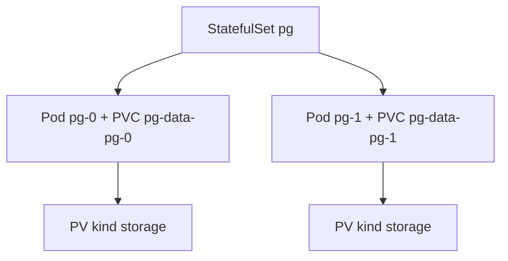

# 9.3 StatefulSet + PV/PVC：託管 PostgreSQL 與 Redis

Backend、SSR、SPA 都是無狀態的；但 PostgreSQL 與 Redis 有狀態——需要穩定身份與穩定磁碟。本節用 StatefulSet + volumeClaimTemplates 解決。

## 為何不用 Deployment 裝資料庫

| 需求 | Deployment | StatefulSet |
|---|---|---|
| Pod 名稱 | 隨機 hash（`pg-7d9c8-abc`） | 穩定序號（`pg-0`、`pg-1`） |
| 磁碟 | 共用或丟失 | 每副本專屬 PVC（模板自動建） |
| 啟停順序 | 並行 | 依序 0→1→2，刪除反向 |
| 適用 | 無狀態 Web | 資料庫、叢集型中介軟體 |



## PostgreSQL 實戰（含 volumeClaimTemplates）

```yaml
apiVersion: apps/v1
kind: StatefulSet
metadata:
  name: pg
spec:
  serviceName: pg-headless  # 必須先建無頭 Service
  replicas: 1               # 實驗單副本；HA 見正式章節
  selector:
    matchLabels: { app: pg }
  template:
    metadata:
      labels: { app: pg }
    spec:
      containers:
        - name: postgres
          image: postgres:16
          ports:
            - containerPort: 5432
          env:
            - name: POSTGRES_PASSWORD
              valueFrom:
                secretKeyRef: { name: pg-secret, key: password }
          volumeMounts:
            - name: pg-data
              mountPath: /var/lib/postgresql/data
  volumeClaimTemplates:  # 每副本自動長出一塊 PVC
    - metadata:
        name: pg-data
      spec:
        accessModes: ["ReadWriteOnce"]
        resources:
          requests: { storage: 2Gi }
---
apiVersion: v1
kind: Service
metadata:
  name: pg-headless
spec:
  clusterIP: None  # 無頭服務：直接以 pg-0.pg-headless 解析
  selector: { app: pg }
  ports:
    - port: 5432
```

Kind 預設帶 `standard` StorageClass（rancher local-path），PVC 會自動綁 PV，無需手建。`kubectl get pvc` 應見 `pg-data-pg-0 Bound`。

## Redis 雙用途：pub/sub 與 session store

本書 Redis 一魚兩吃，這正是 WebSocket 多副本能水平擴展的關鍵：

| 用途 | 機制 | 說明 |
|---|---|---|
| pub/sub 廣播 | `PUBLISH room:42 msg` | A Pod 收到的聊天訊息，經 Redis 轉給持有其他連線的 B Pod |
| session / 連線索引 | `SET sess:<id> podIP`、Presence Set | 配合 7.1 重連，客戶端斷線重連可找回房間 |

```yaml
apiVersion: apps/v1
kind: StatefulSet
metadata:
  name: redis
spec:
  serviceName: redis-headless
  replicas: 1
  selector:
    matchLabels: { app: redis }
  template:
    metadata:
      labels: { app: redis }
    spec:
      containers:
        - name: redis
          image: redis:7-alpine
          ports:
            - containerPort: 6379
          args: ["--appendonly", "yes"]
          volumeMounts:
            - name: redis-data
              mountPath: /data
  volumeClaimTemplates:
    - metadata:
        name: redis-data
      spec:
        accessModes: ["ReadWriteOnce"]
        resources:
          requests: { storage: 1Gi }
```

Rust 後端連 `redis://redis-headless:6379`（Service 名_REQ_，StatefulSet 縮放也不變）。

## 本節小結

- 有狀態服務用 StatefulSet：穩定名稱 + `volumeClaimTemplates` 每副本專屬磁碟。
- Kind 的 `standard` StorageClass 讓 PVC 自動綁定，實驗零成本。
- Redis 同時是 pub/sub 廣播匯流排與 session store，是 WS 多副本架構的地基。

## 想一想

1. 刪除 `pg-0` Pod 後，它的資料還在嗎？PVC 與 Pod 的生命週期有何不同？
2. 若把 Redis 換成 Deployment + 單一 PVC，會失去什麼保證？
3. pub/sub 與 session store 若拆成兩個 Redis 實例，各自的持久化策略該怎麼定？
