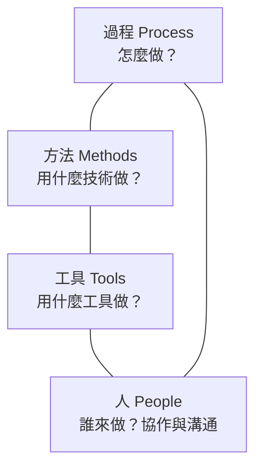

# 1.1 什麼是軟體工程

## 從一個問題開始

假設你被要求「寫一個程式，幫餐廳管理訂位」。也許你會想：這有什麼難的？建立一張表單讓客人填寫姓名、電話、人數和時間，存進資料庫就能用了。但事情真的這麼簡單嗎？

當你坐下開始思考，問題會像雪球一樣滾大：

- **客人**要能查詢有沒有位子，可能透過網站、電話，或者 App
- **老闆**要能看到明天有哪些訂位、客人取消了沒有、哪些桌位被佔用
- **店員**要能快速幫客人改時間、合併訂位、記錄特殊需求（例如靠窗、素食）
- **系統**要考慮：兩個客人同時搶同一個位子怎麼辦？客人爽約了該怎麼處理？營業時間之外能訂位嗎？

一個「簡單的訂位程式」，瞬間變成一個有角色、有規則、有情節的**系統**。

**軟體工程（Software Engineering）**，就是用系統化、可重複、有紀律的方法，來開發、維護這樣複雜的軟體系統。它不是「寫程式」更進階的代名詞，而是一門**關於如何處理複雜性的學問**。

## 程式設計 ≠ 軟體工程

這是本書第一個要建立的區別，也是最容易被忽略的。

| | 程式設計（Programming） | 軟體工程（Software Engineering） |
|---|---|---|
| **目標** | 讓程式跑起來 | 讓系統長期可靠地運作 |
| **時間尺度** | 幾小時到幾天 | 幾年到幾十年 |
| **規模** | 單一程式、單一作者 | 大型系統、多人協作 |
| **衡量標準** | 功能正確 | 正確 + 可維護 + 可擴展 + 可測試 |
| **核心挑戰** | 克服演算法與語法的難題 | 管理複雜性與變更 |

教科書式的區分很容易，但實務上的界線其實是模糊而且漸進的。一個人從「寫自己的小工具」到「參與大型團隊系統」，是一條連續的光譜，不是一道鴻溝。本書要傳達的不是「你現在在寫程式，等你夠資深才叫軟體工程」這種傲慢的二分法，而是：**即便今天只是寫一個小工具，養成軟體工程的習慣——想想邊界條件、想想別人怎麼讀你的程式碼、想想將來怎麼改——都會讓你走得更遠。**

一個經典的比方可以幫助記憶：

> 程式設計像是寫一篇短文——把想法表達清楚。
> 軟體工程像是辦一份長期發行的報紙——要考慮記者、編輯、排版、印刷、讀者回饋，而且明天還要繼續出刊。

## 軟體為什麼會失敗

Fred Brooks 在他的經典著作《人月神話》（*The Mythical Man-Month*，1975）中，把軟體的困難分為兩類。這可能是軟體工程史上影響最深遠的一個洞察，讓我們花一整節來理解它（見 1.2 節）。這裡先給出一個直觀的區分：

- **本質性困難（Essential Complexity）**：由問題本身帶來的複雜性，怎麼也躲不掉。
- **附屬性困難（Accidental Complexity）**：由工具、語言、流程帶來的額外複雜性，是可以被改善甚至消滅的。

軟體專案失敗的故事，多半不是因為「程式員不夠聰明」，而是因為沒有正視本質性困難——需求不清楚、架構跟不上、溝通出問題。而軟體工程的方法論，本質上就是在回答一個問題：**如何在巨大的複雜性面前，仍然做出可靠、可維護、能長期演進的系統。**

## 軟體工程的四大支柱

傳統上，軟體工程被拆解成幾個支柱。我們先用一張圖銘記它們，後續各章會逐一深入。

1. **過程（Process）**：一套有紀律的開發流程——需求、設計、實作、測試、部署。決定「怎麼做」。
2. **方法（Methods）**：具體的技術——如何建模、如何設計架構、如何寫測試。決定「用什麼技術做」。
3. **工具（Tools）**：支援開發的工具鏈——編輯器、版本控制、CI/CD、測試框架。決定「用什麼工具做」。
4. **人（People）**：軟體是由人開發、為人服務的。溝通、協作、管理與人的因素，往往是最難的一環。

這四大支柱並非孤立存在，它們彼此影響。工具的進步（例如版本控制、自動化測試）會改變過程；過程的改進會影響人的協作方式；而人的能力與喜好，又決定了採用什麼工具和方法。本書的每一章，都會在傳統內容之外，特別標註「AI 時代的融合點」，因為 AI 正在深刻改變這四根支柱。

## AI 時代，為什麼還需要軟體工程？

這本書誕生於一個特殊的時代：生成式 AI 讓「寫程式」這件事變得前所未有地容易。你對 AI 說一句話，它能吐出幾百行程式碼。有人因此懷疑：軟體工程是不是要被淘汰了？

本書的立場很明確：**恰好相反。** AI 讓程式碼的「產量」暴增，但也讓軟體的「複雜度」與「品質責任」暴增。就像有了算盤、計算機之後，會計學不但沒有消失，反而因為能處理更大量的帳目而變得更加重要。AI 寫出更多程式碼，就需要更多的工程紀律來保證這些程式碼正確、安全、可維護。

在第一章 1.4、1.5 節，我們會深入討論 AI 如何改變了附屬性困難與本質性困難的分布，以及軟體工程師角色如何轉變。這裡請先記住一個核心觀點：

> **AI 沒有降低對軟體工程的需求，反而提高了它的門檻。** 因為現在任何人都能「生產程式碼」，那真正稀缺的、真正有價值的，就是能判斷這些程式碼好不好、能不能承擔後果的工程能力。

## 本章小結

- **軟體工程**是一門處理複雜性的學問，不等於寫程式
- 它由**過程、方法、工具、人**四大支柱構成
- 軟體的困難分為**本質性**與**附屬性**兩類（下一節詳述）
- AI 時代，**軟體工程不但不會消失，反而更加重要**

## 想一想

1. 想想你最近寫過的一個程式。如果它要運行 5 年、由 10 個人共同維護，你會做哪些跟現在不同的事？
2. 為什麼大型軟體專案常常失敗，而小型程式很容易寫成功？困難的根源是什麼？
3. 有人說「有了 AI，人人都能寫程式」，你同意嗎？寫出程式和寫好程式，差在哪裡？
