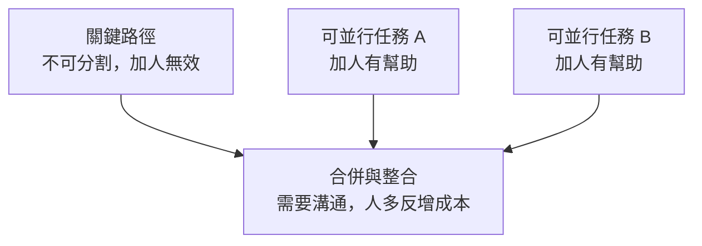

# 1.3 人月神話與 Brooks 法則

## 人月：一個誘人的陷阱

假設一個專案，一位工程師需要 12 個月才能完成。很自然的想法是：那派 12 位工程師，1 個月就能做完？或者派 6 位，2 個月？

這個想法之所以誘人，是因為它把「人」和「月」當成了可以任意互換的單位——**人月（man-month）**。Fred Brooks 在《人月神話》一書中，辛辣地指出了這個謬誤：

> **向一個已經落後的軟體專案添加人手，只會讓它更加落後。**

這句話被稱為 **Brooks 法則（Brooks's Law）**。

為什麼會這樣？因為人手不能無限制地互相替換。讓我們拆解背後的邏輯。

## 為什麼「加人」反而更慢

### 溝通成本呈指數成長

軟體開發不只是「每個人寫自己那部分」，還需要大量的協調與溝通。當團隊裡有 n 個人時，可能的溝通管道數量是：

```
n(n-1)/2
```

這是組合數，成長速度是**平方級**的。三個人有 3 條溝通管道，五個人有 10 條，十個人有 45 條，三十個人有 435 條。

雖然一個人寫程式時，人越多總產能越高（直到極限），但有**不可分割的任務**存在——某些工作本質上無法分割給多人並行。例如設計一個系統的核心架構，不能拆成十個人一人想一點。

### 新人上線需要時間

新加入的工程師對專案一無所知，需要時間理解需求、熟悉程式碼、融入團隊。這段「上手時間」不但不能立即產出，還需要消耗老手的時間來教導。如果專案已經落後，此時加人，等於用寶貴的、已經稀缺的「老手時間」去換「尚未能工作的新人」，短期內產出反而下降。

### 任務可以分割並行的程度有限

有些任務容易分割（例如寫多個彼此獨立的工具），有些則極難分割（例如定義模組介面、統一架構）。真正決定專案能否加速的，是**那些不可分割的關鍵路徑**，而不是總工作量。

## 圖解：人月之間的關係

如果一個任務可完全並行（例如搬磚），加人確實能線性縮短時間：10 個人 1 小時搬完 10 個磚，20 個人 30 分鐘。

但軟體任務大多是「部分可並行、部分不可分割」的混合體。當不可分割的部分是瓶頸時，加人對縮短關鍵路徑毫無幫助；當溝通成本上升時，加人甚至會讓總時間變長。



## 外科手術團隊：Brooks 的解決方案

既然「一堆平等的人」會因溝通成本爆炸而失敗，Brooks 提出了另一種組織方式：**外科手術團隊（Surgical Team）**。傳統上，一個大型專案的問題是參與者太多、溝通太複雜；Brooks 的構想是反過來——**把團隊搞小，但讓每個人都極度專業**。

在 Brooks 的構想裡，這個「小團隊」用人數並不多，但角色分工極其精細：一位**主治醫師（Chief Programmer）**負責核心設計與關鍵程式碼，其他成員——副手、系統分析員、測試員、工具員、程式註冊員——各自專業，圍繞著主治醫師提供支援。團隊雖然小，但每個人都把一件事做到極致，彼此靠清楚的介面協作，大幅降低溝通成本。

在 AI 時代，這個構想以一種 Brooks 想像不到的方式被實現了——「一人外科手術團隊」成為可能（見 1.5 節與 12 章）。

## 沒有銀彈，但有人月

《人月神話》一書的名字本身就是個雙關：一方面指「人-月」這個單位，另一方面用「神話」暗示它是個謬誤。而全書另一核心——「沒有銀彈」——我們已經在 1.2 節提過。

把兩者結合起來，Brooks 想表達的是：

- 軟體專案的困難，不能靠**無限加人**（人力不可替換）解決
- 也不能靠**某個神奇工具**（沒有銀彈）一次解決
- 只能靠**好的過程、好的方法、好的工具、好的團隊**組合起來，日積月累地管理複雜性

## AI 時代重看人月神話

AI 的出現，讓人月神話出現了一個前所未有的轉折：**「人月」概念徹底失效**。為什麼？

過去，產能 = 人數 × 每人效率，而且受到溝通成本的限制。但 AI Agent 之間沒有「人類式的溝通成本」——一個人類工程師可以同時指揮多個 AI Agent，各 Agent 之間透過結構化的介面與共用的上下文協作，不需要開會、不需要情緒管理。

於是一個「人 + 一群 AI」的團隊，它的溝通成本不隨「AI 數量」指數成長。這讓 Brooks 的「一人外科手術團隊」從理想變成現實——人類工程師是那位主治醫師，AI Agent 是那些專業副手。這部分我們會在 1.5 節與第 12 章深入探討。

但要注意，Brooks 的核心警告在 AI 時代依然成立——**不可分割的關鍵路徑（需求定義、架構決策、品質責任）仍然無法靠「加 AI」來跳過**。AI 可以加速那些可並行的附屬性工作，卻不能替你決定「系統該長什麼樣」或「使用者真正要什麼」。

## 本章小結

- **人月**不是可以無限互換的單位
- **Brooks 法則**：向落後的專案加人，只會讓它更落後
- 原因是**溝通成本平方成長**、**新人上手耗時**、**關鍵路徑不可分割**
- Brooks 提出**外科手術團隊**作為解決方案
- AI 時代「一人外科手術團隊」成為可能，但**不可分割的關鍵路徑仍無法靠加人解決**

## 想一想

1. 為什麼溝通成本是「n(n-1)/2」？試著用 5 人團隊畫出所有溝通管道。
2. 你能否想到一個「不可分割」的軟體任務？為什麼它無法靠並行工人加速？
3. 在某些情境下，加人確實能加速專案——你覺得是什麼情境？（提示：任務高度獨立、新手很快上手時）
