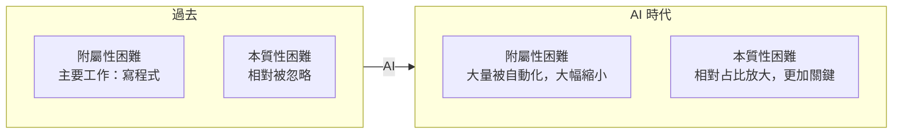

# 1.4 AI 時代：附屬性困難的消亡與本質性困難的永存

## 一個震撼的時刻

2025 年前後，AI 程式設計工具（如 Claude Code、GitHub Copilot、Cursor、OpenCode）開始在開發者中普及。你可能看過這樣的畫面：一個工程師對著 AI 說「幫我寫一個能把 CSV 轉成 JSON 的工具」，幾秒鐘後，函式就寫好了，含錯誤處理、測試用例、甚至文件註解。

如果你第一次看到這個場景，難免會感到震撼——過去要花一小時的工作，現在幾秒就完成了。這讓我們不得不重新審視 1.2 節的「沒有銀彈」論點：**AI 是不是那個銀彈？**

這正是本章要回答的核心問題。答案分成兩半：**AI 是消滅附屬性困難的終極武器，但它沒有、也無法消滅本質性困難。**

## AI 如何消滅附屬性困難

回到 1.2 節對附屬性困難的定義——它來自工具與方法，而非問題本身。AI 幾乎精準地命中了每一項：

| 附屬性困難 | 範例 | AI 的消滅方式 |
|-----------|------|--------------|
| 繁瑣的語法 | 記不住庫的 API 簽名 | AI 直接生成正確語法 |
| 樣板程式碼 | CRUD、DTO 轉換、基本配置 | AI 秒級生成 |
| 記憶體管理 | 手動管理資源 | 現代語言 + AI 自動處理 |
| 基礎單元測試 | 為每個函式寫覆蓋測試 | AI 根據邏輯自動補全 |
| 文件同步 | 程式碼改了文件沒改 | AI 讀程式碼動態生成/同步文件 |
| 除錯 | 追著 stack trace 逐行查 | AI 讀全局上下文直接定位根因 |

結果是：**原本佔據工程師大量時間的「體力活」，被極大地自動化了。** 一個受過訓練的工程師，在不降低品質的前提下，程式碼產量可以提升數倍。這正是 AI 帶來的巨大紅利。

## AI 無法消滅本質性困難

然而，AI 越是強大，我們越要清醒地看到它幫不上忙的地方——那正是本質性困難的所在。

### 需求模糊性：AI 不知道使用者要什麼

Brooks 說的第一種本質困難是「複雜性」，但更根本的其實是**需求的模糊性**。「幫我做一個訂位系統」這句話有無窮多種解讀。使用者要的是現場排隊還是線上預約？要整合第三方平台嗎？允許重複訂位嗎？

AI 擅長「在清楚的需求下生成程式碼」，但它**不了解使用者的痛點、商業目標與組織政治**。它無法替你開會、感受使用者的挫折、決定商業上的取捨。一個結構完美卻解決不了真實問題的程式，是垃圾程式——**Garbage in, Garbage out**。這是需求工程（第 2 章）無法被 AI 取代的原因。

### 架構權衡：AI 不能替你承擔權衡

設計大型系統時，需要在「一致性 vs 可用性」「成本 vs 效能」「簡單 vs 靈活」之間做出權衡。這些權衡依賴對業務的深刻理解與價值判斷，無法由 AI 產生標準答案。AI 可以列出選項、分析利弊，但**最終的取捨與責任必須由人承擔**。

### 邏輯嚴密性與邊界：AI 會產生幻覺

AI 會「幻覺」（Hallucination）——寫出看似合理、實則錯誤或有安全漏洞的程式碼。它可能遺漏邊界條件、忽略錯誤處理、寫出不安全的 SQL 查詢。因此，**驗證 AI 產出的邏輯是否正確、是否覆蓋了邊界情況，仍然是無可替代的人類工作**（第 5 章）。

## 本質困難 vs 附屬困難的重新分布

用一張圖總結 AI 造成的變化：它沒有讓「總困難」消失，而是**把困難從「附屬性的、可消滅的」重新分布到「本質性的、不可消滅的」**。

換句話說，**AI 沒有降低做軟體的總難度，而是徹底改變了難度的「形狀」**。過去 80% 的時間花在「寫程式」這個附屬性工作上；現在，更多時間應該花在「定義問題、設計架構、驗證品質」這些本質性工作上。而這些，恰恰是軟體工程真正要傳授的核心。

## 「沒有銀彈」在 AI 時代的重新解讀

Brooks 說「沒有銀彈」，指沒有任何單一技術能十倍提升軟體生產力。AI 的出現是不是推翻了這句話？

辯證地看：

- **如果只算「產出程式碼」的效率**，AI 確實逼近了十倍，甚至超過十倍。就這個狹義角度，AI 是最接近銀彈的工具。
- **但如果算「做出正確的軟體」的總效率**，AI 並沒有讓需求定義、架構設計、品質驗證這些本質性工作變快——它們仍然是瓶頸。

所以本書的立場是：

> AI 是對抗**附屬性困難**的銀彈，但它不是對抗**本質性困難**的銀彈。而本質性困難，才決定軟體專案最終的成敗。

這也呼應了 1.5 節即將討論的核心問題：當 AI 消滅了大量附屬性困難後，軟體工程師的價值重心，理應且必須轉移到本質性困難上。

## 本章小結

- AI 是**消滅附屬性困難**的強大武器
- 但它**無法消滅本質性困難**：需求模糊性、架構權衡、邏輯嚴密性
- AI 改變了難度的**形狀**，把重心推向本質性困難
- 從產出程式碼的效率看，AI 接近銀彈；從做出正確軟體看，不是
- **本質性困難是軟體工程師真正的價值所在**

## 想一想

1. 試著讓一個 AI 工具生成一個「訂位系統」的程式碼。然後問它一些需求問題（例如「要不要支援爽約補償」），看看它能不能替你做出合理的業務決定。
2. 為什麼 AI 越強大，需求定義、架構設計、品質驗證這些工作越顯重要？
3. 你認為「浪費時間」的定義，在 AI 時代是否改變了？哪些時間仍然不是浪費？
