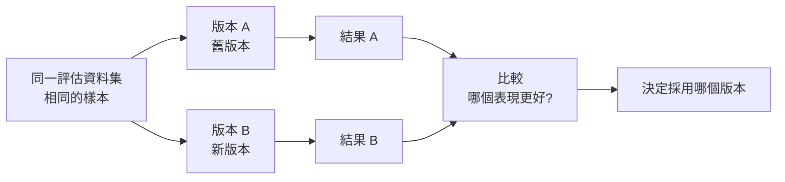

# 10.3 對比實驗與消融實驗

## 評估之後：如何知道「哪個版本好」

建立評估資料集（10.2）是為了「度量」。有了度量，下一個問題是：「**我該相信哪個版本**」——換了 Prompt、加了一個工具、改了 Harness，到底是變好還是變差？

**對比實驗（A/B testing / Comparative Evaluation）** 與 **消融實驗（Ablation）**，就是「用科學方法比較不同版本」的工具。它們是「把 Agent 開發從『猜測』變成『嚴謹實驗』」的關鍵。

## 對比實驗：哪個版本更好

**對比實驗**的核心是：**在「同一個評估資料集」上，比較「不同 Agent 版本」的表現差異。**

### 基本流程

### 對比實驗的嚴謹性要求

要做到「可信的對比」，必須消除「干擾變數」：

1. **單一變數原則**：一次只改「一個東西」——否則改了 3 樣，你不知道是哪樣造成差異
2. **相同資料集**：兩個版本必須在**同一組樣本**上比較，差異才可歸因
3. **重複多次**：AI 行為有隨機性，單次結果不足信——要多跑幾次取平均/取分布
4. **回到「可度量」本質**：差異要用 10.1 的度量來「量化」，而非「感覺」

**陷阱提醒**：對比時若不小心引入了「不是你故意改的差異」（例如模型版本偷偷更新了、隨機種子不同），結果就會失真——**「對比」要像做實驗一樣控好變數。**

### 用「統計」而非「感覺」看結果

當兩個版本的表現差異「看起來差不多」時，不要急著下結論。理想上要問：

- 差異是「穩定可見」的，還是「隨機波動」？
- 數量要夠大（樣本足夠），差異才有意義

**務實**：對學生與開發者，做到「同一資料集 + 單一變數 + 重複幾次取趨勢」已經遠勝「憑感覺」。統計嚴謹度可以依情境調節，但**「用資料下決定」的習慣不能省略**。

## 消融實驗：誰在起作用

**消融實驗（Ablation Study）** 源自醫學/生物學（「切除」一個部位觀察影響），在 ML/Agent 領域指的是：

> **把系統的某個組成「移除（ablate）」，觀察系統表現如何下降——藉此推斷「這個組成值多少」。**

例如，一個 Agent 系統包含了：
- RAG 知識庫（第 7 章）
- 優化的工具定義（第 8 章）
- Harness 的驗證機制（第 9 章）

你想知道「到底哪個在貢獻表現」。方法：分別**關掉**每個部分，看整體表現掉多少：

| 實驗組 | 移除的組成 | 預期 |
|--------|----------|------|
| 完整系統 | 無（baseline） | 最基準 |
| 移除 RAG | 沒有知識庫檢索 | 若顯著變差 → RAG 很有用 |
| 移除工具定義優化 | 工具描述改回模糊 | 若變差 → 工具設計有價值 |
| 移除驗證機制 | 不做結果校驗 | 若變差（或錯誤增多）→ 驗證有價值 |

**消融實驗的價值**：它回答「**這坨複雜系統裡，每一部分到底值不值**」——避免你「加上很多功能卻不知道哪個在起作用」。「面向 ROI 的評估」讓你知道「該砍什麼、保留什麼」（呼應 KISS，3.4 節）。

### 消融實驗的姿態

- **肯定式消融**：移除「你以為有用」的部分，觀察負面影響（主流的做法）
- **這正是「透過移除，證明該部件有其必要價值」的科學精神**
- 對「不能移除」的部分（例如模型本身）則做**替換**式的對比（換不同的模型，看影響）

## 對比與消融：評估中的「科學方法」

把「對比」與「消融」放一起看，它們其實是同一種「科學方法」在 Agent 開發中的應用：

> **透過「變一個變數、固定其他」，觀察「結果是否變化」——用這種方式，把「誰貢獻了什麼」拆解清楚。**

- **對比實驗**：由「變一個變數」出發，比較「整體表現」的差異
- **消融實驗**：由「移除一個組件」出發，觀察「危害有多大」

它們互補：**對比**回答「A 比 B 好不好」，**消融**回答「某個部件值不值」。兩者都建立在 10.1（度量）與 10.2（資料集）之上。

## 為何這在 AI 時代格外重要

回顧本質：Agent 系統由「很多設計決策」組成（Prompt 寫法、工具、Harness、上下文策略），而每個決策都有「更多的排列組合」——而且**模型是黑箱、行為不確定**。在這樣的系統裡：

- 沒有對比實驗，你**無法知道**「往上加東西」或「改一個設定」到底是加分還是扣分
- 沒有消融實驗，你**會累積一坨**「不知有沒有用」的功能，把系統越搞越複雜（違反 KISS）

**一句話**：**「變一個變數、觀察影響」的實驗紀律，是把 AI Agent 從「疊功能的拼湊」變成「科學調校的工程」的核心習慣。**

## 本章小結

- 對比與消融：用「科學方法」決定「哪個版本好、哪個部件有用」
- **對比實驗**：同一資料集比較不同版本；要求**單一變數、相同樣本、重複多次**
- **用資料而非感覺**下定論，注意統計雜訊
- **消融實驗**：移除某組件觀察表現下降 → 推斷該組件的價值
- 兩者互補：對比答「A 比 B 好嗎」，消融答「某部件值嗎」
- 實驗紀律把 Agent 開發從「拼湊」變成「科學調校」（並守護 KISS）

## 想一想

1. 為什麼對比實驗要「一次只改一個變數」？一次改多個變數會造成什麼問題？
2. 設計一個你的 Agent（或用 OpenCode）的「消融實驗」：你覺得哪個部件最可能「移除了也差不多」？
3. 「用資料下決定 vs 憑感覺」——你覺得在 Agent 開發中，憑感覺最危險的地方是哪裡？