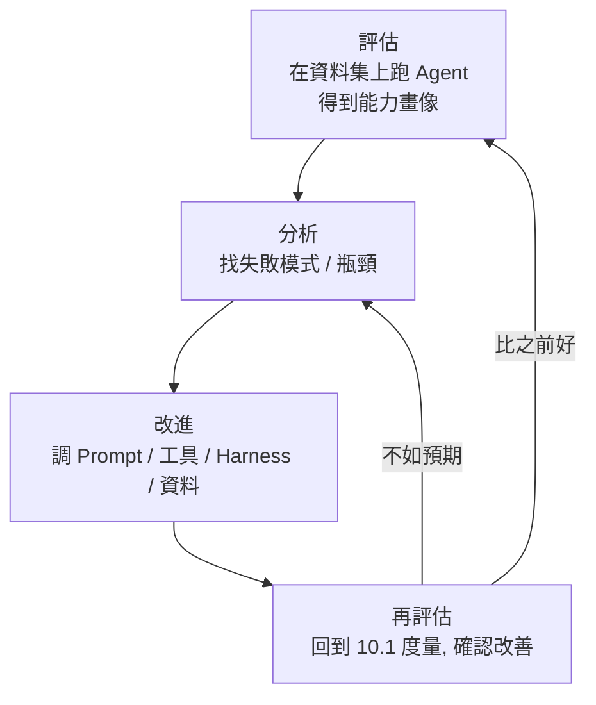

# 10.4 Agent 的持續進化閉環

## Agent 也要「迭代」與「持續改進」

前面章節建立的評估工具（度量、資料集、實驗），如果只用一次，價值有限。本章最後的兩節，把這些工具串成一個**「持續的迴圈」**——讓 Agent **像軟體工程一樣，被「持續地度量、改進、進化」**。

這正是「Agent 的持續進化閉環」：**不是「做一次評估就收工」，而是透過「回饋 → 分析 → 改進 → 再評估」的循環，讓 Agent 的能力一路向上。**

## 閉環的四個環節

### 1. 評估（Evaluate）

在「有代表性的資料集」（10.2）上跑 Agent，得到能力畫像（10.1）。這是閉環的「眼睛」。

### 2. 分析（Analyze）

深挖「**為什麼**這類任務失敗」：

- 失敗集中在哪類任務？（知識不足？工具用錯？步驟卡住？）
- 失敗的模式是什麼？（幻覺？誤解指令？缺少驗證？）
- 對應到系統的哪一層可改？（Prompt？Context？Tools？Harness？——7-9 章）

**關鍵**：分析要「對症下藥」——改進必須針對「根因」，而不是「亂調一通」。

### 3. 改進（Improve）

依分析結果，實施「有針對性」的改進——可能是：

- 修 Prompt / 加想要的 Context（第 7 章）
- 優化工具定義 / 加新工具（第 8 章）
- 補 Harness 的約束 / 驗證 / 糾正（第 9 章）
- 補評估資料集的樣本、發現漏測的真實任務（10.2）

**一次改一個**（10.3 的單一變數原則），才能知道「這個改動值多少」。

### 4. 再評估（Re-evaluate）

改完，**回到同一組（+新增）樣本**重新評估：

- 是否變好？（10.1 度量）
- 有沒有「其他任務」反而變差？（5.6 節的迴歸思維、10.3 對比）
- 若沒改善 → 回到分析，重新診斷（可能改錯方向）

**關鍵**：閉環的目的不只是「上一個台階」，而是「**持續保證品質、避免退化**」。

## 閉環的關鍵：每次改進都要「證明」

持續進化閉環中，最容易犯的錯誤是：**「我改了，所以應該變好了」——卻沒有真正重測證明。**

正確的紀律是每一輪改進都要「**以數據證明**」：

- 改進前：記錄「改進前的評估結果」（baseline）
- 改進後：記錄「改進後的評估結果」
- 用對比/消融（10.3）看差異是否真實

> **「如果沒有左欄（前）與右欄（後）的數字，改進就只是『說說而已』。」**

這呼應 10.1 的核心——**每一輪閉環，都是一次「先度量、再改進、再度量」的科學循環。**

## 閉環需要「制度化」

持續進化不是「某天心血來潮做一下」，而應該變成**「制度化的工作流程」（integration into workflow）**：

- 在 CI / 交付流程中**定期跑評估**（結合第 6 章 CI/CD、第 12 章護欄）
- 把「新出現的真實失敗案例」**蒐集回饋**，不急著改，先化身「新樣本」加入資料集
- 建立「基準（baseline）」的版本化，避免「改壞了卻不知道」

**一句話**：持續進化閉環，是把「評估」從「研究工具」升級成「**日常的工作節奏**」——像軟體工程離不開測試一樣，AI Agent 開發離不開評估迴圈。

## 從「閉環」到下一節：學習的兩種形式

持續進化閉環靠的是「**我們（工程師）主導的改進**」——我們看評估、改 Prompt/工具/Harness。這是最主要的進化方式（也是本書最強調的）。

但還有另一種更「自主」的進化——**讓 Agent 直接「從經驗中學習」**，自動更新它的「知識與技能」：這是下一節（10.5 節）「學習訊號與更新載體」的主題。

## 本章小結

- **持續進化閉環**：評估 → 分析 → 改進 → 再評估，不斷向上（像軟體工程迭代）
- 四環節：**評估（能力畫像）、分析（找根因）、改進（對症下藥）、再評估（證明改善）**
- 工具與方法：10.1 度量、10.2 資料集、10.3 對比/消融
- **每次改進都要「以數據證明」**（前後對照），不能只說「應該變好了」
- 閉環要**制度化**：進 CI、蒐集新失敗案例、版本化基準
- 下一節：另類進化——讓 Agent 直接「從經驗中學習」

## 想一想

1. 畫出你自己的 Agent 專案的「持續進化閉環」，並標出每個環節你最可能「偷懶」的地方。
2. 為什麼「改完沒重測」會讓閉環崩潰？「只加了不證明」的風險在哪？
3. 你覺得「工程師主導的進化」（改 Prompt/工具）與「Agent 自主學習」相比，各適合什麼情境？（預告 10.5 節）