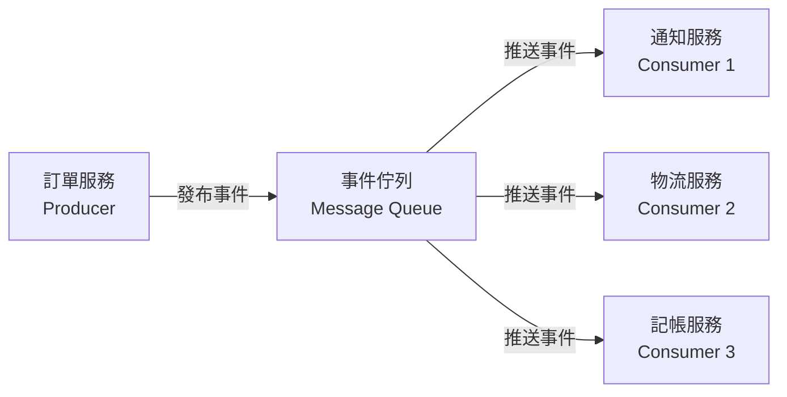
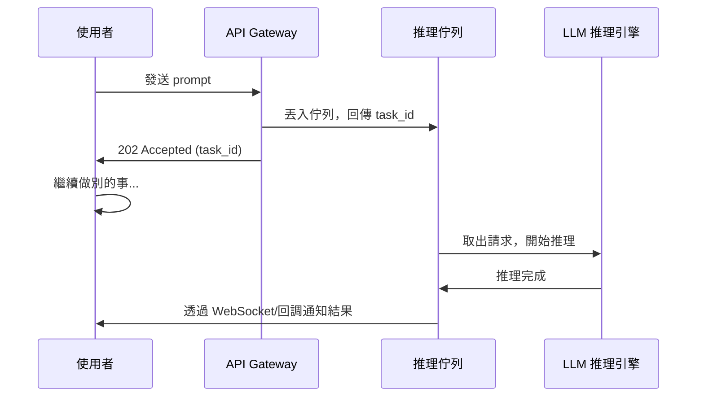

# 11.1 事件驅動與非同步架構

## 從「呼叫就等」到「發出就走」

你在第 3 章學過函式呼叫是同步的——呼叫端會暫停，等待被呼叫端回傳結果。這種模式簡單直覺，但有一個致命瓶頸：**如果被呼叫端很慢（例如 LLM 推理需要數秒甚至數分鐘），呼叫端就被卡住了。**

想像一個客服系統：使用者傳來一段文字，系統要先用 LLM 產生回答、再查詢資料庫、再寄信。如果三件事都同步執行，使用者要等 5 秒（LLM）+ 2 秒（DB）+ 1 秒（Email）= 8 秒才能看到回覆。如果同時有一百個使用者，系統就得同時處理一百個等待迴圈——這是不可擴展的。

**非同步架構**的核心思想是：**把「要做的事」丟出去，立刻回來繼續做別的事，等結果好了再通知我。** 這不是新概念——瀏覽器載入網頁時，JavaScript 非同步 fetch 就是日常案例。

## 同步 vs 非同步：一個對比

| 面向 | 同步 | 非同步 |
|------|------|--------|
| 呼叫端狀態 | 等待、阻塞 | 繼續執行 |
| 適合場景 | 快速運算、需要立即結果 | I/O 密集、長時間運算 |
| 擴展性 | 受限於執行緒數量 | 可用少量執行緒處理大量請求 |
| 錯誤處理 | try/catch 直觀 | 需要回調或事件處理 |
| 程式碼複雜度 | 低 | 較高 |

## 事件驅動架構

**事件驅動架構（Event-Driven Architecture, EDA）**是非同步的進化版。差別在於：非同步是「我丟任務、等結果」；事件驅動是「我丟一個事件，誰有興趣誰來處理」——**發送者甚至不知道誰會處理這件事。**

這就像傳簡訊和打電話的差別：打電話是同步的（你要等對方接）；傳簡訊是非同步的（傳完就繼續做別的）；而事件驅動像是在社群媒體發文——你發了一個「訂單已成立」的事件，物流系統會處理、通知系統會處理、記帳系統也會處理，但你不需要知道有誰在聽。

### 事件驅動的三個核心元件

```
1. 事件（Event）：發生了什麼事（例如「使用者下單」）
2. 事件生產者（Producer）：發出事件的人
3. 事件消費者（Consumer）：接收並處理事件的人
```

事件通常透過**事件佇列（Message Queue）**傳遞，像是 RabbitMQ、Apache Kafka、或雲端服務如 AWS SQS。佇列是事件的暫存區——生產者把事件丟進去就離開，消費者按自己的速度從佇列中取出處理。



### 為什麼事件驅動適合 AI 系統

在 AI Agent 系統中（第 8 章），一個 Agent 呼叫工具後可能要等很久——LLM 推理、外部 API 回應、資料庫查詢。事件驅動架構讓我們：

1. **解耦**：Agent 不需要知道下游有哪些服務，只要發出事件
2. **容錯**：某個消費者當機，事件仍然在佇列中，不會丟失
3. **擴展**：消費者不夠用時，多開幾個實例就好（水平擴展）

## LLM 訓練同步 vs 部署非同步的矛盾

這裡有一個值得深思的矛盾。

**LLM 的訓練過程**本質上是同步的——你要把大量資料餵進模型，等它收敛、算 loss、更新參數，一步接一步。你不能「先訓練一半、去吃飯、回來再繼續」（好吧，Checkpoint 可以，但那是另一回事）。訓練的計算密集特性，要求 GPU 集群連續運算數天甚至數週。

**但 LLM 的部署使用**卻是天然非同步的——使用者發出 prompt，模型花幾秒推理，回傳結果。在高併發場景下，你不可能讓一百個使用者排隊等一個 GPU 依序推理。

這個矛盾帶來了幾個架構上的挑戰：

1. **推理佇列化**：多個使用者的推理請求排入佇列，GPU 以 batch 方式處理，提升硬體利用率
2. **快慢分離**：快速的前處理（解析輸入、路由決策）與慢速的 LLM 推理分開處理，避免快操作被慢操作卡住
3. **非同步回調**：使用者不必盯著畫面等，系統在結果就緒後主動推送



這就是為什麼 OpenAI 的 API 在高負載時會回傳 `202 Accepted` 而不是 `200 OK`——它在告訴你：「你的請求收到了，排隊中，結果好了會通知你。」

## 佇列作為系統的緩衝與節流

事件佇列在複雜系統中不只是「傳遞消息」，它還有幾個關鍵功能：

- **緩衝（Buffering）**：當突發流量涌入時，佇列吸收尖峰，消費者按自己速度消化，避免系統崩潰
- **節流（Throttling）**：控制消費者同時處理的事件數量，避免下游服務被壓垮
- **持久化（Persistence）**：事件被保存在磁碟上，即使系統重啟也不會丟失
- **重放（Replay）**：出錯時可以重新處理特定事件（例如修完 bug 後重跑）

在 AI Agent 系統中，佇列扮演的角色類似**第 9 章 Harness 的排程器**——它決定什麼時候把什麼任務交給哪個 Agent 處理，確保整個系統不會因為某個 Agent 太慢而癱瘓。

## 本章小結

- **同步架構**簡單直覺但不適合長時間運算；**非同步架構**讓系統在等待時繼續工作
- **事件驅動架構**更進一步：發送者不需知道誰會處理事件，透過佇列實現鬆散耦合
- **事件佇列**提供緩衝、節流、持久化、重放等關鍵功能
- LLM 的訓練（同步密集）與部署（非同步分散）存在天然矛盾，需要**佇列化、快慢分離、非同步回調**來調和
- 這些架構模式是設計多 Agent 系統的基礎建設

## 想一想

1. 想像一個 AI 聊天應用：使用者傳訊息後，系統要做「內容審核 + LLM 推理 + 對話記錄儲存」三件事。如果三件事都同步執行，體驗會怎樣？如果用事件驅動呢？
2. Kafka 和 RabbitMQ 都是事件佇列，但设计理念不同。你覺得哪個更適合 AI Agent 系統？為什麼？（提示：想想事件的「順序性」和「持久化」需求。）
3. 為什麼 OpenAI 的 API 在高負載時回傳 202 而不是直接拒絕請求？這種設計有什麼好處和風險？
