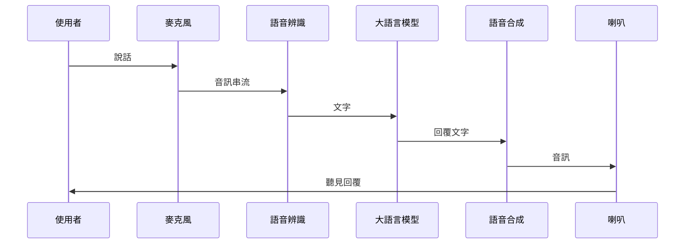
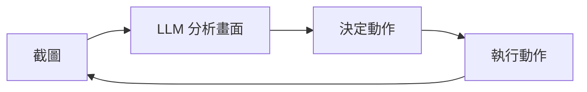
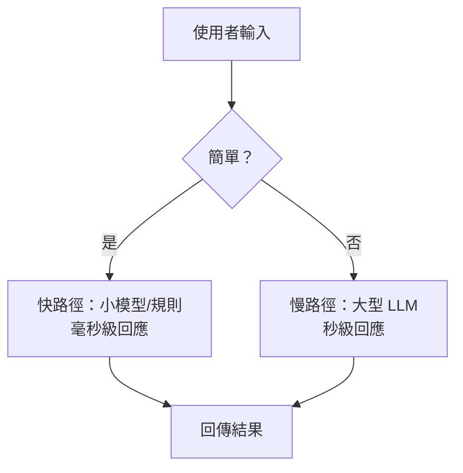

# 11.2 即時互動：語音、Computer Use 與物理世界

## 兩根軸：模態與時機

在第 1.2 節的 AI 發展簡史中，我們看過 AI 從文字走向多模態。但「能處理語音」和「能即時對話」是兩件完全不同的事。理解即時互動系統的關鍵，是認清兩根軸：

**模態軸（Modality）**：AI 能接收和輸出什麼？
- 文字（最古老、最穩定）
- 語音（需要語音辨識 + 合成）
- 影像（需要視覺模型）
- 影像串流（Computer Use，截圖 + 滑鼠鍵盤操作）
- 物理動作（機器人、無人車）

**時機軸（Timing）**：AI 必須多快回應？
- 非即時：可以等幾秒（聊天機器人、程式碼產生）
- 近即時：需要在百毫秒內回應（語音對話、遊戲 NPC）
- 即時：需要在毫秒內回應（自駕車、機器人避障）

這兩根軸的交叉，創造了截然不同的工程挑戰。文字聊天是「低模態壓力 + 低時機壓力」；語音對話是「中模態壓力 + 高時機壓力」；自駕車是「高模態壓力 + 極高時機壓力」。

## 語音互動：最接近人類的界面

語音是人類最自然的溝通方式，但對 AI 來說卻是最複雜的互動模態之一。一個語音互動系統至少要處理三件事：

1. **語音轉文字（STT）**：把使用者說的話轉成文字
2. **LLM 推理**：理解語意、產生回覆文字
3. **文字轉語音（TTS）**：把回覆轉成自然的語音



問題在於：這三個步驟串起來，延遲可能高達 2-3 秒。人類對話的自然反應時間大約是 200-500 毫秒。如果每次回覆都要等 3 秒，對話體驗就像在跟一個「反應很慢的人」講電話——尷尬且不自然。

### 減少延遲的工程策略

實務上，工程師會用幾種方式降低感知延遲：

- **邊收邊處理（Streaming）**：語音辨識不等整句話說完，而是邊收音邊產生文字，LLM 也邊產出邊送 TTS
- **端點偵測（Endpoint Detection）**：智慧判斷使用者「說完了」，而不是等長時間沉默
- **模型快取**：對常見問題預先產生回覆，減少 LLM 推理時間
- **本地小模型**：用小型模型處理簡單問題，只有複雜問題才呼叫大型 LLM

這些策略的共同思路是：**把能並行的並行、能預測的預測、能本地的本地。**

## Computer Use：AI 操作電腦

2024 年底，Anthropic 推出了 Claude 的 Computer Use 功能——讓 AI 能看到螢幕截圖、移動滑鼠、點擊按擊按鈕、鍵盤輸入。這代表 AI 從「對話」跨越到「操作」，觀察空間從「文字」擴展到「整個桌面」。

Computer Use 的迴圈很直觀：



這個迴圈每一步都需要時間：截圖要傳輸、LLM 要理解畫面、動作要執行。一個完整的「看-想-做」迴圈可能需要 3-5 秒。在文字聊天中這不算什麼，但當你要求 AI 幫你「打開 Chrome、搜尋某個東西、點進第三個結果」時，使用者會眼睜睜看著滑鼠慢慢移動、按鈕慢慢點擊——非常慢。

### Computer Use 的架構挑戰

| 挑戰 | 說明 |
|------|------|
| 視覺延遲 | 每次截圖都是幾百KB到幾MB的圖片，傳輸和分析都需要時間 |
| 狀態追蹤 | 螢幕畫面每毫秒都在變，AI 看到的可能是「過時的」畫面 |
| 錯誤恢復 | 點錯了怎麼辦？AI 需要能「Undo」或「修正」 |
| 安全邊界 | AI 能操作電腦，等於有你所有檔案和帳號的存取權 |

這些挑戰讓我們回到第 9 章 Harness 工程的核心思想：**你需要給 AI 設定明確的邊界、驗證機制和糾正迴圈。** Computer Use 如果沒有約束，就像給一個陌生人你家的鑰匙和密碼。

## 物理世界：機器人與無人車

當 AI 從數位世界跨入物理世界，時機軸的壓力暴增。一個機械手臂要接住掉落的球，你不能等 LLM 花 3 秒推理——球早就掉地上了。

這是為什麼物理世界的 AI 系統通常採用**分層架構**：

- **底層**：快速、確定性的控制器（毫秒級反應），處理避障、平衡、基本動作
- **中層**：行為規劃器（百毫秒級），決定「做什麼」——例如路徑規劃、任務分配
- **頂層**：LLM 或高階 AI（秒級），負責「理解意圖」——例如使用者說「幫我把桌上的杯子拿過來」

```
頂層（LLM）：理解語意、分解任務
    ↓
中層（規劃器）：決定路徑和動作序列
    ↓
底層（控制器）：即時控制馬達、感測器
```

這種分層的思想，在 AI Agent 系統中也同樣適用。

## 快慢分離：一個通用的架構原則

回顧上述三種場景——語音、Computer Use、機器人——我們看到一個共同的設計原則：**把快的操作和慢的操作分開。**

在 AI 系統中：
- **快路徑（Fast Path）**：簡單判斷、路由決策、格式轉換——用小模型或規則引擎，毫秒級回應
- **慢路徑（Slow Path）**：複雜推理、長文生成、多步驟規劃——用大型 LLM，秒級回應



這種分類不是靜態的——它需要一個**路由決策器**來判斷「這個請求該走哪條路」。路由本身也需要快（如果路由就要 3 秒，就失去了意義），所以通常用簡單的分類模型或規則來實作。

這與第 11.1 節的事件驅動架構相呼應：快路徑的結果直接回傳，慢路徑的任務丟入佇列非同步處理——使用者先得到初步回應，等到完整結果就緒後再更新。

## 本章小結

- 即時互動系統可以用**模態軸**（接收什麼）和**時機軸**（多快回應）兩個維度來分類
- **語音互動**的關鍵挑戰是延遲：邊收邊處理、端點偵測、模型快取都是減少感知延遲的策略
- **Computer Use** 讓 AI 從對話跨越到操作，但截圖-分析-執行的迴圈仍然很慢，需要 Harness 來約束
- **物理世界的 AI** 需要分層架構：底層快速控制器 + 中層規劃 + 頂層 LLM 理解
- **快慢分離**是跨場景的通用架構原則：簡單問題走快路徑，複雜問題走慢路徑

## 想一想

1. 如果你要設計一個「即時語音翻譯」系統（中翻英），你會怎麼平衡翻譯品質和延遲？哪些步驟可以並行、哪些必須等待？
2. Computer Use 每 3-5 秒才能完成一個「看-想-做」迴圈。如果要讓它操作一個需要快速連續點擊的介面（例如玩遊戲），你覺得有什麼根本性的限制？
3. 在你的手機上，哪些 App 已經在使用「快慢分離」的架構？例如：輸入法的預測（快）和語音助手的回答（慢），它們的路由邏輯是什麼？
