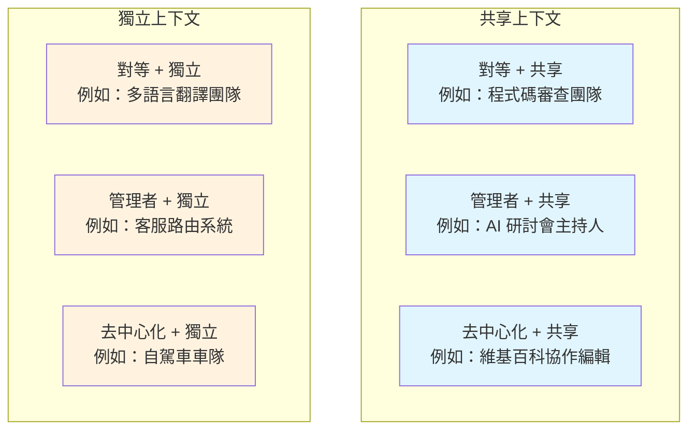

# 11.3 多 Agent 協作的分類框架

## 為什麼需要多個 Agent

第 8 章介紹了單一 Agent 的架構：LLM 加上工具，透過 ReAct 迴圈完成任務。但現實世界中有許多問題是單一 Agent 難以勝任的：

- **專業分工**：一個 Agent 精通法律文件審閱，另一個擅長程式碼產生，各自專精比「什麼都會一點」更有效
- **規模限制**：上下文視窗有限（第 7 章），一個 Agent 無法同時處理大量的文件和程式碼
- **品質把關**：一個 Agent 產生內容，另一個 Agent 審查——這是第 9 章 Harness 思想的延伸
- **並行加速**：多個 Agent 同時處理不同子任務，整體速度更快

但多 Agent 系統不是「多叫幾個 Agent 就好」。協作方式的選擇直接影響系統的可靠性、延遲和可控性。本節提出一個分類框架，幫助你系統化地思考多 Agent 協作的設計空間。

## 兩個維度：上下文共享與控制結構

多 Agent 協作的設計空間可以用兩個維度來描述：

### 維度一：上下文的共享程度

**共享上下文（Shared Context）**：所有 Agent 存取同一份對話紀錄、同一份文件、同一個記憶體。任何一個 Agent 看到的資訊，其他 Agent 也能看到。這就像一個團隊共用同一個 Google Doc——資訊透明，但也可能互相干擾。

**獨立上下文（Independent Context）**：每個 Agent 有自己的對話歷史、自己的記憶、自己的知識庫。Agent 之間不直接看到彼此的內部狀態，只能透過訊息溝通。這更像不同部門各有自己的文件系統，需要開會才能交換資訊。

| 面向 | 共享上下文 | 獨立上下文 |
|------|-----------|-----------|
| 資訊透明度 | 高，所有 Agent 看到相同的東西 | 低，每個 Agent 只知道自己知道的 |
| 一致性 | 容易保持一致（單一真實來源） | 可能產生衝突（各 Agent 各說各話） |
| 上下文污染風險 | 高（不相關資訊干擾判斷） | 低（每個 Agent 只看到相關資訊） |
| 溝通成本 | 低（直接讀共享區域） | 高（需要明確的訊息傳遞） |
| 適用場景 | 需要高度協調的任務（如程式碼審查） | 專業分工的任務（如多語言翻譯） |

### 維度二：控制結構

**對等（Peer-to-Peer）**：Agent 之間地位平等，沒有誰指揮誰。它們透過發布事件或直接通訊來協作，類似第 11.1 節的事件驅動架構。

**管理者（Manager/Orchestrator）**：有一個「管理者 Agent」負責分配任務、整合結果、做最終決策。其他 Agent 是「工人」，聽從管理者的指令工作。

**去中心化（Decentralized）**：比對等更進一步——沒有固定的通訊結構，Agent 根據當前需求動態建立連線。有點像鳥群飛行：每隻鳥只觀察附近的同伴，但整體呈現出有序的行為。

## 分類框架圖

這兩個維度交叉，產生六種基本模式：

## 各模式的典型案例

### 對等 + 共享：程式碼審查

多個 AI Agent 共同一份程式碼庫，各自從不同角度審查：一個檢查效能、一個檢查安全性、一個檢查可讀性。它們各自提出建議，最後由人類（或一個整合 Agent）做最終決策。共享上下文確保它們看到相同的程式碼版本，對等結構讓它們互不干涉。

### 管理者 + 共享：AI 研討會

一個「主持人 Agent」決定討論主題、分配發言順序、整合各方觀點。所有 Agent 共享同一個對話紀錄，確保討論不離題。主持人有權限中斷偏離主題的發言、總結達成的共識。

### 去中心化 + 共享：維基百科式協作

多個 Agent 各自貢獻一篇文章的不同段落，共享同一個文件空間。沒有固定的工作流程——Agent A 修改了一段，Agent B 看到後覺得需要調整語氣，就直接修改。衝突靠版本控制和共識機制解決。

### 對等 + 獨立：多語言翻譯

英文 Agent 和日文 Agent 各自有自己的語言專業上下文。它們不共享內部狀態，而是各自接收原文、產生翻譯、互相校對。獨立上下文確保英文 Agent 的英文文法判斷不會被日文文法污染。

### 管理者 + 獨立：客服路由

一個「路由器 Agent」接收使用者問題，判斷類型後分配給專業 Agent：技術問題給技術客服、帳務問題給帳務客服。每個專業 Agent 有自己的知識庫和對話紀錄，彼此隔離。路由 Agent 只負責分配，不處理具體問題。

### 去中心化 + 獨立：自駕車車隊

每輛車是一個獨立 Agent，有自己的感測器資料和決策模型。車輛之間透過 V2X 通訊分享路況，但不共享決策邏輯。每輛車根據自己看到的路況和收到的訊息，獨立做出行駛決策。

## 如何選擇適合的模式

選擇多 Agent 協作模式時，問自己三個問題：

1. **Agent 之間需要看到相同的東西嗎？** 如果需要高度一致性，選共享上下文；如果各司其職更有效率，選獨立上下文。
2. **需要有人做最終決策嗎？** 如果需要（例如品質把關、衝突裁決），選管理者模式；如果各 Agent 的輸出可以直接合併，選對等模式。
3. **通訊結構是固定的還是動態的？** 固定的用管理者或對等，動態的用去中心化。

實務上，**管理者 + 獨立上下文**是最常見的模式，因為它兼顧了可控性（管理者確保品質）和隔離性（各 Agent 不互相干擾）。這也與第 9 章 Harness 的管理者角色一致——Harness 本身就是一個「管理者」，它監督 Agent 的行為、驗證輸出、在出錯時介入。

## 本章小結

- 多 Agent 協作的設計空間可以用**上下文共享程度**（共享/獨立）和**控制結構**（對等/管理者/去中心化）兩個維度來分類
- 兩個維度交叉產生**六種基本模式**，每種模式有不同的適用場景
- 共享上下文利於一致性但有污染風險；獨立上下文利於專業分工但需要額外溝通
- **管理者模式**最常見，因為它兼顧可控性與隔離性，與 Harness 的監督角色一致
- 選擇模式時問三個問題：需要共享資訊嗎？需要中央決策嗎？通訊結構固定嗎？

## 想一想

1. 第 10 章提到「LLM-as-a-Judge」——一個 LLM 評估另一個 LLM 的輸出。這屬於本節分類框架中的哪種模式？為什麼？
2. 如果你要設計一個「AI 寫作助手」，讓多個 Agent 分別負責事實查核、文法修正、風格潤飾，你會選共享還是獨立上下文？管理者還是對等？為什麼？
3. 去中心化模式聽起來很酷，但為什麼在實務上很少見？它的主要挑戰是什麼？
