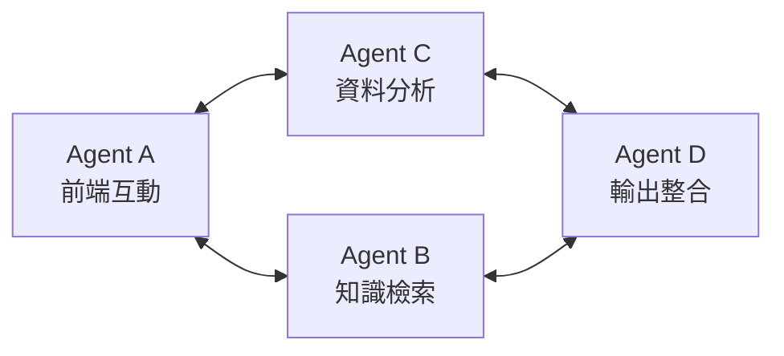
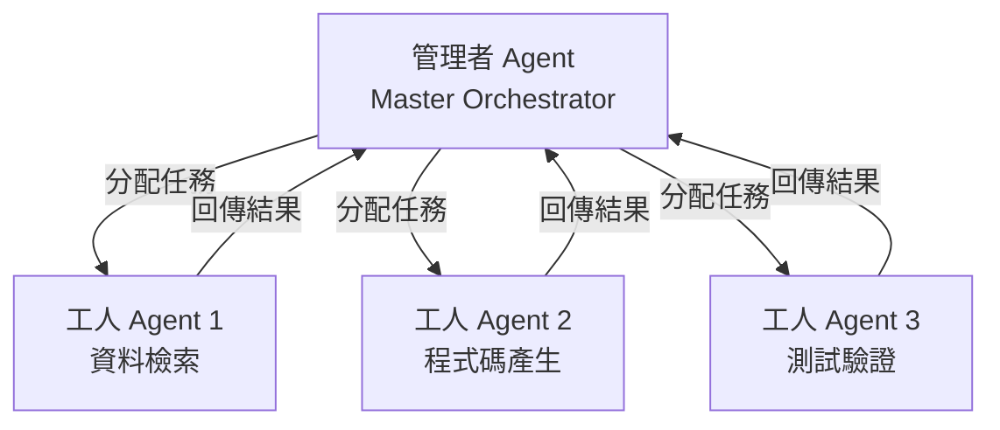
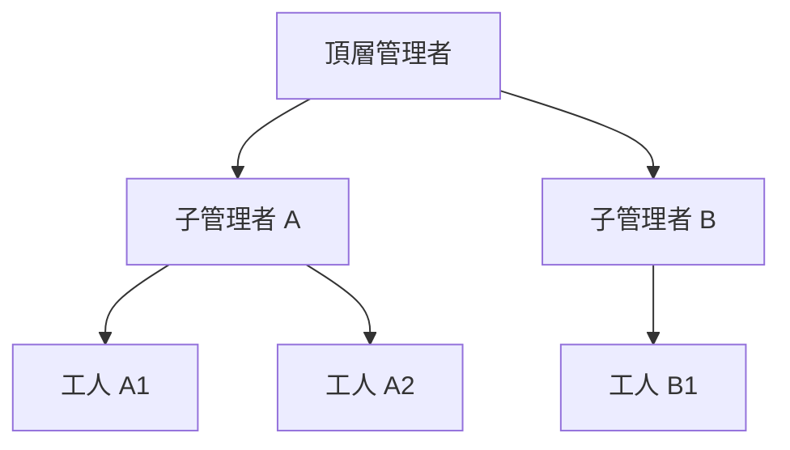
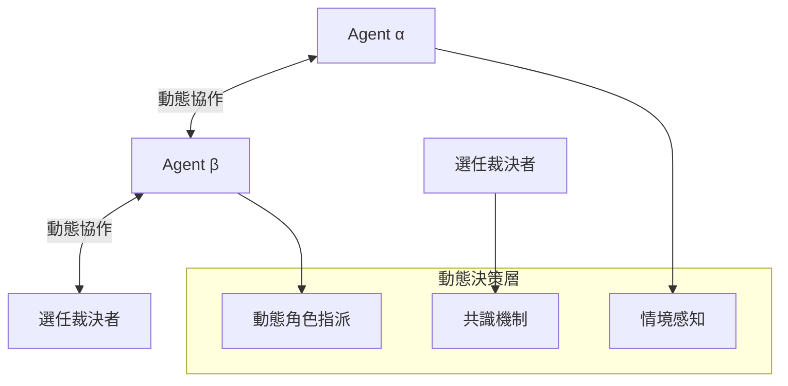

# 11.4 協作拓撲：對等、管理者與去中心化

## 從分類到實作設計

第 11.3 節提出了多 Agent 協作的分類框架。本節深入三種控制拓撲的**設計細節**——不只說明「是什麼」，更要回答「怎麼設計、有什麼優缺點、什麼時候用」。

這三種拓撲可以想像成三種人類組織：自由市場（對等）、公司主管制（管理者）、開放原始碼社群（去中心化）。每種都有其適用情境。

## 對等（Peer-to-Peer）拓撲

### 結構

對等拓撲中，所有 Agent 地位平等，透過發布事件或直接訊息協作，沒有中央指揮者。

### 設計考量

1. **通訊協定**：對等 Agent 之間要有一個共同的訊息格式（類似第 3 章的 API 契約）。因為沒有中央協調者，每個 Agent 都要能理解彼此的訊息。
2. **發現機制**：Agent A 怎麼知道該把任務丟給誰？需要一個服務註冊表或路由表。
3. **錯誤處理**：如果 Agent B 沒有回應，Agent A 要找誰求助？對等系統沒有「主管」可以兜底。
4. **狀態一致性**：沒有中央狀態，每個 Agent 各自維護狀態，容易產生資訊不一致。

### 優缺點

**優點**：- 沒有單一失敗點（任何 Agent 掛掉，其他仍可運作；可在下方 mermaid 圖中看到去中心化的差異）
- 擴展容易：多加幾個 Agent 很自然
- 低耦合：Agent 之間不互相依賴

**缺點**：- 難以做整體品質控管
- 除錯困難（問題發生在哪個 Agent？）
- 容易產生重複處理或遺漏（沒人負責「統籌全局」）

### 適用場景

對等拓撲適合**「各自獨立、結果可合併」**的任務——例如多個翻譯 Agent 各翻一章（每章獨立）、多個影像分析 Agent 各分析一張圖。

## 管理者（Manager）拓撲

### 結構

這是最廣為使用的模式，我們常稱之為「編排器-執行器」（Orchestrator-Worker）或 Hub-and-Spoke。一個管理者 Agent 負責分配任務、收集結果、做最終整合。

### 設計考量

1. **管理者職責**：管理者不只是「轉發任務」——它要做任務分解（把大任務拆成子任務）、任務分配（決定誰做什麼）、結果整合（合併、驗證、裁決衝突）、錯誤糾正（發現某個工人失敗，重派或調度）。
2. **工人是「無狀態」的**：工人 Agent 不需要記住全局，只需要接收任務、執行、回傳。這讓工人可以被替換、可以水平擴展。
3. **管理者的瓶頸**：所有訊息都流經管理者，當子任務很多時，管理者會變成瓶頸。這是管理者模式最大的缺點。
4. **階層式管理者（Hierarchical）**：當任務太複雜時，管理者可以再往下委派子管理者，形成樹狀結構。

### 優缺點

**優點**：- 品質可控：管理者可以驗證每個工人的輸出
- 職責明確：誰負責什麼非常清楚
- 易於除錯：問題可以追溯到具體的工人
- 與 Harness 工程完美契合：管理者就是一個大型 Harness

**缺點**：- 單一失敗點：管理者掛了，整個系統停擺
- 管理者瓶頸：所有訊息都流經管理者，吞吐量受限
- 管理者本身可能有幻覺或偏見，且無人監督它

### 適用場景

管理者拓撲適合**「需要逐步運算、結果相依」**的任務——例如軟體開發（規劃→寫碼→測試→修正）、研究專案（提出假說→收集資料→分析→結論）。這是目前商業 AI 產品最常用的架構。

## 去中心化（Decentralized）拓撲

### 結構

去中心化拓撲沒有固定的通訊結構與角色分工。Agent 根據當前需求動態建立連線、動態決定誰做什麼。沒有管理者，也沒有固定的對等群組。

### 設計考量

去中心化是最先進、同時也最難設計的模式。它的三個關鍵元件：

1. **情境感知（Situation Awareness）**：每個 Agent 要能感知「現在整體的任務是什麼、我在其中扮演什麼角色」。沒有中央協調者，每個 Agent 要靠共享的任務描述來對齊目標。
2. **動態角色指派**：因為角色不是固定的，Agent 需要一個機制來決定「這次誰來當領導、誰來當執行者」。常見做法是投票或委派——某個 Agent 發現自己最適合某項任務，就主動接手。
3. **共識與裁決機制**：多個 Agent 意見不一致時，誰來裁決？通常選任一個暫時的「裁決者」，或透過加權投票達成共識。這對應到第 9 章的「驗證」概念，只是驗證者不是固定的。

### 優缺點

**優點**：- 高度彈性：可以適應動態變化，沒有僵化的結構
- 沒有單一失敗點：任何 Agent 都可以被替代
- 與真實複雜系統（生態系、市場）的運作方式更接近

**缺點**：- 工程實作困難：動態協調、共識、容錯都極難
- 行為不可預測：難以保證系統「一定」能完成任務
- **難以評估**：沒有明確的責任歸屬，Recall 失敗時無法歸因（呼應第 10 章評估的重要性）
- 除錯是噩夢：你很難重現一個「動態」系統的行為

### 適用場景

去中心化拓撲適合**「高變動性、需自主適應」**的任務——例如智慧城市的多個交通號誌管理系統、無人機編隊協作、供應鏈優化。目前多數去中心化 Agent 系統還停留在研究階段，商業化案例較少。

## 三種拓撲的比較

| 面向 | 對等 | 管理者 | 去中心化 |
|------|------|--------|----------|
| 控制集中度 | 無 | 高 | 無（動態） |
| 單一失敗點 | 無 | 管理者 | 無 |
| 品質控管 | 弱 | 強 | 弱（靠共識） |
| 擴展性 | 高 | 中（受管理者限制） | 高 |
| 可預測性 | 中 | 高 | 低 |
| 實作難度 | 中 | 低 | 高 |
| 商業成熟度 | 中 | 高 | 低 |

## 設計決策的心智模型

選擇拓撲時，可以照一個「金字塔」思考：從**「最簡單能解決問題」**的開始，不要一開始就選最先進的。

1. 如果任務透過**單一 Agent + 工具**就能完成，不要引入多 Agent（第 8 章）
2. 如果需要多 Agent，先試**管理者模式**——它最成熟、可控、可評估
3. 只有當管理者變成瓶頸、或任務本質上是高度動態的，才考慮**對等或去中心化**

這個順序與第 9 章的迭代思想一致：從簡單、可控的方案開始，用評估反饋逐步演化到更複雜的架構。

## 本章小結

- **對等拓撲**（Peer-to-Peer）：無中央協調、彈性高但難控管，適合「結果可合併」的獨立任務
- **管理者拓撲**（Manager）：編排器-執行器模式，品質可控、職責明確但管理者是瓶頸，是商業最成熟模式
- **去中心化拓撲**（Decentralized）：動態協作、需共識機制，彈性最高但實作最難、最難評估
- 設計心智模型：**先單一 Agent，再管理者，最後才考慮對等或去中心化**
- 架構的選擇應與評估能力（第 10 章）匹配——你必須能測量，才能改進

## 想一想

1. 一個「三智能客服 + 一個品質審核」的系統，你會用哪種拓撲？為什麼選它？如果用對等或去中心化會遇到什麼問題？
2. 管理者模式中，管理者 Agent 本身可能做出錯誤決策、且無人監督它。你認為該如何解決「誰來監督管理者」這個問題？（提示：想想 Harness 工程與去中心化的裁決機制。）
3. 去中心化系統「難以評估」是它最大的弱點。如果你非要用去中心化，你會設計什麼機制來讓它仍然可被測量？
