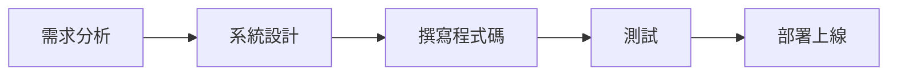
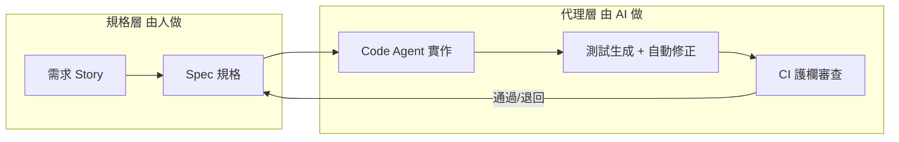
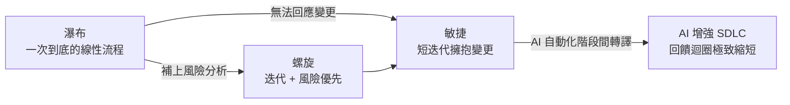

# 12.1 從瀑布到敏捷到 AI 增強的 SDLC

## 為什麼要先談流程

程式設計課教你寫出「正確的一段程式碼」，軟體工程課則教你「如何在幾十人、幾個月、上萬行程式碼的規模下，持續交付可用的軟體」。後者的核心問題是**流程**——團隊用什麼順序、什麼節奏、什麼品質標準，把模糊的需求變成能上線的產品。

SDLC（Software Development Life Cycle，軟體開發生命週期）就是描述這個過程的框架。過去六十年，業界至少嘗試了四種主要範式：**瀑布（Waterfall）、螺旋（Spiral）、敏捷（Agile），以及因 AI 而生的 AI 增強 SDLC**。理解這個演進史，等於理解軟體工程應對「變更」這個本質性困難（見 1.2 節）的全部歷史。

## 瀑布：一次到底的線性流程

1970 年代，Winston Royce 提出「從需求到部署逐階段完成」的模型。瀑布把開發分成**需求、設計、實作、測試、部署**五個階段，後一階段必須等前一階段「完全結束」才開始。

- **優點**：文件完整、階段清楚、容易排程與估算
- **缺點**：假設需求一次想得清楚、且不會再變；後期發現問題要回頭改，成本隨時間指數膨脹（第 2 章「越晚越貴」）

典型失敗案例是大型政府或銀行專案：花兩年把需求寫成厚厚一疊規格書，實作一年後才發現需求早已過時，最後整案失敗或大量返工。瀑布並非一無是處，它適合需求非常穩定、結果可預期的系統（例如早期的批次資料處理），但面對快速變動的市場，它就像「把整艘船造完才下水」，風險極高。

## 螺旋：風險驅動的迭代

1988 年 Barry Boehm 提出螺旋模型，把**迭代**和**風險分析**加入流程。每一圈螺旋等於一次迷你瀑布，依序進行「目標設定 → 風險分析 → 開發驗證 → 下一圈評估」，而且每圈都先處理風險最高的部分。

螺旋的智慧在於：**風險越大、越不確定的東西，越要早點動手、用小步驗證。** 它承認需求與技術都有未知，用「每一圈處理最危險的問題」把災難提前引爆。可惜它過度依賴專業的風險分析能力，門檻偏高，且文件負擔重，因此沒有成為主流，但它的「迭代 + 風險優先」思想深深影響了後來的敏捷。

## 敏捷：擁抱變更的價值宣言

2001 年的《敏捷宣言》是迄今影響最深遠的範式轉移，四項核心價值：

1. **個人與互動** 重於 流程與工具
2. **可用的軟體** 重於 詳盡的文件
3. **與客戶協作** 重於 契約談判
4. **回應變更** 重於 遵循計畫

敏捷用「短迭代（Sprint，通常 1-4 週）＋ 每次迭代交付可執行的軟體 ＋ 使用者故事與站立會議」，把需求變更從「意外」變成「常態」。但它並未消除溝通成本——撰寫使用者故事、維護看板、開評審會議，本身都是繁重的協調工作。敏捷解決了「變更」，卻把成本轉移到「人與人的協作」上。

## AI 增強的 SDLC：把回饋迴圈壓到最短

AI 增強的 SDLC 不是第四種「截然不同」的流程，而是**敏捷的極致化**：用 LLM Agent 把需求、規格、程式碼、測試之間的轉譯成本降到幾乎為零，讓回饋迴圈從「兩週一次」縮短到「幾分鐘一次」。

關鍵變化對應本書各章：

- 需求 → Spec：**Spec-Driven Development**（3.2 節）用 AI 把自然語言需求轉為可執行規格
- Spec → 程式碼：**Agentic Coding**（4.4 節）由 Code Agent 一氣呵成實作
- 程式碼 → 測試：AI 自動生成測試（第 5 章）
- 審查：**AI Reviewer** 自動做程式碼審查（12.4 節）

## 四種範式的比較表

四種範式的演化關係可以濃縮成一張圖：瀑布的「線性」最缺乏彈性，螺旋補上「風險優先的迭代」，敏捷把它推向「以人與交付為中心的短迭代」，而 AI 增強 SDLC 再把其中的轉譯工作交給 Agent。

| 面向 | 瀑布 | 螺旋 | 敏捷 | AI 增強 SDLC |
|------|------|------|------|--------------|
| 核心理念 | 一次完成 | 風險驅動的迭代 | 擁抱變更 | 自動化轉譯 |
| 需求變更 | 幾乎不允許 | 每圈可調整 | 每個迭代可調整 | 即時可調整 |
| 交付節奏 | 專案結束才交付 | 每圈交付一部分 | 每 1-4 週交付 | 每次 Agent 迭代即可交付 |
| 最大成本 | 階段間的文件轉譯 | 專業風險分析 | 人與人的溝通協調 | 規格工程與最終審查 |
| AI 的角色 | 無 | 無 | 工具性質輔助 | 主要生產引擎 |
| 本質性困難 | 沒解決 | 部分解決 | 部分解決 | **仍然存在**（1.4 節） |

請特別注意最後一列。AI 大幅削減了**附屬性困難**（樣板程式碼、基礎測試、文件），但**需求的模糊性、系統的複雜性、品質的驗證**這三座大山並沒有消失——只是它們的「承載點」移到了規格與審查階段。這就是為什麼本書反覆強調：**AI 越強，規格工程與人作為最後守門員的角色越重要。**

## 本章小結

- SDLC 四大範式：**瀑布、螺旋、敏捷、AI 增強 SDLC**，是針對「變更」本質困難的連續回應
- 瀑布**一次到底**，適合穩定需求；螺旋用**風險優先的迭代**補強；敏捷用**短迭代擁抱變更**
- AI 增強 SDLC **不是新流程而是敏捷的極致**：把階段間轉譯交給 Agent，回饋迴圈壓到最短
- 本質性困難在 AI 時代**依然存在**，只是承載點轉移到規格工程與人類審查

## 想一想

1. 你修過的一次作業/專案，適合用哪一種流程？如果用瀑布做，哪一步最可能出問題？
2. 「需求變更」這個本質困難，四種範式各自用什麼方式應對？AI 增強後為什麼回饋迴圈能變短？
3. 為什麼說「AI 增強 SDLC 不是第四種流程」？它的核心是技術還是流程思維？