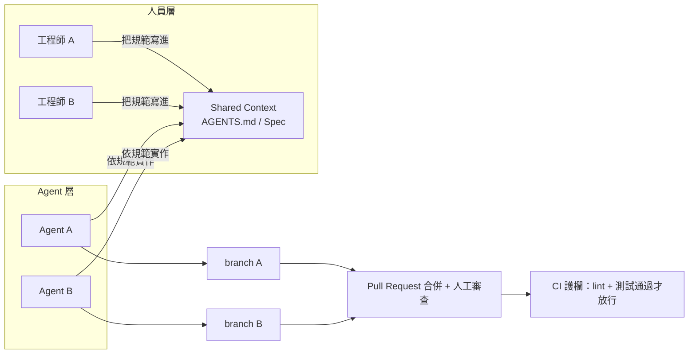

# 12.2 多人 + AI 的協同開發

## 從「一人 + AI」到「多人 + AI」

第 4.4 節我們討論過「一人 + AI」（Agentic Coding）：一位工程師主導一個終端機視窗，給 Code Agent 下指令，AI 生成程式碼，人負責審查。這是 AI 開發的「單人模式」。

但真實專案幾乎都是**多人協作**。於是問題來了：當團隊裡每個人都有自己的 AI 助手，而且每個助手都從各自的角度對同一份程式碼庫下指令，會發生什麼事？

- 工程師 A 的 AI 把 `utils.ts` 重構成新的 API
- 工程師 B 的 AI 沒人通知，繼續用舊 API 寫新功能
- 上線時兩邊的程式合不起來——**兩台 AI 打架了**

AI 的「打架」根源在於：**AI 沒有團隊記憶，也不懂默契。** 人類團隊靠會議、規範、默契協調行為，AI 只靠「你給它的那點上下文」。多人 + AI 的協同，核心課題就是把「默契」變成「制度的上下文」，讓所有 AI 看到同一套規則。

## 「打架」的三種典型型態

1. **規格衝突**：兩個 Agent 對同一個欄位名、同一支 API 簽約兩種不同定義
2. **權責衝突**：兩個 Agent 同時「自認有權」改同一支函式，互相覆蓋
3. **狀態迷失**：Agent 不知道同事已經改了某些檔案，基於過期資訊產生新程式碼

這三種衝突人類團隊也有，但人類會**停下來問人**，AI 只會**依照眼前看到的資料繼續往下寫**。因此協定必須比人類團隊更明確、更機器可讀。

## 如何避免 AI 互相打架

**原則一：把「默契」寫成「規範」，讓所有 AI 共享。** 12.3 節的 Shared Context（AGENTS.md / CLAUDE.md 等）就是這個原則的落地。凡是不希望 AI 猜的決策，都寫成只有一種讀法的規則，例如「一律使用 kebab-case 命名 URL」「不要改 `migrations/` 底下已發佈的檔案」。

**原則二：用規格切分權責，避免同一份工作被兩個 Agent 同時開工。** 12.1 節提到的規格（Spec）裡每一筆需求，一次只指派給一位負責人連同他的 Agent。任務邊界清楚了，AI 就沒有「越權」的想像空間。

**原則三：靠版本控制與 CI 兜底。** 就算規範再完善，衝突仍然可能發生。Git branch + Pull Request 讓兩個人的 AI 產出各自隔離，最後由人來合併與審查；CI 的自動測試則在合併前把「規格衝突」和「API 破壞」直接抓出來（12.4 節）。

## 平行還是串行：讓 Agent 分工的方式

多人 + AI 協作有兩種基本排程：

- **平行分工**：每個人的任務彼此獨立（不同的模組、不同的服務），AI 之間不需要溝通。這最省時，但前提是「介面必須先由規格釘死」——不然收斂時才發現對不上。
- **串行接力**：A 完成前端、B 接棒做後端、C 最後整合。每一棒都以「上一棒寫好的規格」為輸入，AI 的上下文永遠是「最新的產出」。

資深團隊的經驗是：**能用平行就用平行，但平行依賴的堅固介面（OpenAPI、Prisma Schema，見 12.3 節）必須先存在。** 而不確定性高的部分，用串行小步更安全。

## 審查，比以往更重要

即使所有 AI 都守規矩，人仍然是品質的**最終承擔者**（本書一貫立場）。多人 + AI 的團隊裡，工程師的主要工作從「寫程式碼」變成：

1. 把需求寫成夠清楚的規格
2. 檢查 AI 產出是否符合規格與規範
3. 合併各分支時，處理規格層面的衝突

這正是 12.1 節說的「指揮官與架構師」角色。看得懂、改得動、負得起責的工程師，是多人 + AI 團隊唯一能當「守門員」的存在。

## 本章小結

- 一人 + AI 是「單人模式」，多人 + AI 的挑戰在於**AI 沒有團隊默契**
- AI 打架的三種型態：**規格衝突、權責衝突、狀態迷失**
- 三個避戰原則：**規範共享（Shared Context）、規格切分權責、Git + CI 兜底**
- **平行分工靠堅固介面、串行接力靠最新規格**
- 多人 + AI 時代，工程師的核心職責是**寫規格、審查、處理衝突**

## 想一想

1. 觀察你兩個同學的 AI 同時改同一個專案，列出你看到的三種衝突，並對應到本節的三種型態。
2. 為什麼「介面先由規格釘死」是平行分工的前提？沒有規格硬釘會發生什麼？
3. 你認為「審查 AI 產出」比「自己寫」省力嗎？省在哪、費在哪？