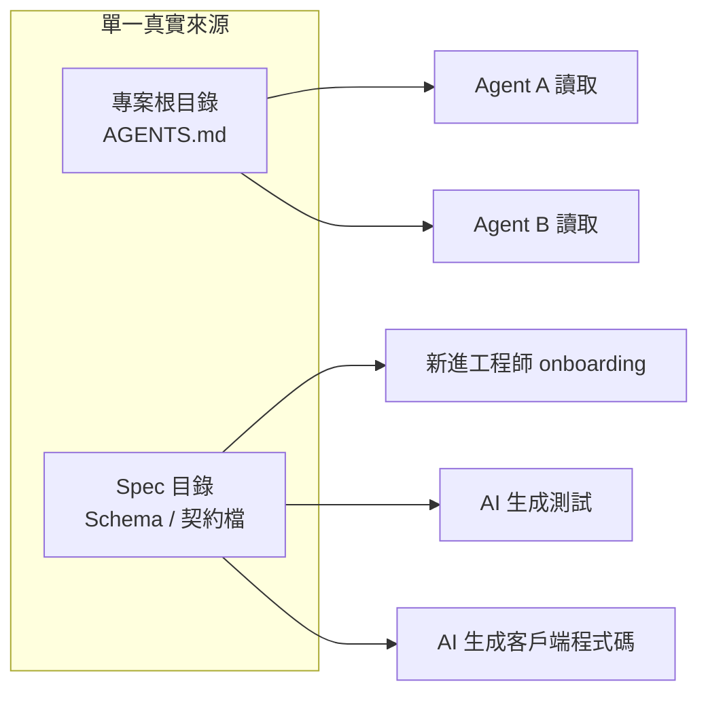

# 12.3 統一 AI 的全局認知：Shared Context

## AI 只看到它「眼前」的檔案

人類的協作靠「共通的背景知識」：我們在開會時講過要遵守命名規則、知道公司慣例、記得老闆的偏好。這些背景知識不會寫進每一行程式碼，但它無處不在、自動生效。

AI 沒有這種背景知識。**Code Agent 每次工作時，只看得到上下文（Context）裡給它的那些內容**——開啟的檔案、終端機輸出、以及被明確載入的指令。如果團隊的慣例沒有寫成文字，對 AI 來說就等於「根本不存在」。這就是**Shared Context（共享上下文）**要解決的問題：把團隊的默契，翻譯成每個 Agent 都讀得到的文字。

問題是：你的團隊可能有 N 個工程師，每個工程師又開了 N 個 Agent 視窗。**如果慣例分散在每個人的嘴巴或記憶裡，就會產生 N 種「默契」。** Shared Context 的目標，是讓所有 Agent（以及所有人）讀到**同一份、唯一的規則**。

## 專案級的 AI 規範檔案

業界發展出了幾種把指令寫進專案的慣例，本質都是在「與程式碼庫同目錄」放一份給 AI 讀的說明書：

| 檔案 | 來源生態 | 定位 |
|------|----------|------|
| `.cursorrules` | Cursor 編輯器 | AI 規則（含元件寫法等） |
| `CLAUDE.md` | Claude Code / 相關工具 | 專案說明 + 團隊協定 |
| `AGENTS.md` | 通用 Agent 生態（OpenCode 等） | 為 AI 寫的「崗位說明書」 |

這類檔案通常包含：專案架構簡介、技術棧與命令、命名與風格慣例、禁止事項（例如「不要提交 `node_modules`」「不要在 `main` 上直接 commit」）、以及常見坑。**它們不是給人看的文件，是給 AI 看的合約。** 12.2 節說的「把默契寫成規範」，實作上就是這些檔案。

## 單一真實來源：讓「話」只有一個版本

多份規則檔案本身可能打架：`CLAUDE.md` 說用 `snake_case`，`.cursorrules` 說用 `camelCase`——AI 該聽誰的？

治理原則叫**單一真實來源（Single Source of Truth, SSOT）**：每一件事實、每一條規則，在整個團隊裡**只能有一個權威版本**，其他位置只能「引用」它，不能「複製」它。

複製帶來的問題在 12.2 節已經出現過：兩個工程師各寫一份 API 定義，很快就會不一致。SSOT 的做法是**只有 `schema/` 底下那支 `openapi.yaml`（或 `schema.prisma`）是權威**，任何程式碼、測試、文件都從它產生，不允許手寫第二份。

## 以 Schema 作為共享規格：兩個實例

模組或服務之間的介面，是最容易發生「AI 打架」的地方，因此最需要 SSOT。兩個實務標準：

**OpenAPI（以前叫 Swagger）**：用來描述 REST API 的機器可讀規格。它同時定義了路徑、參數、回應型別、錯誤格式。一個 OpenAPI 檔案可以自動生成：伺服器端 stub、客戶端 SDK、API 文件、甚至測試案例。**前端 Agent 與後端 Agent 各自讀同一份 OpenAPI，就能用同一個世界觀做事。**

**Prisma Schema**：定義資料庫模型（ORM 層）。欄位名稱、關聯、型別、關聯唯一性都集中在 `schema.prisma`。多個 Agent 若各自瞎猜資料表結構，產出的查詢必然互相衝突；只要所有 Agent 從同一份 Schema 出發，欄位命名與資料型別就自然一致。

關鍵心法：**「共享規範」要選機器可讀的格式**。`.md` 的描述永遠有解釋空間，而 `openapi.yaml`、`schema.prisma` 是可直接被解析、驗證、當真值用的。規範越「可執行」，AI 越沒有誤讀空間。

## 讓規則自動送達，而不是靠人記住

單有檔案還不夠，還要有**分發機制**。好的團隊會：

1. 把 `AGENTS.md` 放在專案根目錄，讓所有 Agent 啟動時自動載入，而不是放在某個工程師自己的 `~/` 設定檔裡
2. 用 CI 檢查「是否有人違反契約」——例如在合併入庫前對照 OpenAPI 做契約測試（12.4 節）
3. 新人（無論人類或 AI）的第一課都是讀根目錄的說明書

Shared Context 成熟之後，團隊的體驗是：**不用再擔心「哪個 AI 不知道規矩」**。因為所有 AI 都從同一個事實來源起跑，12.2 節的「打架」自然大幅減少。

## 本章小結

- **AI 沒有背景知識**，只看得到上下文給它的內容，所以默契必須寫成文字
- 專案級 AI 規範：**`.cursorrules` / `CLAUDE.md` / `AGENTS.md`**，是給 AI 看的崗位說明書
- **單一真實來源（SSOT）**：事實與規則只能有一個權威版本，其他位置只能引用
- **OpenAPI 與 Prisma Schema** 是高度機器可讀的共享契約，讓多個 Agent 共用同一世界觀
- 規範要有**分發機制**：放在專案根目錄、由 CI 驗證、新人第一課

## 想一想

1. 在你自己的專案建立一份 `AGENTS.md`，列出三個「不希望 AI 猜」的慣例，並想想它分別對應 12.2 節的哪種衝突。
2. 為什麼「機器可讀的 Schema」比 `.md` 描述更能避免歧義？各舉一個誤讀例子。
3. 若兩份規則檔案打架，SSOT 原則建議怎麼處理？為什麼不允許兩邊同時修改？