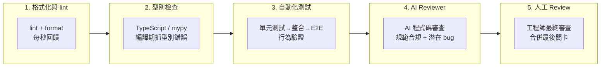
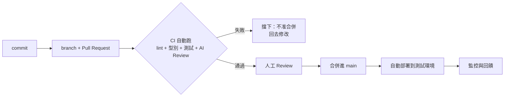

# 12.4 自動化品質護欄與 CI/CD

## AI 世代，品質把關必須自動化

12.1 節講過，AI 把「寫程式碼」速度拉得飛快；但同時，AI 也會**自信地寫出錯誤程式碼**。越快的生產引擎，越需要一件可靠的煞車。在 AI 大量產生程式碼的時代，**把品質把關交給「掃一次、按一個按鈕就跑完」的自動化系統**，是唯一跟得上 AI 速度的選擇。

品質護欄（Quality Guardrail）的概念，就像高速公路的護欄：不保證車子永遠不會偏，但保證**一偏出線就被擋住**，而不是等車子翻下山才發現。護欄必須**自動、快速、每次都跑**——依賴「人記得要檢查」的護欄，等於沒有護欄。

## 五道護欄，從便宜到昂貴

**1. lint 與格式化**：報酬率最高的一關。統一風格、抓明顯錯誤、讓格式上下一致。工具如 ESLint、Ruff、Prettier 能在幾秒內掃完整個專案。

**2. 型別檢查**：TypeScript、mypy 等靜態型別檢查，能在編譯期抓出「給錯檔案、傳錯型別」這類 AI 最容易犯的錯。它比測試便宜、比 lint 更有「正確性」保證。

**3. 自動化測試**：單元測試 → 整合測試 → E2E 測試（第 5 章的測試金字塔）。對 AI 生成的程式碼尤其重要，因為**「AI 相信自己的輸出」，只有測試能獨立驗證行為是否符合預期**。

**4. AI Reviewer**：讓一個「與撰寫者無關的 AI」審查另一個 AI 的產出，檢查命名風格、安全性、是否符合 Spec、有沒有明顯的 bug。AI 審 AI 不能取代人，但能完成「閱讀、整理、標註可疑處」這種高重複性工作，人工審查時就如同有了一個預先把危險區標好紅線的助理。

**5. 人工 Review**：最貴、最後、最不可省。人（尤其對專案有 ownership 的工程師）負責最終的「符不符合需求、負不負得起責」，此為第 12.2 節反覆強調的守門員角色。

## CI/CD：讓護欄「不被跳過」

護欄如果只是「每個人自己選擇要不要跑」，就會被偷偷跳過——「我改一行而已，不用掃了吧？」。**CI/CD 的意義在於強制執行**：任何程式碼要進 `main`，一律先經過自動化管線，不通過就不許合併。

以 GitHub Actions 為例：每開一個 PR，機器人自動執行整條管線，紅燈就不給合併。這把「品質把關」從「工程師的個人紀律」變成「流程鐵律」——不分誰寫的、寫得快慢，一律跑完護欄才能合併。

## AI 時代護欄的進化：AI 驗證 + 契約測試

有幾道新護欄是 AI 世代才有的：

- **AI 生成的測試**：讓 AI 依 Spec 自動生成測試案例，先寫測試、再驗證程式碼（呼應 Spec-Driven Development），測試與實作互為鏡像、互相監督。
- **契約測試（Contract Testing）**：用 12.3 節的 OpenAPI 契約，自動檢查「前端呼叫的 API 簽約」與「後端實作的 API 簽約」是否一致——前端與後端由不同 Agent 各自產生，契約測試把「AI 打架」扭轉為「合併前就被抓到」。
- **AI 內容安全護欄**：檢查生成程式碼是否含提示注入風險（第 13 章）、是否洩漏 API 金鑰。

## 護欄不是越多越好

護欄會滋生維護成本：誤報太多會被忽略，跑得太慢會拖慢開發、AI 反而因此繞過 CI。務實原則：

1. **便宜的護欄優先**：先 lint，再型別，再測試
2. **快而準就讓它上 CI**：太慢或假警報多的檢查留在本地
3. **護欄本身也要測試**：定期檢查「護欄是否真的會抓錯」——故意提交一個 bug，確認 CI 攔得住

## 本章小結

- AI 越強，**自動化品質護欄**越必要，品質把關必須跟得上生產速度
- 五道護欄：**lint、型別檢查、自動測試、AI Reviewer、人工 Review**，從便宜到昂貴循序布置
- **CI/CD 讓護欄「無法被跳過」**：不通過就不允許合併，把紀律變成鐵律
- 新護欄：**AI 生成測試、OpenAPI 契約測試、內容安全檢查**
- 護欄以務實為上：便宜優先、快而準才上 CI、護欄本身也要被驗證

## 想一想

1. 找一個小專案，實際架設 GitHub Actions，依序加上 lint → 測試 → 合併規則，感受護欄把自己改動擋下來的過程。
2. 為什麼「人記住要檢查」不算護欄？護欄的必要特徵是什麼？
3. 若一個檢查常常誤報（對的程式碼也被抓出來），對團隊會產生什麼行為影響？用護欄理論說明。