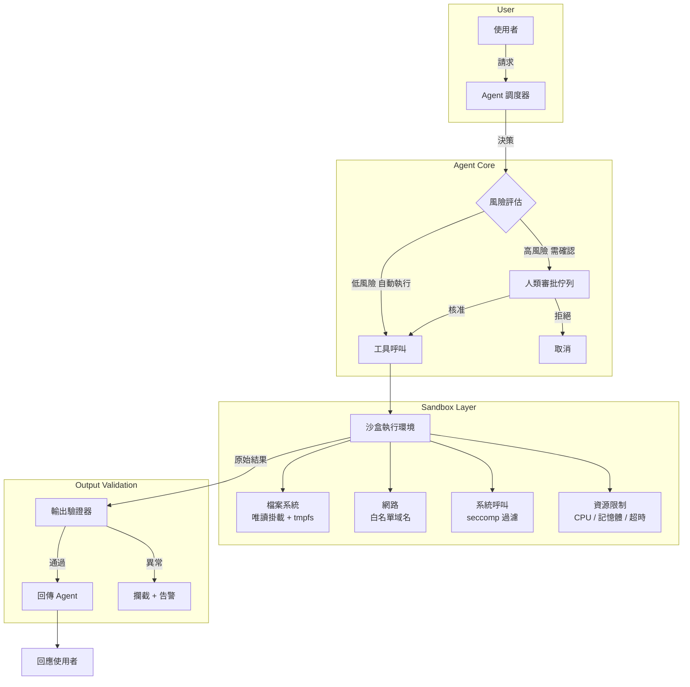

# 13.2 工具安全與權限控制

## 為什麼工具安全至關重要

在第 13.1 節中，我們看到提示注入可能導致 LLM 被操控來執行非預期操作。但這一切的前提是：Agent **確實擁有**可以造成傷害的工具。一個只能輸出文字的 LLM，最壞情況是產生不當內容；但一個能呼叫 Bash、讀寫檔案、執行金流交易的 Agent，一旦被劫持，造成的損害就可能是真實世界的損失。

因此，工具安全（Tool Safety）是 Agent 系統設計中不可妥協的核心議題。

## 故障安全預設值（Fail-Safe Defaults）

**所有能力預設關閉**，是工具安全的第一原則。

新的 Agent 系統上線時，不應自動綁定任何具有寫入能力或外部副作用的工具。每個工具都需要經過明確的授權流程才能啟用。這與傳統資安中的「預設拒絕」（Default Deny）原則一致。

實務上的實作方式：

- **工具註冊表**（Tool Registry）：所有可用工具集中管理，每個工具附帶元資料，包括用途描述、風險等級、所需權限。
- **啟用清單機制**：Agent 需要在設定中明確列出要啟用的工具，未列出的工具一律不可呼叫。
- **風險分級**：

| 風險等級 | 工具類型 | 範例 | 啟用條件 |
|---------|---------|------|---------|
| 低 | 只讀查詢 | 網頁搜尋、唯讀資料庫查詢 | 預設啟用 |
| 中 | 本地操作 | 檔案讀寫、Shell 執行 | 需明確啟用 |
| 高 | 外部副作用 | 發送郵件、金流交易、API 寫入 | 需逐次確認 |
| 極高 | 不可逆操作 | 刪除資料庫、撤銷部署 | 需人類審批 |

## 權限最小化（Principle of Least Privilege）

每個工具應只擁有完成其功能所**絕對必要**的最小權限。例如：

- 資料庫查詢工具只能 SELECT，不能執行 DROP 或 DELETE。
- 檔案工具只能操作特定目錄（如 `/workspace/`），不能存取 `/etc/` 或 `~/.ssh/`。
- 網路工具只能連線白名單上的域名，不能任意發出 HTTP 請求。

在實作上，這通常透過作業系統層級的機制來強制執行（如 Linux 的 namespace、seccomp、AppArmor），而非僅依賴模型自律。

## Sandbox 與隔離環境

### 為什麼需要沙盒

即使做了權限最小化，仍然可能有零日漏洞或未預期的權限提升路徑。沙盒（Sandbox）是最後一道防線：讓工具在隔離環境中執行，即使被攻破，影響範圍也受到限制。

### 沙盒實作層次

1. **語言層沙盒**：如 Python 的 RestrictedPython，限制可使用的內建函式。
2. **程序層沙盒**：使用 Linux namespace、seccomp-BPF 限制系統呼叫。
3. **容器沙盒**：使用 Docker/gVisor/Kata Containers 隔離檔案系統與網路。
4. **虛擬機沙盒**：最強隔離，但啟動成本較高，適合高風險操作。

### 工具沙盒示意圖



## 存取控制清單（ACL）

對於每一種工具的每一個操作，都應有明確的存取控制清單（Access Control List）。在 Agent 系統中，ACL 可以同時作用於三個層面：

### Agent 層 ACL

不同 Agent 角色擁有不同的工具存取權限。例如：

- 客服 Agent 只能讀取訂單資料，不能修改。
- 部署 Agent 只能觸發 CI/CD pipeline，不能直接操作伺服器。
- 研究 Agent 只能搜尋網頁和讀取文件，不能執行任意程式碼。

### 工具層 ACL

同一個工具對不同 Agent 或不同情境有不同權限。例如檔案系統工具：

- Agent A 只能讀寫 `/workspace/agent_a/`。
- Agent B 只能讀寫 `/workspace/agent_b/`。
- 所有 Agent 都不能存取 `/workspace/shared/secrets/`。

### 操作層 ACL

同一個工具的同一個操作，根據參數有不同的風險。例如 SQL 工具：

- SELECT 語句：自動執行。
- INSERT/UPDATE 語句：需日誌記錄。
- DELETE 語句：需人類確認。
- DDL（CREATE/DROP）：禁止執行。

## AI 使用高風險工具的安全設計案例

以 Bash 工具為例，說明如何在實務中結合上述原則：

```python
class BashTool:
    def __init__(self):
        self.allowed_commands = ["ls", "cat", "grep", "find", "wc"]
        self.blocked_patterns = ["rm ", "sudo ", "curl ", "wget ", "| sh"]
        self.max_execution_time = 30  # 秒
        self.workspace_root = "/workspace/"

    def execute(self, command: str, agent_id: str) -> ToolResult:
        # 1. 路徑正規化：防止路徑穿越
        resolved = os.path.realpath(command)
        if not resolved.startswith(self.workspace_root):
            return ToolResult(blocked=True, reason="路徑超出允許範圍")

        # 2. 命令白名單檢查
        base_cmd = command.split()[0]
        if base_cmd not in self.allowed_commands:
            return ToolResult(blocked=True, reason=f"命令 {base_cmd} 不在白名單")

        # 3. 危險模式過濾
        for pattern in self.blocked_patterns:
            if pattern in command:
                return ToolResult(blocked=True, reason="偵測到危險模式")

        # 4. 在沙盒中執行（帶超時）
        result = sandbox.run(command, timeout=self.max_execution_time)

        # 5. 輸出驗證
        if contains_sensitive_info(result.output):
            result.output = redact(result.output)

        return result
```

以金流工具為例，安全設計更為嚴格：

- 每筆交易都需人類在前端 UI 確認，Agent 只能「建議」交易，不能直接執行。
- 交易金額設有上限，超出部分需二次授權。
- 所有交易記錄寫入不可變更的審計日誌。
- 實作速率限制（Rate Limiting），防止被提示注入操控後大量轉帳。

## 本章小結

工具安全是 Agent 系統從「能做事」到「安全地做事」的關鍵跨越。核心原則包括：故障安全預設值（所有能力預設關閉）、權限最小化、Sandbox 隔離、以及精細的 ACL 控制。這些原則需要同時作用於 Agent 層、工具層、操作層，形成縱深防禦。記住：模型的智慧無法取代架構的約束——安全不能靠「希望模型不要做壞事」來保證。

## 想一想

1. 如果你的 Agent 需要執行 SQL 查詢，你會如何設計 ACL 來區分 SELECT、INSERT、UPDATE、DELETE 的權限？
2. 沙盒環境會帶來效能開銷。在需要即時回應的場景（如客服對話），你會如何在安全與效能之間取捨？
3. 設計一個「Agent 可以發送郵件」的工具安全方案：需要哪些層級的確認機制？如何防止 Agent 被提示注入後發送垃圾郵件？
