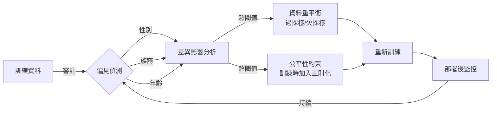
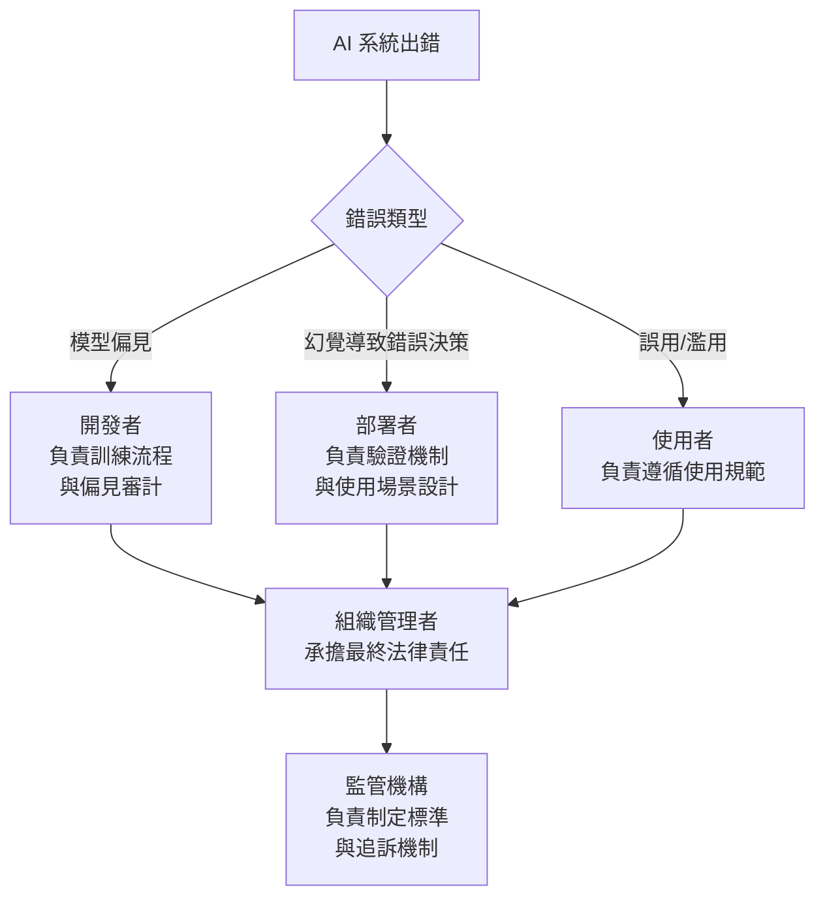

# 13.3 AI 的偏見、幻覺與責任歸屬

## AI 偏見：從資料到系統

AI 系統的偏見（Bias）並非憑空產生，而是從訓練資料、模型架構到應用部署的每個環節中被引入和放大的。

### 偏見的來源

**訓練資料偏見**是最根本的源頭。如果歷史資料中女性求職者的錄取率低於男性，模型就會學到「性別影響錄取決斷」這個模式。即使開發者沒有刻意加入性別特徵，模型仍可從郵遞區號、畢業學校等代理變數（Proxy Variable）中推斷出性別。

**標註偏見**來自資料標註者的主觀判斷。不同文化背景的標註者對「有毒言論」的標準不同，導致模型的毒性偵測在不同語言和文化群體上的表現差異巨大。

**部署偏見**發生在模型被應用於與訓練情境不同的場景時。一個在美國市場資料上訓練的信用評分模型，直接套用到東南亞市場時，可能系統性地低估某些群體的信用。

### 偏見的後果

偏見不僅是倫理問題，更是工程品質問題：

- **歧視性結果**：招聘工具低估女性候選人、貸款系統對特定族裔不利。
- **效能落差**：人臉辨識對深色膚色的錯誤率顯著高於淺色膚色。
- **信任崩壞**：一旦使用者發現系統對不同群體有差別待遇，整體信任就會瓦解。

### 偏見的檢測與緩解

實務上的關鍵做法：

- **多元化測試集**：確保測試資料覆蓋不同性別、年齡、族裔、語言等群體。
- **差異影響分析**（Disparate Impact Analysis）：量化不同群體間的結果差異，設定可接受閾值（例如：不同群體的通過率比值不低於 0.8）。
- **持續監控**：部署後持續追蹤模型在不同群體上的表現差異，偏見可能隨時間漂移。

## AI 幻覺：自信地說錯話

### 什麼是幻覺

AI 幻覺（Hallucination）是指模型生成了聽起來合理、語法正確、但事實上錯誤的內容。這不是偶發的 bug，而是 LLM 架構的固有特性——模型本質上是在預測「下一個最可能的 token」，而非查詢事實資料庫。

### 幻覺的來源

1. **訓練資料的缺口**：模型對訓練資料中不存在或稀少的主題，會「填補空白」，產生看似合理但不正確的內容。
2. **過度泛化**：模型學到的模式被錯誤地套用到不適用的情境。例如，知道「1997 年 IBM 深藍贏了棋賽」和「2011 年 Watson 贏了益智節目」，可能生成「2005 年 AI 首次在圍棋擊敗人類」（這是假的）。
3. **長上下文中的資訊遺失**：在長對話中，早期的關鍵細節可能被「稀釋」，模型在後續回應中產生不一致的內容。
4. **解碼策略**：Temperature 設得越高，模型越傾向「創意生成」，幻覺風險也越高。

### 幻覺的後果

在 Agent 系統中，幻覺的危害被放大，因為 Agent 會根據幻覺內容**採取行動**：

- Agent 幻覺出一個不存在的 API 端點，嘗試呼叫它導致錯誤。
- Agent 幻覺出一位不存在的客戶的訂單資訊，導致錯誤的客服回覆。
- Agent 在程式碼生成中幻覺出一個不存在的函式庫函式，產生無法執行的程式碼。

### 幻覺的防禦

- **檢索增強生成**（RAG）：讓模型基於檢索到的真實文件回答，而非僅依賴參數記憶。
- **引用與溯源**：要求模型標註資訊來源，使用者可驗證。
- **信心校準**：訓練模型輸出信心分數，低信心時主動表示不確定。
- **多模型交叉驗證**：用不同模型對同一問題生成答案，比較一致性。
- **工具輔助驗證**：讓 Agent 在回答事實性問題前，先用搜尋工具或知識庫查詢確認。

## 責任歸屬：誰為 AI 的錯誤負責

AI 出錯時，責任歸屬是法律、倫理與工程三個交匯的議題。在人機協作（Human-in-the-Loop）的框架下，核心原則是：**人類承擔最終責任**。

### 責任鏈模型

### 各方責任

- **AI 開發者**：有責任確保模型經過充分測試，已知偏見有文件記錄，幻覺風險有緩解措施。但開發者不對所有下游使用場景負責——這就是為什麼需要明確的使用條款。
- **應用部署者**：選擇將 AI 導入特定場景的人或組織，承擔主要的營運責任。例如：醫院使用 AI 輔助診斷，醫院必須確保有合格醫師做最終判斷。
- **AI Agent 系統設計者**：在 Agent 系統中，設計工具調度、權限控制、人類確認機制的工程師，直接影響了出錯時的損害範圍。設計越完善，出錯後的損害越小。
- **使用者**：最終操作者有責任理解工具的能力與限制，不應盲目信任 AI 輸出。在專業領域（醫療、法律、金融），專業人員有義務對 AI 輸出進行專業判斷。

### 關鍵原則：AI 輔助，人類決斷

在任何可能造成重大影響的決策中，AI 應扮演**輔助**角色，而非**替代**角色：

- AI 提供建議與分析，人類做最終決定。
- AI 的輸出必須附帶信心評估與不確定性聲明。
- 當 AI 無法達成足夠的信心水準時，應主動將決策權交還人類。
- 系統應記錄完整的決策軌跡，便於事後審計和責任追溯。

## 本章小結

AI 的偏見源於資料與系統設計的種種缺陷，幻覺則是 LLM 架構的固有特性。兩者都可能在 Agent 系統中造成真實世界的損害。防禦偏見需要從訓練到部署的全生命週期治理；防禦幻覺需要 RAG、引用驗證、信心校準等技術手段。而在責任歸屬上，核心原則是：AI 輔助決策，人類承擔最終責任。這不是推卸責任，而是確保每個決策環節都有人為品質把關。

## 想一想

1. 一家公司用 AI 篩選履歷，結果被發現對女性求職者有系統性歧視。責任應該歸屬於 AI 供應商、公司的人資部門，還是部署這套系統的 IT 部門？
2. 如果一個 AI 助手在回答客戶問題時產生了幻覺，導致客戶做出錯誤的投資決定，投資損失的責任歸屬如何劃分？
3. 如何設計一個 AI 系統，使得它在「不確定」時能主動說「我不確定」，而不是自信地給出錯誤答案？這在技術上有什麼困難？
