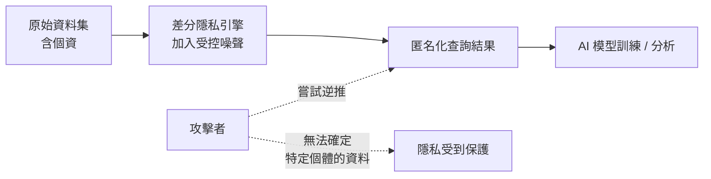
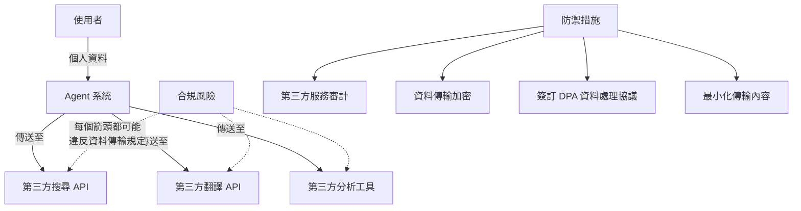

# 13.4 合規與隱私保護

## 資料合規的法規背景

當 AI 處理使用者資料時，必須遵守相關法規。不同司法管轄區有不同的要求，但核心精神一致：使用者對自己的資料擁有權利，組織有義務保護這些資料。

### 主要法規

**GDPR（一般資料保護規則）** 是歐盟制定的隱私保護法規，也是目前全球最具影響力的資料保護框架：

- **合法基礎**：處理個人資料必須有合法依據（同意、合約履行、合法利益等）。
- **資料主体權利**：包括查閱權、更正權、刪除權（被遺忘權）、資料可攜權、反對自動化決策權。
- **資料保護影響評估**（DPIA）：高風險的自動化處理（包括 AI 系統）需要事先進行影響評估。
- **違規通知**：發生資料外洩時，72 小時內必須通知監管機構。

**其他重要法規**包括：美國的 CCPA/CPRA（加州消費者隱私法）、巴西的 LGPD、台灣的個資法、中國的《個人資料保護法》等。

### AI 對合規帶來的新挑戰

AI 系統特別容易觸犯合規紅線，原因包括：

- **模型訓練使用個資**：將個人資料用於模型訓練，可能違反「目的限制」原則。
- **模型記憶**：訓練後的模型可能在輸出中「記憶」並洩漏訓練資料中的個資。
- **自動化決策**：使用 AI 進行信用評分、招聘篩選等，可能觸發 GDPR 的自動化決策條款。
- **跨境傳輸**：AI 模型通常部署在雲端，使用者資料可能跨境傳輸，觸發 GDPR 的跨境資料傳輸限制。

## 隱私保護的技術手段

### 資料最小化（Data Minimization）

**只收集、只處理、只保留必要的資料**。這是隱私保護的核心原則。在 AI 系統中的實踐：

- **輸入過濾**：在資料進入 LLM 之前，先用正則表達式或 NER 模型過濾掉個資（姓名、身分證號、信用卡號等）。
- **匿名化與假名化**：
  - **完全匿名化**：移除或替換所有可識別個人的資訊。
  - **假名化**：用假名替換真實姓名，保留映射表但在嚴格控制下存取。
- **差分隱私**（Differential Privacy）：在訓練資料或查詢結果中加入受控噪聲，使得無法從輸出推斷出任何單一使用者的資料。

### 差分隱私的直覺理解

差分隱私的數學直覺是：無論某位使用者的資料是否存在於資料集中，查詢結果的分佈幾乎相同。這使得攻擊者無法透過比較有無某位使用者時的結果差異，來推斷該使用者的資料。

### 聯邦學習（Federated Learning）

資料不離開使用者的裝置，只將模型更新傳回伺服器進行聚合。這從根本上減少了中央化資料收集帶來的隱私風險：

- 每個使用者的原始資料始終留在本地。
- 只有模型梯度（經加密）被傳輸。
- 中央伺服器只看到聚合後的更新，無法反推個別使用者的資料。

但聯邦學習並非萬靈丹——梯度逆向工程攻擊（Gradient Inversion Attack）在某些條件下仍可能從梯度中還原出部分原始資料。

## AI 處理使用者資料的風險

### 風險一：模型資料外洩

LLM 可能在輸出中意外洩漏訓練資料中的敏感資訊。2023 年的研究已證實，透過精心設計的提取攻擊（Extraction Attack），可以從某些模型中提取出訓練資料的片段，包括姓名、電話、電子郵件等個資。

**防禦措施**：
- 訓練資料嚴格清洗，移除所有個資。
- 部署後的模型定期進行資料提取測試。
- 使用差分隱私訓練，降低模型記憶個資的能力。
- 輸出過濾器攔截可能含有個資的內容。

### 風險二：對話記錄的隱私

Agent 系統通常需要保存對話歷史以維持上下文連貫性，但這些記錄可能包含使用者分享的敏感資訊。

**防禦措施**：
- 對話記錄加密儲存，存取需授權。
- 設定保留期限，過期自動刪除。
- 提供使用者查看和刪除自己對話記錄的介面。
- 敏感對話內容不進入模型的持續學習。

### 風險三：第三方工具的資料傳遞

Agent 在調用外部工具時，可能將使用者資料傳給第三方服務：

**防禦措施**：
- 對第三方服務進行隱私影響評估。
- 與第三方簽訂資料處理協議（DPA），明確其資料保護義務。
- 傳輸前對資料做最小化處理——只傳必要欄位。
- 優先使用不需傳送原始資料的 API（如：本地化的模型、匿名化的查詢）。

## 隱私保護的工程實踐

### Privacy by Design

將隱私保護嵌入系統設計的每個環節，而非事後補救：

- **預設隱私**：系統預設採用最嚴格的隱私設定，使用者可選擇放寬。
- **端對端加密**：使用者與 Agent 之間的通訊全程加密。
- **零信任架構**：系統內部的每個元件間通訊也需驗證與加密。
- **透明性**：向使用者清楚說明哪些資料被收集、如何使用、保留多久。

### 合規檢查清單

在部署 AI Agent 系統前，應確認以下事項：

- 是否已完成資料保護影響評估（DPIA）？
- 使用者是否已獲得充分告知並給予同意？
- 資料收集是否符合最小化原則？
- 資料是否在必要的期限內保留？
- 是否有機制讓使用者行使查閱、更正、刪除等權利？
- 資料跨境傳輸是否有合法機制（如 SCCs、充分性認定）？
- 第三方服務是否已簽訂資料處理協議？
- 是否有資料外洩應變計畫？
- AI 模型是否經過資料提取攻擊測試？
- 對話記錄與使用日誌的存取控制是否完善？

## 本章小結

AI 系統處理使用者資料時面臨嚴峻的合規挑戰。GDPR 等法規要求組織在資料收集、處理、儲存、傳輸的每個環節都遵循嚴格規範。技術上的防禦手段包括資料最小化、匿名化、差分隱私、聯邦學習等。AI 特有的風險（模型記憶洩漏、對話記錄隱私、第三方資料傳遞）需要額外的保護機制。Privacy by Design 的理念要求將隱私保護從一開始就嵌入系統架構，而非事後補丁。合規不是一次性的工作，而是需要持續監控與更新的長期承諾。

## 想一想

1. 一個 AI 助手需要讀取使用者的行事曆來安排會議，哪些資料可以傳送給 LLM，哪些應該留在本地？如何在功能與隱私之間取得平衡？
2. 如果你的 AI 系統要從歐洲擴展到亞洲市場，不同國家的隱私法規差異會帶來哪些技術與營運上的挑戰？
3. 差分隱私透過加入噪聲來保護隱私，但噪聲會降低資料的準確性。在醫療 AI 等需要高精確度的場景中，你會如何在隱私保護與模型精確度之間做取捨？
