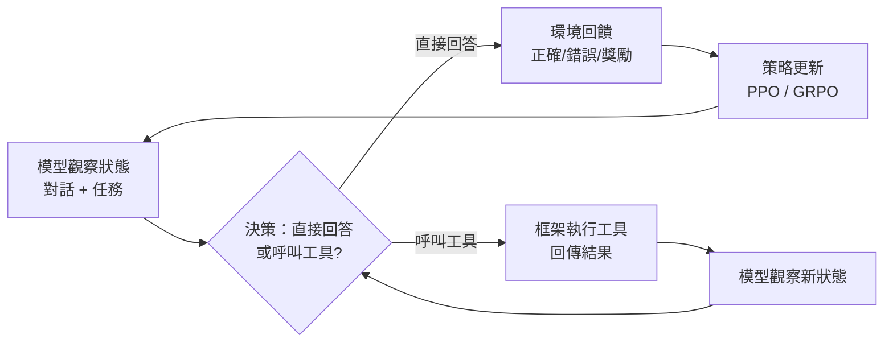

# 14.1 模型即 Agent：RL 內化工具呼叫決策

## 從框架兜底到模型自主

回顧本書第二篇，我們在第八章建立了「Agent = LLM + 上下文 + 工具」的基本公式，在第九章透過 Harness（約束、驗證、糾正）為 Agent 裝上安全機制。在目前的實踐中，大量決策由框架或 Prompt 模板承擔：什麼時候該呼叫工具、呼叫哪個工具、如何組裝參數，這些策略主要靠工程師在 Prompt 中指示、在 Harness 中約束。

這代表一個重要事實：**模型本身尚未「學會」做 Agent——它只是在框架引導下扮演 Agent。**

但研究與產業界正在快速推進另一條路：**Model as Agent**——透過強化學習（Reinforcement Learning），把工具呼叫的決策策略直接內化進模型參數。模型不再只是被動地「被框架推著走」，而是主動「學會什麼時候該拿工具」。

## RL 內化的是決策，不是執行

這裡有一個關鍵區分，值得反覆強調：

**強化學習內化的是「決策策略」，不是「工具執行能力」。**

模型透過 RL 學會的，是「在這個狀態下，呼叫搜索工具比直接回答更可能得到正確答案」這類判斷。但工具本身——搜索引擎、程式碼解釋器、資料庫查詢引擎——仍然由外圍框架提供。模型不直接執行 SQL、不直接發 HTTP 請求，它只是輸出一個結構化的「呼叫請求」，由框架代為執行後將結果回傳。

用一個比喻：RL 內化的是「知道何時該打電話」的能力，而不是「電話線路」本身。線路屬於基礎設施，永遠在模型之外。

這為什麼重要？因為它界定了**模型能力的邊界**。即使模型的決策策略再精準，工具的執行仍然受限於外圍環境。安全性、可靠性、可觀測性——這些仍然需要 Harness 來保障。

## 訓練流程：從環境回饋中學習

Model as Agent 的訓練流程大致如下：

在每一個決策點，模型嘗試不同的策略組合。環境（或模擬器）根據最終結果給予回饋。透過大量迭代，模型逐漸學會哪些情境適合直接回答、哪些情境需要工具輔助、哪些工具組合能更有效地完成任務。

這與第九章的 Harness 工程形成一個有趣的張力：**Harness 是人工設計的規則，RL 訓練是從經驗中萃取的策略。** 兩者解決的是同一個問題——「Agent 什麼時候該做什麼」——但路徑截然不同。

## 當前邊界與實務意義

目前，Model as Agent 仍處於早期階段，但已有幾個明確的趨勢：

- **模型自主決策的範圍在擴大**：從簡單的單工具選擇，到多步驟的工具鏈編排
- **訓練數據的品質決定了策略上限**：垃圾數據訓練出的決策策略，會導致模型在錯誤時機呼叫工具
- **Harness 不會消失，但角色在轉變**：從「替模型做決策」轉為「為模型的決策設定安全邊界」

對軟體工程師而言，這意味著你現在設計的 Agent Harness——那些約束、驗證、糾正機制——將來可能成為模型訓練環境的一部分。**你今天寫的規則，明天可能變成模型學會的直覺。**

## 本章小結

- **Model as Agent** 透過 RL 把工具呼叫策略內化進模型參數
- RL 內化的是**決策策略**，工具執行仍在模型之外
- Harness 與 RL 解決同一問題，但路徑不同：**人工規則 vs 經驗萃取**
- 未來趨勢：模型自主決策範圍擴大，Harness 角色從「決策者」轉為「安全邊界守護者」

## 想一想

1. 如果模型透過 RL 學會了「何時該呼叫工具」，那第九章的 Harness 約束機制是否變得不再必要？為什麼？
2. 「RL 內化決策」與「Prompt 工程引導決策」在本質上有什麼不同？各自的優劣是什麼？
3. 想像一個場景：模型學會在回答數學題前先呼叫計算器。如果計算器工具有一天壞了，模型會如何表現？這暴露了什麼風險？
