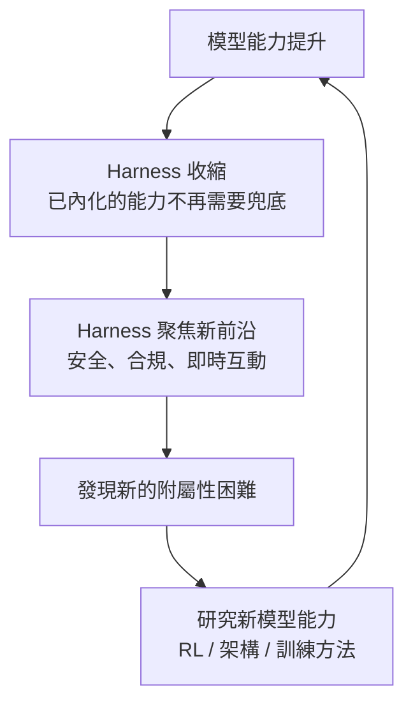

# 14.2 模型與 Harness 的共同演進飛輪

## 兩股力量的交織

本書一路走來，我們反覆看到兩個角色的互動：**模型**（LLM）負責理解與生成，**Harness**（框架、約束、驗證、糾正機制）負責兜底與保護。這兩股力量並非靜態平行，而是動態交織——它們構成了一個**共同演進飛輪**。

理解這個飛輪，是理解 AI 工程未來走向的關鍵。

## 苦澀的教訓與它的啟示

Rich Sutton 在 2019 年寫下著名的「苦澀的教訓」（*The Bitter Lesson*）：

> AI 研究的歷史反覆證明一件事：利用大量算力的通用方法，最終總是戰勝人類精心設計的專用方法。

這段話的原始語境是搜尋與學習，但它的精神同樣適用於 Agent 工程：**模型的通用能力每提升一步，Harness 中那些替它「補短板」的專用機制就可能變得過時。**

然而，與苦澀的教訓不同的是，Agent 工程不會完全拋棄 Harness。因為 Harness 不只是「補能力不足」，它同時承擔**安全約束、合規保障、可觀測性**等責任——這些不是模型能力提升就能自動消失的。Brolin 的「沒有銀彈」（*No Silver Bullet*）在此延伸：**模型能力是銀彈嗎？不，它只是降低了附屬性困難的成本，本質性困難——複雜性管理——依然存在。**

## 飛輪的運作機制

飛輪的運轉邏輯如下：

**第一步：模型能力提升。** 新一代模型學會了更複雜的決策——多步推理、工具鏈編排、甚至 14.1 節討論的 RL 內化策略。過去需要 Harness 用規則處理的場景，模型現在可以自主完成。

**第二步：Harness 收縮。** 隨著模型能力內化了某些決策，Harness 中對應的兜底機制就不再必要。例如，早期的 Agent 框架需要硬編碼「遇到計算問題就呼叫計算器」，現在模型自己知道何時該做這件事。這些規則可以移除，Harness 變得更輕量。

**第三步：Harness 向新前沿遷移。** 收縮不等於消失。Harness 把精力投向模型尚未覆蓋的領域——例如 14.3 節討論的即時互動與持續學習、例如安全紅線的硬性約束、例如跨系統的合規審計。這些是模型短期內難以自主處理的。

**第四步：新的附屬性困難浮現。** 每當模型突破一項能力，新的使用場景隨之出現，帶來新的附屬性困難。這些困難推動進一步的研究與模型訓練。

飛輪thus 重新轉動。

## 實務啟示：Harness 的設計哲學

理解飛輪後，對實務工作有三個重要啟示：

**一、不要把 Harness 設計得太「死」。** 如果你把某個兜底邏輯寫死在框架裡，當模型學會這項能力後，你的框架就成了技術債。好的 Harness 應該是**可組合、可替換、可移除**的——就像 3.1 節講的模組化設計。

**二、追蹤模型能力的前沿。** 你不一定要讀論文，但至少要知道：模型目前在哪些場景已經可靠？哪些場景仍需 Harness 兜底？這個邊界每個季度都在移動。

**三、投資模型無法替代的能力。** 飛輪轉動意味著模型會持續侵蝕 Harness 的領地。你需要把精力放在模型短期內無法內化的領域：跨組織的合規、多系統的整合、倫理判斷、以及——最重要的——定義問題本身（見 14.4 節）。

## 本章小結

- 模型與 Harness 構成**共同演進飛輪**：模型內化能力 → Harness 收縮 → 聚焦新前沿 → 新困難 → 模型進一步突破
- **苦澀的教訓**提醒：通用能力終將戰勝專用補丁
- **沒有銀彈**提醒：模型不是銀彈，本質性困難永存
- 實務啟示：Harness 設計要**可移除**，追蹤模型前沿，投資不可替代能力

## 想一想

1. 回顧你在第九章設計的 Harness，其中哪些兜底機制可能在未來被模型內化？你會如何設計它們以便未來移除？
2. 苦澀的教訓說「通用方法戰勝專用方法」，但在 Agent 工程中，Harness 的安全約束似乎不會被模型取代。你同意嗎？為什麼？
3. 如果你是團隊的 Tech Lead，你會如何決定「這項能力應該用 Harness 實現還是等模型進步」？你的判斷標準是什麼？
