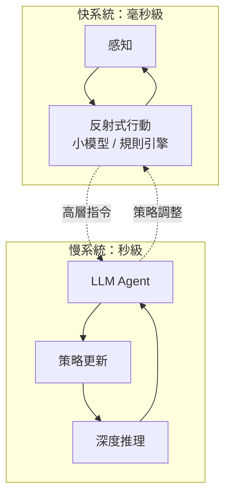

# 14.3 兩朵烏雲：即時互動與持續學習

## 物理學的啟發

1900 年，開爾文爵士宣稱物理學晴空萬里，只剩「兩朵烏雲」——後來它們分別催生了相對論與量子力學。今日的 Agent 工程，同樣面臨兩朵尚無優雅解法的烏雲。

## 第一朵烏雲：即時互動

目前的 Agent 以「回合制」運作：使用者輸入 → 模型思考 → 工具呼叫 → 結果回傳 → 模型回應。每個回合涉及一次完整的 LLM 推理，延遲通常在數百毫秒到數秒之間。

但真實世界充滿**即時互動**場景：

- 語音對話要求回應延遲低於 300 毫秒（11.2 節）
- 機器人操控需要毫秒級的感知-行動迴圈
- 協同編輯要求多人 + AI 的操作近乎同步

問題的核心是：**LLM 推理是慢的，但互動要求是快的。**

### 快慢分離架構

目前最有希望的方向是**快慢分離**：把 Agent 的運作拆成兩個時鐘頻率不同的系統。

**快系統**（類似 Daniel Kahneman 所說的 System 1）：用小型模型或規則引擎處理即時反應——避障、語音即時回饋、緊急停機。它不需要深度推理，只需要低延遲。

**慢系統**（類比 System 2）：用大型 LLM 做深度推理——規劃、多步驟工具鏈、複雜判斷。它的輸出是高層策略，下發給快系統執行。

這種架構借鑑了認知科學的雙系統理論，也與 11.2 節討論的事件驅動架構相呼應。但它的挑戰在於：**快慢系統之間的介面如何設計？策略如何即時同步？** 這些是尚未完全解決的工程問題。

另一個方向是**推理加速**：推測性解碼（Speculative Decoding）、模型量化、硬體加速。如果推理延遲能降到個位數毫秒，快慢分離的必要性就會降低。但以目前的趨勢看，推理成本與延遲的下降速度，仍跟不上即時互動場景的需求增速。

## 第二朵烏雲：持續學習

人類Agent（也就是你我）有一項令人羨慕的能力：**從經驗中持續學習。** 你不需要重讀整本教科書才能學會新東西——你從日常互動中不斷調整認知模型。

目前的 LLM 做不到這一點。模型一旦訓練完成，其參數就凍結了。它不會因為跟你對話了一千次而變得更了解你。每次對話都是「失憶」的——10.4 節討論的持續進化閉環，本質上是在模型外部構建記憶與學習機制。

### 持續進化 vs 持續學習

這裡有一個重要的概念區分：

- **持續進化（Continuous Evolution）**：模型不變，透過外掛的記憶庫、經驗資料集、定期微調等方式，讓 Agent 的整體行為不斷改善。這是目前的實踐路徑。
- **持續學習（Continual Learning）**：模型本身在部署後持續更新參數，從每次互動中直接學習。這是理想的終極狀態。

兩者之間的鴻溝，在於一個根本性的問題：**模型在部署後更新參數，如何避免災難性遺忘（Catastrophic Forgetting）？** 神經網路在學習新任務時，傾向於覆蓋舊任務的知識。對人腦而言，這就像學了法文後忘記了中文。

### 小世界假設 vs 大世界假設

Agent 工程中還有另一個值得深思的張力，可以借用語言學家 John 邱的「小世界假設 vs 大世界假設」框架來理解：

- **小世界假設**：Agent 在受限環境中操作——有限的工具集、明確的任務範圍、可預期的互動模式。這是目前大多數 Agent 的現實。在小世界中，持續進化（外掛記憶 + 定期微調）通常夠用。
- **大世界假設**：Agent 在開放環境中運作——未知的工具、突發的任務、不可預期的互動。這是 Agent 的長期願景。在大世界中，只有真正的持續學習才能應對。

目前的 Agent 工程師，大部分時間在小世界中工作，但必須為大世界的到來做準備。這意味著架構設計要足夠靈活，能容納尚未出現的工具與任務。

## 本章小結

- **第一朵烏雲（即時互動）**：LLM 推理太慢，與即時場景需求衝突
  - 方案一：**快慢分離**——小模型負責即時反應，大模型負責深度推理
  - 方案二：**推理加速**——降低延遲，但短期內難以完全解決
- **第二朵烏雲（持續學習）**：模型凍結後無法從經驗中直接學習
  - 目前路徑：**持續進化**（外掛記憶 + 定期微調）
  - 長期目標：**持續學習**（模型本身在部署後更新），但面臨災難性遺忘
- **小世界 vs 大世界**：目前 Agent 工程多在小世界中運作，架構設計需為大世界留有彈性

## 想一想

1. 如果你正在設計一個語音 Agent（像 Siri 或 Alexa），你會如何劃分快系統與慢系統的邊界？哪些決策屬於快系統？
2. 「持續進化」與「持續學習」之間的鴻溝，對你的 Agent 系統架構有什麼具體影響？你會如何設計記憶機制？
3. 想像一個 Agent 在開放環境（大世界）中運作：它遇到一個從未見過的工具。它應該如何「學會」使用這個工具？與你在小世界中遇到新工具的處理方式有何不同？
