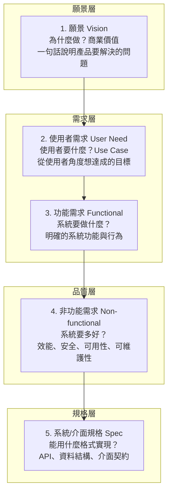

# 2.1 需求的本質：從模糊意圖到精確規格

## AI 時代最大的誤區

許多人以為，有了 AI 就不需要做需求分析了。這個誤區很危險，值得在第一節就戳破。

事實是：**AI 不懂人類社會的真實痛點、商業目標與組織政治。** AI 是邏輯與語法極強的「執行者」，但它沒有真實的使用者體驗，更無法替商業決策承擔責任。

回顧 1.4 節的結論——AI 無法消滅「需求的模糊性」這本質性困難。因此，**需求分析（Requirements Analysis）非但不會消失，反而成為人類工程師最重要的價值所在。** 本書第一章指出，工程師的核心能力之一是「定義問題」，這正是需求工程的核心。

## 需求：軟體工程的起點

需求（Requirements）是「系統應該做什麼」的描述。它是整個軟體工程的**輸入**——如果輸入是錯的，後面所有設計、實作、測試都建立在錯誤的基礎上，成本會隨著時間指數膨脹（見 6 章）。

但「需求」這個詞有另一個陷阱：**使用者說出來的，往往不是他們真正想要的。** 這就是需求工程的精髓——**在模糊的自然語言與精確的、可執行的規格之間，搭建一座橋。**

## 需求的分層：從願景到規格

一個成熟的團隊，會把「需求」拆成幾個層次，每層的抽象程度與負責人不同：

從上到下，抽象程度遞減、精確程度遞增。傳統軟體工程的問題在於：**最底下那層（Spec）與最上面那層（願景）之間，隔著巨大的鴻溝，而且中間的轉譯全靠人力、且常常斷裂**。

## 使用者需求 vs 功能需求的區別

這是需求工程最基本的區別，初學者很容易混淆：

- **使用者需求**：以「使用者」為主語，描述使用者想達成的目標。例：「我想要在手機上查看明天餐廳有沒有空位。」
- **功能需求**：以「系統」為主語，描述系統必須提供的功能。例：「系統應顯示指定日期、時間的可用桌位數量。」

為什麼要區分？因為**同一個使用者需求，可以有多種不同的功能實現方式**。釐清「使用者真正要達成什麼」，能避免過早陷入「系統該怎麼做」的細節，保留設計的自由度。

## 非功能需求：常常被遺忘的關鍵

功能需求回答「系統**做**什麼」，非功能需求回答「系統做得**好**不好」。後者常被忽略，卻往往決定成敗：

- **效能（Performance）**：回應時間、吞吐量
- **安全性（Security）**：認證、授權、資料保護
- **可用性（Availability）**：系統宕機時間上限
- **可維護性（Maintainability）**：修改的成本
- **可擴展性（Scalability）**：能承受多大的成長
- **可用性體驗（Usability）**：使用者多容易上手

一個經典例子：功能需求「系統能處理訂單」很簡單，但非功能需求「系統在購物節高峰期每秒能處理 10000 筆訂單、且 99.99% 時間可用」——這才是真正困難、也真正有價值的需求。非功能需求常常是架構設計（第 3 章）的主要驅動力。

## 需求的本質：對話與闡明

需求不是一次訪談就能「收集」到的——這個詞本身有誤導性。更精確的比喻是：需求是被**闡明（elicit）**出來的，透過反覆的對話、提問、澄清，把模糊的想法一步步變成精確的規格。

這在本質上是**人與人之間的溝通**，而不是機械的「記錄」。理解使用者沒說出口的隱性需求（例如「倉管員戴手套滑鼠不好用，需要全鍵盤操作」這種現場情境），需要同理心與深入現場，這是 AI 目前無法取代的（見 2.5 節）。

## 需求變更：一個永恆的常態

軟體需求幾乎總會變。這就是 1.2 節說的「可變性」本質困難。面對變更，傳統瀑布式流程（一次把需求定死、逐階段進行）往往失敗，因為它假設需求能一次想清楚。後續章節會介紹敏捷與迭代的開發方式（第 12 章），其核心就是在擁抱需求變更的前提下工作。

## 本章小結

- **需求分析不會被 AI 取代**，反而更加重要
- 需求分五個層次：**願景、使用者需求、功能需求、非功能需求、規格**
- **使用者需求 ≠ 功能需求**，要區分「使用者要達成什麼」與「系統要做什麼」
- **非功能需求**常被忽略，卻決定架構與成敗
- 需求是**被闡明的**，透過反覆對話把模糊變精確
- 需求變更是常態，需要迭代式開發來應對

## 想一想

1. 用「訂位系統」為例，分別寫出它的「使用者需求」和「功能需求」各 3 條。
2. 為什麼同一個使用者需求可以有不同的功能實現？舉例說明。
3. 為什麼非功能需求「只在特殊時刻才重要」，卻往往最難實現？
