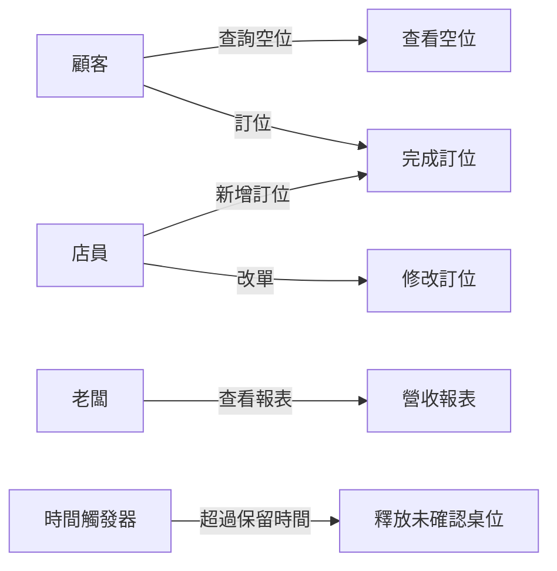

# 2.3 用例建模與使用者故事

## 從「系統要做什麼」回到「使用者要做什麼」

需求分析最重要的視角轉換，是**從「系統的功能」轉向「使用者的目標」**。很多團隊一談需求就開始列「系統要有登入、要有搜尋、要有報表」——這是從系統內部往外看，容易淪為功能清單，卻看不出這些功能服務於誰、為什麼存在。

兩個廣為使用的工具，幫助我們把視角拉回使用者身上：**用例圖（Use Case）**與**使用者故事（User Story）**。

## 用例（Use Case）

用例是一個經典的需求建模工具，來源於 UML（統一建模語言）。它用來描述：**一個或多個參與者（Actor），如何與系統互動，以達成一個對使用者有價值的目標。**

一個用例由三個核心組成：

- **參與者（Actor）**：與系統互動的角色，可以是人、外部系統或時間觸發器。
- **目標（Goal）**：參與者想要達成的事。
- **主流程（Main Flow）與替代流程（Alternate Flow）**：達成目標的步驟，以及各種例外情況下的處理。

### 舉例：訂位系統的用例

參與者：顧客、店員、老闆、時間觸發器

用例：「顧客完成訂位」

**主流程**：
1. 顧客輸入日期、時間、人數
2. 系統查詢並顯示可用桌位
3. 顧客填入姓名、電話
4. 系統確認並鎖定桌位
5. 系統送出確認通知

**替代流程**：
- 2a. 沒有可用桌位 → 系統顯示候補選項
- 3a. 顧客填寫資料不完整 → 系統提示補齊
- 4a. 桌位在確認瞬間已被搶走 → 系統提示重新選擇

用例的價值在於：**它強制你思考「誰在什麼情境下、想達成什麼目標、碰到什麼阻礙」，把抽象的「需求」變成具體的「情境劇本」**。畫用例圖（見下）可以快速看出系統涉及哪些角色、提供哪些服務，但真正的精華在於用例的**文字敘述**——尤其是那些替代流程，那才是需求能否落地的關鍵。



## 使用者故事（User Story）

敏捷開發（見第 12 章）採用了另一種更輕量的描述方式：**使用者故事**。它用一個簡單的句式，捕捉「誰、想要什麼、為什麼」：

> **作為（as a）＿＿＿，我想要（I want）＿＿＿，以便（so that）＿＿＿。**

例如：

> 作為一位**顧客**，我想要**在手機上預先訂位**，以便**到餐廳時不用排隊等待**。

使用者故事的三大特點：

1. **短**：通常寫在一張便條紙/一個便簽上，不追求詳盡
2. **以價值為中心**：清楚表達「為什麼」要這個功能
3. **是對話的起點**：使用者故事本身是「談話的邀請」，細節在後續對話與驗收條件中補齊

使用者故事對應的完整規格，通常加上**驗收條件（Acceptance Criteria）**，說明「怎樣才算做完」。這在 AI 時代特別重要（見 2.6 節）——因為驗收條件就是「AI 要達成的可驗證目標」。

## 用例 vs 使用者故事

兩者是解決類似問題的兩種工具，了解它們的取捨能幫助你選擇：

| 面向 | 用例（Use Case） | 使用者故事（User Story） |
|------|-----------------|------------------------|
| **來源** | 傳統 RUP/UML 流程 | 敏捷開發 |
| **詳細程度** | 詳盡，有完整流程與替代流程 | 精簡，一句話 + 驗收條件 |
| **時機** | 專案早期、需求嚴謹時 | 迭代中、逐步細化 |
| **重點** | 系統與參與者的互動情境 | 使用者想要的價值 |
| **生命周期** | 較正式，一次性 | 活的，可在迭代中演進 |

**實務建議**：兩者不衝突。大型或關鍵的流程（如支付），適合用用例把替代流程想清楚；日常功能，用使用者故事快速推進即可。本書之後的章節會頻繁用到「使用者故事 + 驗收條件」這個組合，因為它和 AI 開發（Spec-Driven Development）的契合度最高。

## 把使用者故事轉成驗收條件

驗收條件讓使用者故事從「對話邀請」變成「可驗證的規格」。常見的書寫方式：

```
作為顧客，我想要線上訂位，以便到餐廳免排隊。

驗收條件：
- Given 我是已登入顧客
- When 我選擇周五 19:00、4 人
- Then 系統顯示該時段可用桌位
- And 我選擇桌位後，系統鎖定該桌位並寄出確認通知
```

這裡用到了「Given-When-Then」的結構，來自行為驅動開發（BDD, Behavior-Driven Development）。本書第 5 章會說明，**這種結構化的驗收條件，可以直接轉換成自動化測試**——這正是「規格即程式碼（Spec is Code）」的核心，也是 AI 時代需求分析的關鍵橋樑。

## 本章小結

- 需求分析的視角，要從**系統功能**回到**使用者目標**
- **用例**：參與者 + 目標 + 主/替代流程，適合嚴謹地分析互動情境
- **使用者故事**：作為___我想要___以便___，精簡、以價值為中心
- 使用者故事 + **驗收條件**（Given-When-Then）= 可驗證的規格
- 兩者不衝突，可依情境混用

## 想一想

1. 為「線上訂位系統」的「取消訂位」寫一個用例，列出主流程與至少 3 個替代流程。
2. 用「作為…我想要…以便…」寫出 3 個關於訂位系統的使用者故事。
3. 把你寫的其中一個使用者故事，配上 Given-When-Then 的驗收條件。
