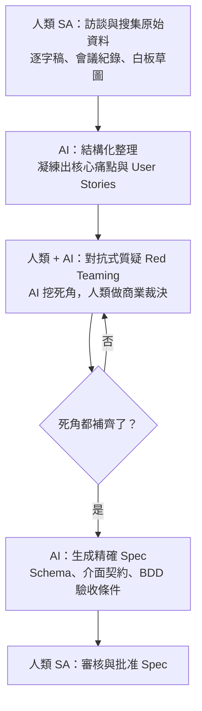

# 2.5 AI 輔助需求分析：Red Teaming Prompting

## SA 的新角色：從「翻譯官」到「指揮官」

傳統系統分析師（SA）的角色，是「把客戶說的人話，手工翻譯成工程師看的技術文件」。這是個辛苦的「轉譯」工作，而且容易在開發過程中與程式碼脫節。

AI 時代，SA 的角色升級為「**系統導演與品質把關者**」：負責引導 AI 補全邏輯死角，並審查 AI 產出的規格是否真正符合商業價值。前面 1.5 節把這個角色描述為「指揮官」，本節具體展示 SA 如何「指揮」AI 挖掘需求。

其中最關鍵的一套技術，就是 **Red Teaming Prompting（紅隊提問）**。

## 什麼是 Red Teaming

**Red Teaming（紅隊）** 源自軍事與資安領域：有一支「紅隊」專門扮演敵人，想辦法攻破系統、找出弱點，以檢驗「藍隊」的防禦是否可靠。

應用到需求分析，就是**故意讓 AI 扮演「嚴苛的批評者」「駭客」「資深 QA」，專門去挖掘你的需求裡有哪些漏洞、邊界案例和思維盲點**。它的核心心法是一句話：

> 不能只問「這功能怎麼做？」，要強迫 AI 問「這功能哪裡會搞砸？」

你越是明確地賦予 AI 一個「找麻煩」的角色，它越能發揮 LLM 見過大量案例的優勢，幫你補齊自己想不到的死角。

## 四大核心 Prompt 技巧

讓 AI 扮演紅隊時，可以從四個角度切入：

### 1. 反向邊界探索（Reverse Boundary Probing）

要求 AI 專門尋找「可能搞砸的地方」——網路中斷、併發衝突、極端輸入。

> 「你是一位極度嚴苛的資深系統分析師。我們正在設計【訂位系統】。請不要寫程式碼，先列出至少 8 個我可能忽略的邏輯漏洞、極端狀況與狀態死角，每個都要說明可能的風險與建議的處理規則。」

### 2. 多角色視角切換（Multi-Perspective Prompting）

要求 AI 分別從「資深 QA」「資安工程師」「使用者體驗設計師」等多個角色角度，對同一需求提出質疑。不同角色看到的盲點不同，合起來更完整。

> 「請同時扮演資深 QA、資安工程師、UX 設計師三個角色，分別從品質、安全、體驗三個角度，質疑這個訂位系統的需求。」

### 3. 狀態轉移檢查（State Machine Probing）

對有狀態轉變的業務（訂單、退款、審核），強迫 AI 檢查非法狀態跳轉與不完整流程。

> 「訂單有 待付款 / 已付款 / 已取消 / 已退款 等狀態。請檢查：是否存在非法的狀態跳轉？如果使用者在『已付款』時按取消，應該發生什麼？如果退款失敗，訂單停在什麼狀態？」

### 4. 約束條件極限化（Boundary Constraints）

對數量、時間、空間等維度進行極值提問。

> 「請就『訂位人數』這個參數，逐一分析：人數為 0、1、2、超過最大容量、負數、極大值時，系統應如何處理？」

## 一個完整的工作流程

把這些技巧串起來，AI 輔助需求分析的典型流程是：



關鍵在於第 3 步——**先質疑、後生成**。永遠先讓 AI 把風險和邏輯死角清點出來，等你確認補償策略後，才讓它生成正式的規格。不要跳過質疑、直接讓 AI「做東西」。

## 需求分析師的新核心競爭力

過去評價一個 SA，看的是「Word 文件寫得多長、UML 圖畫得多標準、需求文件格式多規範」。現在評價的標準完全改變了：

- **過去的 SA**：比的是文件產出速度與格式標準
- **現在的 SA**：比的是誰能同理使用者的真實痛點，並能用正確的 Prompt 驅動 AI 挖出所有邏輯漏洞，最後做出正確的商業裁決

**問題定義能力與邏輯深度，取代了文檔撰寫能力。** AI 提供了無限的解答能力，但人類必須提供唯一的「問題與情境」。沒有正確的問題，AI 產出的只會是一堆結構完美、卻解決不了真實問題的垃圾。

## 一個實際的 Prompt 範本

下面是一個可以直接套用的紅隊提問範本，適合在需求分析初期使用：

```
你現在是一位極度嚴苛的資深系統分析師。我們正在設計【模組名稱，例如：優惠券套用與結帳系統】。

基本需求如下：
【簡述需求：例如：使用者輸入優惠券代碼，符合條件即扣抵金額並發起結帳】

請不要幫我寫程式碼。請針對以下面向，提出至少 8 個我可能忽略的邏輯漏洞、極端狀況與狀態死角：

1. 時間與時區（過期、臨界點、系統時間不一致）
2. 併發與重複操作（Race Conditions、Double Submission）
3. 狀態跳轉與取消（取消時的資源釋放、退款、中途斷線）
4. 極端數值（金額低於 0、折扣大於原價、負數數量）

每個問題請說明『可能發生的風險』與『建議的處理規則』。
```

## 本章小結

- SA 的角色從**翻譯官**轉變為**指揮官與品質把關者**
- **Red Teaming**：故意讓 AI 扮演批評者，挖掘需求漏洞
- 四大技巧：**反向邊界探索、多角色視角、狀態轉移檢查、約束極限化**
- 完整流程：**訪談 → 結構化 → 對抗式質疑 → 生成規格**，核心是「先質疑後生成」
- 新競爭力：**問題定義能力與邏輯深度**，取代文檔撰寫能力
- AI 提供解答能力，人類提供**問題與情境**

## 想一想

1. 用本節的紅隊 Prompt 範本，對「訂位系統」跑一次，看看 AI 挖出哪些你沒想過的死角。
2. 為什麼「先質疑、後生成」這麼重要？如果跳過質疑直接讓 AI 做，會發生什麼？
3. 你覺得一位好的「系統分析師」此刻最重要的 3 項能力是什麼？
