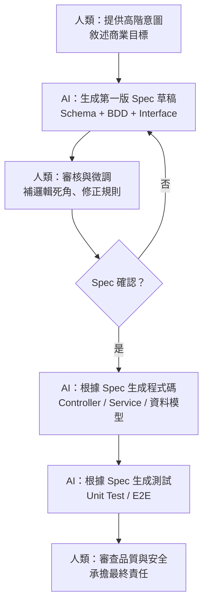

# 2.6 Spec-Driven Development：可執行的規格

## 一個關鍵問題：精確規格要如何產生

第 2.1 節提到，需求的最底層是「可執行的規格（Spec）」。而 2.5 節的結論說，人類要「產出精確的規格」。這裡浮現了 AI 時代最核心的一個命題：

> **過去的程式設計是「把需求翻譯成程式碼（Code）」；未來的程式設計，則是「把模糊想法翻譯成精確規格（Spec）」。**

很多人會問：「可是規格要怎麼寫得精確？」這正是本節要解開的問題。我們稱這個方法為 **Spec-Driven Development（規格驅動開發）**——一種讓「規格即程式碼（Spec is Code）」成為可能的新開發方式。

## 從「人讀」到「人和機器都能讀」的規格

傳統的需求規格是**給人讀**的自然語言文件（Word、PDF、UML 圖）。這種文件的最大問題是：**模糊、會過期、無法直接被執行**。

AI 時代的規格，是一份**結構化、可執行、人和 AI 都能讀**的文件。它有幾種典型的形式，每一種都「精確到可以直接拿來生成程式碼和測試」：

### 1. 可執行的資料/介面規格（Schema）

以結構化方式精確定義資料結構、欄位型別、驗證規則與 API 介面。AI 可以直接讀取 Schema 來自動建立資料庫模型、產生資料驗證邏輯與 API 伺服器。

以 TypeScript 的 Zod 為例——

```typescript
import { z } from 'zod';

// 定義商品項目規格
export const CartItemSchema = z.object({
  productId: z.string().uuid(),
  quantity: z.number().int().positive(),
  price: z.number().positive(),
});

// 定義結帳請求的精確規格
export const CheckoutRequestSchema = z.object({
  userId: z.string().uuid(),
  items: z.array(CartItemSchema).min(1),
  paymentMethod: z.enum(['CREDIT_CARD', 'LINE_PAY', 'APPLE_PAY']),
  couponCode: z.string().optional(),
});

// AI 可直接利用此 Schema 進行資料驗證，免寫額外 if/else
export type CheckoutRequest = z.infer<typeof CheckoutRequestSchema>;
```

這份 Schema 同時是人類可讀的規格、程式會執行的驗證邏輯、以及 AI 生成程式碼的輸入。一個規格多重用途，這就是「可執行」的意義。

### 2. 行為規格（BDD / Gherkin）

用 Given-When-Then 結構定義行為與邊界情境，AI 讀取後可直接轉化成自動化端到端測試。

```
Feature: 線上購物結帳邏輯
  身為一個已登入的購物者
  我希望能使用折扣碼完成付款

  Scenario: 成功使用有效折扣碼結帳
    Given 使用者 "User_123" 已經登入
    And 購物車內包含商品，單價 100 元、數量 2 件
    When 使用者輸入折扣碼 "SAVE20"
    Then 系統應計算總金額為 160 元
    And 系統應呼叫付款 API，金額為 160 元

  Scenario: 購物車為空時結帳失敗
    Given 使用者清空了購物車
    When 使用者嘗試結帳
    Then 系統應拒絕並回傳錯誤碼 "EMPTY_CART"
    And 不應進行任何扣款
```

### 3. 架構介面規格（TypeScript Interfaces）

定義模組邊界、服務合約，確保 AI 產出的程式碼嚴格符合架構，不出現型別不匹配。

```typescript
export interface CheckoutResult {
  orderId: string;
  status: 'SUCCESS' | 'FAILED' | 'PENDING';
  totalAmount: number;
  transactionTime: Date;
  errorMessage?: string;
}

export interface ICheckoutService {
  executeCheckout(request: CheckoutRequest): Promise<CheckoutResult>;
}
```

## Spec-Driven 開發的三重核心

把上面的例子總結起來，Spec-Driven Development 有三大核心：

### 1. 契約優先（Contract-First）

**在生成業務邏輯程式碼之前，先定義好介面契約與資料結構。** 因為介面是「契約」，定了參數與傳回型別，前端、後端、各模組才能獨立開發。契約靠 Schema / Interface 鎖定，AI 依契約生成實作，就不會跑偏。

### 2. 測試先行（Test-First 的延伸）

**先根據 Spec 寫出測試案例，再讓 AI 去填實作讓測試通過。** 這其實是「測試驅動開發」在 AI 時代的自然延伸——只是現在「寫測試讓人類通過」變成了「寫測試讓 AI 通過」。好的驗收條件就是可驗證的規格。

### 3. 規格模組化（Modular Spec）

**不要試圖用一份巨大的 Spec 描述整個系統。** 把系統拆成獨立的小模組（認證、支付、通知），每個模組有自己的 Spec。這有兩個好處：一是符合「高內聚、低耦合」（見第 3 章），二是避免一次給 AI 太多上下文（Context 過大時 AI 容易出錯，這是第 7 章的主題）。

## 人機分工：誰來寫 Spec？

一個自然的問題是：**這三份 Spec 由人寫還是 AI 寫？**

答案沿用 2.5 節的框架：「**人類主導概念與目標，AI 負責寫出規格，最後由人類審核確認。**」人類不需要從零逐字寫 Schema 或 TS Interface，而是提供高階意圖，讓 AI 生成草稿，人類再把關微調。

| 規格類型 | 人類負責的部分 | AI 負責的部分 |
|---------|--------------|--------------|
| BDD（Gherkin） | 商業目標與核心邊界：「我要結帳流程，有折價券，購物車空的要擋掉」 | 自動轉為 Given-When-Then，並反問：「折價券過期？金額為負？」補齊邊界 |
| TS Interface | 架構決策：「用單體還是微服務？要抽象化金流嗎？」 | 依架構決策產生 Interface、Enum、Service Contract |
| 可執行 Schema | 資料驗證規則：「密碼至少 8 碼」「數量不能小於 0」 | 把自然語言規則轉成正確的 Zod / OpenAPI 語法 |

## 完整流程

一個完整的 Spec-Driven 開發循環是：



值得注意的是，這個流程把**人從「寫實作」解放出來，集中到「前端定義問題、後端把關品質」**（呼應 1.5 節）。而 Spec 是整個循環的「單一真實來源（Single Source of Truth）」——程式碼改了，Spec 應該同步更新；Spec 改了，AI 重新生成對應實作。

## 傳統 Spec vs AI 時代 Spec

| 面向 | 傳統 Spec | AI 時代 Spec |
|------|----------|-------------|
| 撰寫者 | 完全由 PM / 架構師手寫 | 人類引導 + AI 自動補全與對齊 |
| 表達形式 | 繁複的自然語言 PDF / Word / UML | 可執行的 Schema、BDD、TS Interfaces |
| 維護成本 | 極高（Code 改了，Spec 就過期） | 極低（AI 雙向同步） |
| 精確度要求 | 容忍某種模糊 | 需嚴格邏輯一致（作為 AI 生成程式碼的 Prompt） |

一句話總結：**在 AI 時代，「寫精確 Spec」就是新時代的「寫程式」（Specification is Code）。** 人類工程師的核心功力，不再是記得多少語法或函式庫，而是**能否清晰地定義問題邊界、輸入輸出規格，以及判斷 AI 補全的邏輯是否有死角**。

## 本章小結

- **Spec-Driven Development**：規格即程式碼
- 三種可執行規格：**可執行 Schema、BDD/Gherkin、TS Interface**
- 三大核心：**契約優先、測試先行、規格模組化**
- 人機分工：**人類主導概念與目標，AI 寫規格草稿，人類審核**
- Spec 是**單一真實來源**，驅動程式碼與測試的生成
- 「寫精確 Spec」就是 AI 時代的「寫程式」

## 想一想

1. 用「訂位系統」為例，嘗試寫一份小的 Zod Schema（或你熟悉語言的對應）定義訂位請求。
2. 為什麼規格要模組化，不能一份大文件包整個系統？
3. 你覺得「Spec 是單一真實來源」這句話，在多人 + AI 協作時為什麼特別重要？（提示：見第 12 章）
