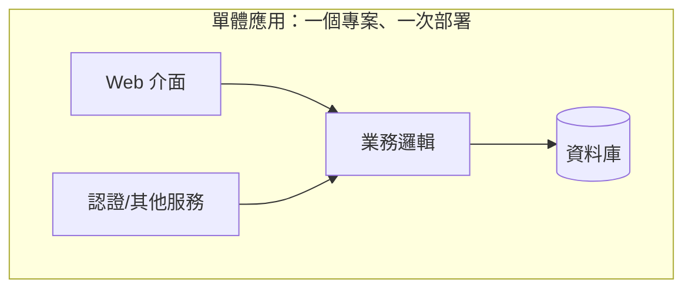
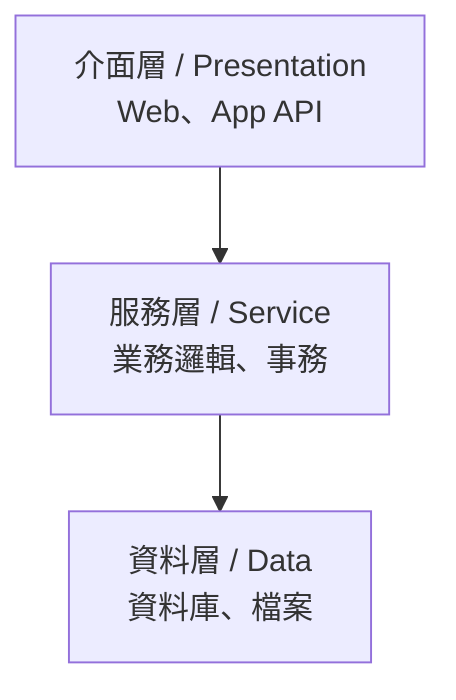
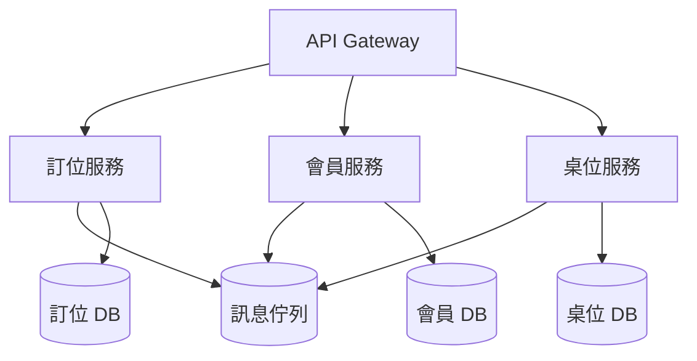
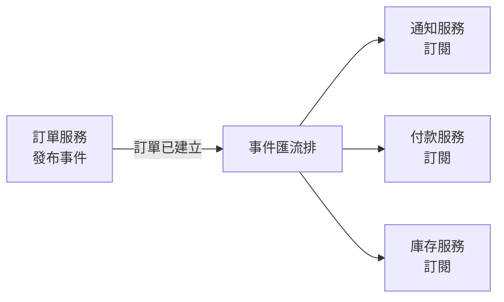

# 3.2 架構模式：從單體到微服務

## 架構：全局的骨架

上一節討論的模組化，是「單元內」的設計。**軟體架構（Architecture）**則關心更高一層的問題：整個系統由哪些部分組成、它們如何互動、採用什麼結構。

架構選擇是軟體工程中最重大的決策之一——因為**架構一旦決定，就很難改變**。換一個架構，往往等於重寫整個系統。因此架構設計的核心，是理解各種架構模式的**取捨（Trade-off）**。

本節沿著一條經典的演進線，介紹幾種最重要的架構模式。它們不是「誰取代誰」的關係，而是各有適用的場景。

## 單體架構（Monolithic）

**單體架構**是把整個應用打包成**一個**可執行的單元。所有功能——介面、業務邏輯、資料存取——都在同一個程式、同一個執行環境中。

**優點**：
- 簡單、易於理解與開發
- 部署簡單（一個檔案/容器）
- 效能好（無跨服務通訊）

**缺點**：
- **一整塊太大**：程式碼越多越難理解、越難維護（違反高內聚？其實是缺乏結構）
- **難以獨立擴展**：某個功能吃資源，整個應用都得擴
- **困難的變更**：改一行可能牽動整個應用，部署風險高
- **團隊協作困難**：幾十人同時改一個大型程式庫，衝突頻繁

**適合場景**：小型專案、新創 MVP、團隊小、功能少而穩定時。**單體架構是被過度詬病、卻也是最實用的架構**——不要因為「聽起來不酷」就嫌棄它。

## 分層架構（Layered）

分層架構是單體內部的一種組織方式，也是最常見的架構風格。它把系統按「關注點」分成幾層，例如經典的三層：

分層的關鍵紀律是**依賴方向**：上層依賴下層，而下層不依賴上層。這樣可以隔離變更——改資料庫，不該影響介面層（透過服務層與資料層的介面隔離）。

**優點**：結構清晰、職責分明、易於理解。
**缺點**：層次多了會僵化、效能有損耗、容易「串層」（跳過中間層直接呼叫）。

## 微服務架構（Microservices）

**微服務**把系統拆成**多個小而獨立、可獨立部署的服務**，每個服務負責單一業務能力，透過網路（通常是 HTTP/REST 或訊息佇列）互相通訊。

**優點**：
- **獨立部署/擴展**：某個服務可以單獨擴容、單獨發布
- **技術多樣**：不同服務可用不同語言、不同資料庫
- **團隊自治**：每個服務可由一個小團隊自主負責（符合「熔斷」與團隊邊界）
- **故障隔離**：一個服務掛了，不至於拖垮整個系統

**缺點**：
- **複雜度爆炸**：分散式系統的網路、一致性、除錯都非常困難
- **跨服務事務困難**：要保證多服務間的一致性（分布式事務）極具挑戰
- **運維成本高**：監控、部署、服務發現、流量治理都需要額外基礎設施
- **效能損耗**：跨服務網路呼叫比本機呼叫慢

**一個廣為流傳的比喻**：微服務不是「把單體拆小」，而是「把單體拆成很多個分散式系統」。而分散式系統（Distributed Computing）有一個著名的註解（Leslie Lamport）：

> 「分散式系統，就是一台你無法再透過上面的軟體故障知道它哪裡壞了的電腦。」

**適合場景**：大型專案、多團隊協作、需要獨立擴展、業務邊界清晰時。**不適合**：小型專案——它的複雜度會壓垮你。

## 事件驅動架構（Event-Driven）

事件驅動架構中，系統各組件透過**非同步事件**而非同步請求來鬆散耦合地互動。某個組件發布事件（如「訂單已建立」），其他組件訂閱並回應，彼此不需要直接知道對方存在。

**優點**：高度解耦、可擴展、能處理非同步與高吞吐場景。
**缺點**：事件流難以追蹤與除錯、最終一致性（資料在某段時間不一致）、事件管理複雜。

## 如何選擇：架構的取捨

架構沒有「最好」，只有「最合適」。選擇的核心是對照**非功能需求**（見 2.1 節）：

| 面向 | 傾向單體 | 傾向微服務 |
|------|---------|-----------|
| 團隊規模 | 小團隊（<15人） | 多個獨立團隊 |
| 業務複雜度 | 簡單、邊界模糊 | 成熟、業務邊界清晰 |
| 擴展需求 | 需求有限 | 需要獨立、彈性擴展 |
| 對可用性的容忍 | 可接受整體重啟 | 需故障隔離與局部降級 |
| 運維能力 | 有限 | 有成熟 DevOps 團隊 |

**實務建議（業界反覆強調）**：**先從單體開始，不要一開始就上微服務**。很多知名公司（Netflix、Amazon 等）也是先做成單體，等規模與業務邊界成熟後，才逐步拆出微服務。一個流行的說法是「Modular Monolith（模組化單體）」——先保持單體，但內部嚴格模組化，一旦需要再拆微服務。這是最務實的起步策略，符合作為教科書要傳達的精神：**架構是演進的，不是一步到位的。**

## AI 時代的架構考量

AI 時代，架構設計多了一個維度——**你的系統要不要整合、如何整合 AI Agent**。例如：

- 傳統的**確定性流程**（如訂單處理）與 **AI 的非確定性決策**（如智能客服）如何共存？
- 是否需要把 AI 能力封裝成獨立服務（例如「推薦服務」「客服 Agent」）？
- AI Agent 的工具與知識庫，放在架構的哪一層？

本書第二篇會深入談 AI Agent 的架構。這裡先記一個原則：**架構決策的權衡（Trade-off）思維，是 AI 時代同樣需要、甚至更加重要的能力**。因為 AI 讓「寫程式」變便宜了，而「設計架構」這件本質性工作（1.4 節）的價值反而更加凸顯。

## 本章小結

- **架構**關心整個系統的結構與互動，是所有決策中最難更改的
- **單體**：簡單、適合小專案/新創
- **分層**：單體內部的組織方式，依賴自上而下
- **微服務**：多個獨立小服務，適合大型多團隊系統，但複雜度高
- **事件驅動**：非同步鬆散耦合，適合高吞吐場景
- **實務建議**：先單體、後演進，不要一上來就上微服務
- 架構選擇的本質是**取捨**，對照非功能需求決定

## 想一想

1. 為什麼「先做單體」常常是更好的起點？何時你才會真正需要拆微服務？
2. 微服務的高複雜度來自哪裡？（提示：網路、一致性、監控）
3. 用取捨的觀點，分析「事件驅動架構」比「同步請求架構」好和壞在哪裡。
