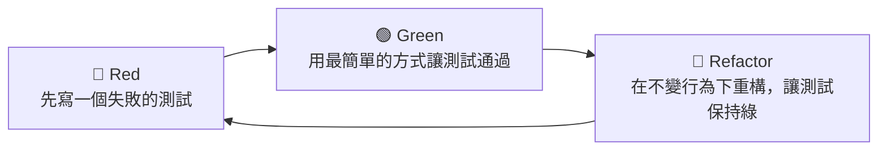

# 4.2 重構：改善既有設計的藝術

## 什麼是重構

**重構（Refactoring）** 是指：**在不改變程式外在行為的前提之下，改善程式碼的內部結構。**

關鍵在「不改變外在行為」——重構不是加功能、不是修 bug，而是「整理內部結構」讓程式碼更好讀、更好維護、更好擴展。它源於 Martin Fowler 的經典著作《重構：改善既有代碼的設計》（*Refactoring: Improving the Design of Existing Code*）。

打個比方：重構像是「整理房間而不是搬新家」——你重新收納、分類、清掃，但沒有改變「你住在這裡」的事實。整理後，你更容易找到東西、更容易迎接新東西。

## 為什麼需要重構

軟體是**活著的**——它會持續成長、被修改。如果放任不管，程式碼會逐漸腐化：

- 新的需求被「塞」進不適合的地方
- 重複的邏輯越積越多
- 函式越長、耦合越緊、命名越模糊

這種累積的壞味道，有個統稱叫**技術債（Technical Debt）**。它就像信用卡債：**短期不清理，累積的利息（維護成本、出錯率）會越來越高。**

重構就是「還技術債」的方式——它不是一次性的「大掃除」（那風險太高），而是**持續、小步地**改善結構，讓技術債保持在可控範圍。

## 重構的好處

- **更容易閱讀與理解**：讀者能更快掌握邏輯
- **更容易修改**：結構清楚了，改動的副作用更可控
- **更容易找 bug**：結構清晰時，問題根源更好定位
- **維持程式碼健康**：防止結構持續腐化
- **為新增功能鋪路**：好結構讓擴展更安全

## 常見的重構手法

重構有大量的「微操作」（Refactoring Catalog），每一種都是小而安全的轉換。這裡介紹幾個最常用的：

### 1. 提煉函式（Extract Method）

把一段邏輯從一個函式抽離成獨立的函式。

```python
# 重構前：一個函式做太多事
def process_order(order):
    validate(order)                     # 驗證
    total = sum(item.price for item in order.items)
    if order.member: total *= 0.9       # 折扣邏輯混在主流程
    save(order, total)
    notify(order.customer, total)

# 重構後：提煉出「計算總價」與「折扣」
def calc_total(order):
    total = sum(item.price for item in order.items)
    if order.member: total *= VIP_DISCOUNT_RATE
    return total

def process_order(order):
    validate(order)
    total = calc_total(order)
    save(order, total)
    notify(order.customer, total)
```

### 2. 改名（Rename）

把模糊的命名改成有意的命名（本質上是 4.1 節的理論化操作）。

### 3. 消除重複（別說 3.4 節）

把重複的程式碼收斂成「單一真實來源」（DRY）。

### 4. 簡化條件式（Simplify Conditional）

把複雜的巢狀條件拆清楚、提早 return。

```python
# 重構前：巢狀深
def is_ok(order):
    if order.active:
        if order.paid:
            if not order.blocked:
                return True
    return False

# 重構後：提早 return
def is_ok(order):
    if not order.active: return False
    if not order.paid:   return False
    if order.blocked:    return False
    return True
```

### 5. 拆分模組（Extract Class/Module）

當一個類別塞了太多職責（違反 SRP），把它拆成多個職責單一的類別（3.4 節）。

## 重構的安全性：測試的關鍵角色

重構最大的風險是「改壞了原本能跑的程式」。因此 Martin Fowler 反覆強調：

> **重構要做得好，前提是有良好的測試保護。**

如果有一組自動化測試能「證明當前行為是正確的」，你就能放心地重構——每次小步重構後跑測試，綠了就繼續、紅了就回滾。**測試是你的安全網（Safety Net）**。

這也解釋了為什麼「測試」（第 5 章）被視為品質的基石，以及為什麼**重構和 TDD（測試驅動開發）常被綁在一起討論**。沒有測試網的重構，是在高空走鋼索。

## 重構時機：Red-Green-Refactor

結合測試，經典的做法是 **TDD 的三步循環**，其中第三步就是重構：



在「讓測試通過」之後、開始下一個功能之前，正是重構的好時機——趁著對這段程式碼的理解還新鮮，立刻改善結構。**「先讓它跑起來，再讓它變好」** 是務實的開發節奏。

## AI 時代的重構

AI 讓重構的「動作」變得非常便宜——你可以請 AI 提煉函式、改名、消除重複、簡化條件式。但要記得兩點：

1. **AI 產生重構也需要測試保護**：否則它改出的新結構可能有行為差異。讓 AI 重構後，仍然要靠測試（與審查）確認行為不變。
2. **AI 也可能「過度重構」**：請它「重構」，它可能把原本還好的程式碼抽象得過度複雜（違反 KISS，見 3.4 節）。審查 AI 重構結果，是工程師的責任。

**實務建議**：讓 AI 處理那些「機械性、低風險」的重構（改名、提煉函式、消除重複），而「涉及架構判斷」的重構（拆分模組、調整依賴方向）仍由人主導決策，因為後者需要對系統全局的理解。

## 本章小結

- **重構**＝不改變行為、改善內部結構
- 目的是**還技術債**，防止程式碼腐化
- 常用手法：**提煉函式、改名、消除重複、簡化條件式、拆分模組**
- 重構的**安全網是測試**——沒有測試保護的重構風險高
- **TDD 三步循環**：Red → Green → Refactor
- AI 時代：AI 便宜處理**機械性重構**，人類主導**架構性重構**與**審查**

## 想一想

1. 找出你寫的程式碼中「一個函式做太多事」的例子，用「提煉函式」重構它。
2. 為什麼重構「必須」有測試當安全網？如果沒有測試，你會怎麼降低重構風險？
3. 讓 AI 重構一段你的程式碼，然後檢查它是否「過度設計」了。
