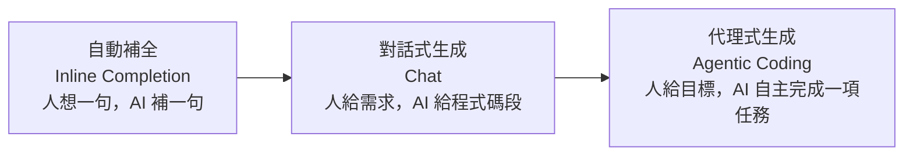
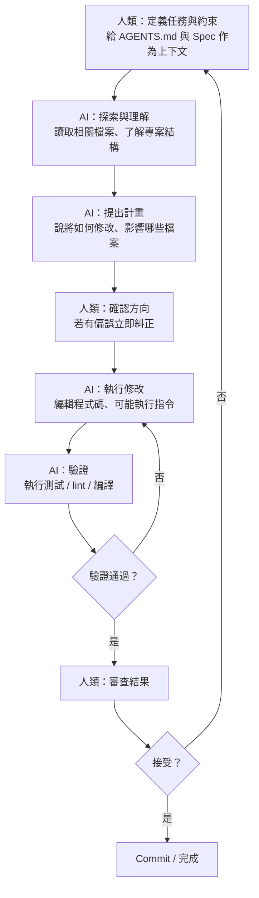

# 4.4 Agentic Coding：人機協同的程式碼生成

## 什麼是 Agentic Coding

**Agentic Coding（代理式程式設計／人機協同程式碼生成）** 是指：讓 AI Agent 不再只是「自動補全的一行提示」，而是**能自主規劃、搜尋、修改、執行、驗證**的程式設計夥伴——人與 AI 以「指揮官──執行者」的方式協同完成程式設計。

回顧 4.4 節之前的討論：AI 主導的「寫程式」正在從「補全（Completion）」進化成「代理（Agentic）」：

**關鍵差異**：在 Agentic Coding 中，AI 不只是「產出程式碼片段」，而是能在一個**受控的迴圈**中反覆工作——讀取檔案、理解專案、規劃修改、執行命令、跑測試、根據結果自我修正——直到達成目標。它以附錄 B 的 OpenCode 等工具為代表。

## 人機協同的分工

Agentic Coding 不是「AI 全自動、人放假」，而是一種**緊密的人機協同**。分工遵循全書的核心原則（1.5、2.5 節）：

| 面向 | 人類（指揮官） | AI（執行者） |
|------|--------------|------------|
| **目標與問題定義** | 定義「要做什麼、為什麼」 | — |
| **規格與介面契約** | 把關 Spec 是否正確（2.6 節） | 依 Spec 生成草稿 |
| **產出程式碼** | — | 讀取專案、規劃、生成、修改 |
| **驗證** | 設計並執行測試 | 跑測試、回報結果、自我修正 |
| **品質與責任** | 批判式審查、最終把關 | 依審查意見修正 |

## Agentic Coding 的典型工作迴圈

一次 Agentic Coding 的任務，通常不是「一次對話就完成」，而是反覆的迴圈：

這個迴圈與 4.4 節、9 章、12 章的內容高度呼應。值得強調的是：**迴圈中的每個「檢查點」都由人掌握節奏**——尤其「確認方向」「審查結果」這兩步，是保證品質的關鍵。

## Agentic Coding 的關鍵成功因素

要讓 AI Agent 高效且可靠地協作，有幾個關鍵因素：

### 1. 任務粒度：拆小、明確

把大任務拆成小、明確、可獨立驗證的子任務。「把整個訂位系統架起來」太含糊，AI 容易迷失；「為 CheckoutService 加入『購物車為空時拋出 EMPTY_CART 錯誤』並附上單元測試」清楚多了。小任務配小驗證，錯誤能及早發現（4.3 節「小步提交」）。

### 2. 品質閘門：人在迴路（Human in the Loop）

**不要讓 AI 全自動跑完不讓你插手**。在關鍵節點（擬定計畫、合併前）設置「人審查」的閘門。Agentic Coding 的價值在「人把精力用在指揮與把關」，不在「人完全放手」。

### 3. 明確的成功定義：用測試作準繩

給 AI「讓測試通過」的明確指令（見 5 章）。有測試可依，AI 的自主迴圈才「有方向」——它會自己迴圈到測試綠燈為止，而不是「感覺做完了」。

### 4. 上下文與約束

透過 AGENTS.md（B.3 節）、權限控制（B.4 節）、工具列表（B.5 節）告訴 AI「能做什麼、不能做什麼、怎麼做」，讓它的自主行為有邊界（第 9 章 Harness 的「約束」要素）。

## 能力模型：Agentic Coding 需要的「看懂別人寫的程式」

Agentic Coding 對 AI 有個重要要求：**它必須能讀懂「別人既有的程式碼」，而不只是從零生成。** 因為真實專案很少是空白起手——AI 要理解團隊既有架構、沿用既有風格、在不破壞其他功能的前提下修改。

這正是本書反覆強調的「看懂別人寫的程式」的能力。對 AI 而言，這依靠**上下文工程**（第 7 章）——如何把相關的既有程式碼、規格、風格餵給 AI。對人而言，管理和提供「完整而正確的上下文」是當工程師的新技能。

## 人機協同的最佳心態

最後，用一句話總結 Agentic Coding 的心態：

> **把 AI 當成一位「能力很強、但需要明確目標與嚴謹監督」的優秀對開發者（Pair Programming 夥伴）。** 你負責「往哪走、走對沒有」，它負責「動手做、執行驗證」。

把它當「無腦自動化」會失控，把它當「完全獨立工程師」會失望。它是一個**在你的指揮與把關下的高效執行者**——而「指揮與把關」正是本書要教你的，人在 AI 時代不可被取代的本質性能力（1.4、14.4 節）。

## 本章小結

- **Agentic Coding** ＝ 人機協同、AI 自主規劃/修改/驗證的程式設計
- 演進：**補全 → 對話式 → 代理式**
- 分工：**人（指揮官）定義目標與規格、確立品質閘門；AI（執行者）生成、修改、驗證**
- 關鍵成功因素：**任務拆小、人在迴路、用測試作準繩、明確的上下文與約束**
- AI 需要「**看懂既有程式碼**」的能力，仰賴上下文工程（第 7 章）
- 心態：把 AI 當「**需明確目標與嚴謹監督的 Pair Programming 夥伴**」

## 想一想

1. 用 OpenCode（附錄 B）對一個小專案執行一次 Agentic Coding 任務，觀察它的「探索→計畫→修改→驗證」迴圈。
2. 為什麼「人在迴路（Human in the Loop）」是 Agentic Coding 品質的關鍵？全自動會出什麼問題？
3. 你認為「看懂別人寫的程式」為什麼是 Agentic Coding 對 AI 的重要能力要求？
