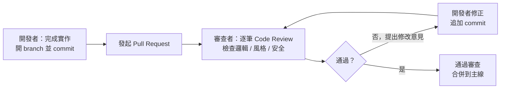
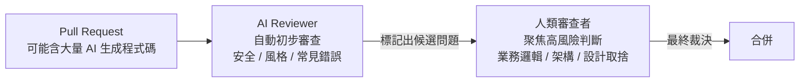

# 4.5 Code Review 在 AI 時代的演變

## 什麼是 Code Review

**Code Review（程式碼審查）** 是指：在程式碼合併到主線之前，由**另一位或多位工程師**仔細檢視程式碼，找出問題、提供建議。

它不是「找麻煩」或「挑毛病」，而是一個**協作與品質保證的過程**。它建立在 4.3 節的分支與 Pull Request 之上：開發者把程式碼放上分支、發起 Pull Request（PR），審查者逐筆檢視並提出意見，雙方討論修改，直到通過後再合併。

## 為什麼需要 Code Review

傳統上，Code Review 的好處很多：及早抓 bug 與設計問題、知識分享、維持一致性、建立集體責任、降低合併風險。這些好處在 AI 時代全部保留，甚至被放大。

## AI 時代的 Code Review：雙重演變

AI 讓 Code Review 的性質發生**雙重演變**——既是「對象」變了，也是「工具」變了。

### 演變一：審查的對象更多是 AI 的輸出

當程式碼大量由 AI 生成（4.4 節）時，Code Review 的首要對象就是 AI 的輸出了。審查者特別要留意：

- **幻覺（Hallucination）**：AI 是否用了不存在的 API、編造了邏輯？
- **品質**：是否符合團隊的設計原則與風格（AI 常會過度設計，見 3.4 節）？
- **規格遵循**：是否偏離 Spec 與介面契約（2.6 節）？
- **安全性**：AI 是否引入了漏洞（見第 13 章）？
- **上下文影響**：是否誤解了既有程式碼或業務情境？

**重點**：因為 AI 可以「以極快速度產出大量程式碼」，審查者也正面臨「待審查的程式碼數量暴增」的壓力。於是第二個演變應運而生。

### 演變二：AI 成為審查的助手（AI Code Reviewer）

AI 可以被用來**輔助（甚至主要）審查**程式碼。它擅長：

- 快速發現常見的錯誤模式、安全漏洞、邏輯漏洞
- 檢查是否符合風格規範
- 提出可讀性與設計改善建議
- 處理「海量程式碼」的初篩——先自動濾掉低風險問題，把人留給高風險判斷

**但 AI 審查也有盲點**：不了解業務情境與架構全局、可能有誤報或漏報、無法承擔最終責任。因此 AI 審查是「好的第一道自動化檢查」，但仍需**人來做最終裁決**。

## 人機分工：AI 初篩、人類裁決

AI 時代最有效的 Code Review 分工是：

**AI 負責「廣」**（快速掃描、機械性檢查、抓常見問題、給建議），**人負責「深」**（業務判斷、架構取捨、安全把關、最終責任）。這正是「機器顧機械性，人顧判斷力」的分工（5、12 章會再深化）。

## 如何做好 AI 時代的 Code Review：務實建議

### 給人類審查者（面對 AI 輸出）

- **別因為「AI 寫的就不細看」**：AI 輸出恰恰更需要批判式審查（4.4 節）
- **驗證而非相信**：對「AI 說沒問題」保持懷疑，重點看**測試與實際執行結果**
- **聚焦高風險**：把精力放在邏輯、安全、邊界條件（2.4 節）、架構一致性這類「需要判斷力」的地方
- **引導 AI 修正**：AI 時代的「修改意見」可以更直接——因為可以由 AI 快速再產出修正版

### 給開發者（使用 AI 協作）

- **小步提交**：讓 AI「改一小步、commit 一小步」，產生可獨立審查的小 PR（4.3 節）
- **PR 描述寫清楚**：交代「AI 做了什麼、改了哪、怎麼測」，降低審查者負擔
- **附測試**：證明行為正確（第 5 章）
- **善用 AI Reviewer 先自我檢查**：讓 AI 先審一遍自己的產出，再交人審

## 與自動化護欄的關係

Code Review 是「人造閘門」，而 CI/CD 的自動化檢查（lint、型別檢查、自動測試）是「機器閘門」，AI Code Reviewer 介於兩者之間。三者分工：

| 閘門層級 | 工具/角色 | 側重 |
|---------|----------|------|
| 機械層 | CI：lint、型別、格式 | 風格、低階錯誤、可自動化 |
| 智慧層 | AI Reviewer | 常見邏輯/安全問題、海量初篩 |
| 判斷層 | 人類審查者 | 業務邏輯、架構、安全、最終責任 |

## 本章小結

- **Code Review** 是合併前品質與協作的閘門
- AI 時代**雙重演變**：審查對象更多是 AI 輸出、AI 也成了審查助手
- 分工：**AI 初篩（廣）、人類裁決（深）**，最終責任在人
- 面對 AI 輸出：**批判式審查、驗證而非相信、聚焦高風險**
- 配合小步提交、清晰的 PR 描述與測試
- 與 CI/AI Reviewer 形成**三層品質閘門**

## 想一想

1. 為什麼「AI 寫的程式碼」反而更需要人類細心審查？
2. 讓 AI 當 Code Reviewer，試著讓它審查一段你（或 AI）寫的程式碼，比較它與人類審查者的建議差異。
3. 在「AI 快速產生大量程式碼」的壓力下，你認為人類審查者該把精力集中在哪裡最有效？
