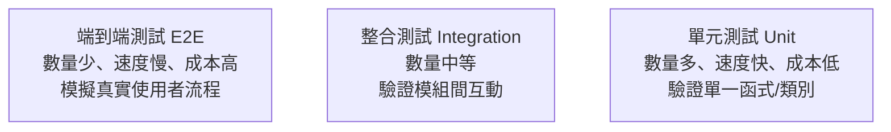

# 5.1 測試金字塔與測試策略

## 為什麼要測試

4.4 節強調「信任但要確認」，第 4 章也屢次提到「用測試作準繩」。本節正式展開測試的完整圖景。

**測試（Testing）** 的核心目標是：**用可重複、可驗證的方式，證明軟體的行為符合預期，並及早發現錯誤。**

測試的重要性在於：
- **證明正確性**：確保功能「真的能跑、跑得對」
- **重構與修改的安全網**（4.2 節）：改了程式碼後能確認沒改壞
- **需求的可驗證化**（2.6 節）：把規格變成可檢查的行為
- **降低風險**：在開發早期、合併前、發布前抓出問題

## 測試的層次：測試金字塔

軟體測試不是「一種測試」，而是分層的結構。最經典的心智模型是 **測試金字塔（Test Pyramid，由 Mike Cohn 提出）**：

### 金字塔三層

**底層：單元測試（Unit Test）**——是不是測試軟體的最小單位（單一函式、單一類別），隔離外部依賴（mock 掉資料庫、網路），速度最快、數量最多。它是測試金字塔的「主體」。

**中層：整合測試（Integration Test）**——驗證多個模組「整合在一起」能否正確協作（例如服務層 + 資料庫、API + 外部服務）。它抓的是「單元各自正常、但合起來出錯」的整合問題。

**頂層：端到端測試（E2E, End-to-End）**——從使用者角度模擬完整流程（如「點擊→加入購物車→結帳→付款→確認」），覆蓋整個系統。最接近真實、也最慢、最脆弱、最難維護。

### 為什麼叫「金字塔」

因為正確的測試**數量分布**應該是「下多上少」：

- **大量的單元測試**（快、便宜、穩定、好除錯）
- **中量的整合測試**
- **少量但必要的 E2E 測試**

**反模式：倒置金字塔（Ice-Cream Cone）**——如果 E2E 測試過多、單元測試過少，測試就會又慢又貴又脆弱，一改動就大量「紅燈」卻難定位問題。

## 測試層次的選擇邏輯

每一層解決不同層次的問題，也付出不同成本：

| 層次 | 驗證什麼 | 速度 | 成本 | 除錯 |
|------|---------|------|------|------|
| 單元 | 單一函式邏輯 | 極快 | 低 | 容易定位 |
| 整合 | 模組間互動 | 中 | 中 | 中等 |
| E2E | 完整使用者流程 | 慢 | 高 | 難定位 |

**策略趨勢**：現代取向是「**盡量往下壓**」——能用快速便宜的單元/整合測試覆蓋的，就不要用慢的 E2E 覆蓋；只在「單元/整合測不到的真實流程」才用 E2E。這正是「測試金字塔」的分層策略。

## 測試策略：除了金字塔，還有什麼

除了層次，測試策略還包含時間與範圍的考量：

- **測試策略（Test Strategy）**：決定「測什麼、怎麼測、共哪些層次、用什麼工具、多少覆蓋」的整體方針
- **TDD（測試驅動開發）**：先寫測試再寫實作（見 4.2 節、5.2 節）
- **BDD（行為驅動開發）**：用 Given-When-Then 描述行為（見 2.6 節），讓測試成為可執行的規格
- **覆蓋率（Coverage）**：測量「程式碼被測到的比例」，是量化參考，但不是「越高越好」（見 5.2 節討論）

## AI 時代的測試策略

AI 對測試的影響是雙重的，貫穿全書：

**一方面，AI 讓「寫測試」變便宜了**——AI 能快速生成單元測試、根據規格生成測試案例（見 5.4 節）。這讓「高覆蓋的測試金字塔」變得更可行。

**另一方面，測試的重要性與難度都上升了**：
- **重要上升**：因為 AI 生成大量程式碼、行為是機率性的，更需要測試來「鎖定」正確行為（呼應 4.4 節「用測試作準繩」）
- **難度上升**：AI 的行為難以預測、難以完全用傳統斷言覆蓋（需要新的 LLM-as-a-Judge 方法，見 5.5 節）

**核心結論**：在 AI 時代，**測試的角色從「品質的驗證工具」上升為「品質的定義與護欄」**。測試不只證明「程式對不對」，更成為「AI 協作的回饋機制與安全網」——這是第 5 章全章的主軸。

## 本章小結

- 測試是用可重複、可驗證的方式證明行為正確、及早抓錯
- **測試金字塔**：單元（多、快、便宜）→ 整合（中）→ E2E（少、慢、貴）
- 策略趨勢：**盡量往下壓**，避免「倒置金字塔」
- 測試策略還包含 TDD、BDD、覆蓋率等面向
- AI 時代：測試從「驗證工具」上升為「**品質定義與護欄**」，同時 AI 讓寫測試變便宜

## 想一想

1. 為什麼「測試金字塔」要下多上少？如果反過來會發生什麼？
2. 你認為「單元測試很多但 E2E 很少」與「E2E 很多但單元很少」的專案，開發體感有何不同？
3. 為什麼 AI 時代測試的重要性與難度都上升了？「鎖定正確行為」的意義是什麼？
