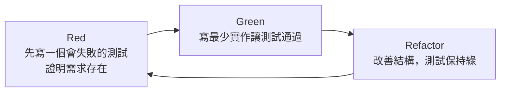

# 5.2 單元測試與 TDD

## 什麼是單元測試

**單元測試（Unit Test）** 是測試金字塔的基座：針對軟體的**最小可測單位**——通常是單一函式或單一類別的單一方法——撰寫測試，驗證它的行為。

單元測試的關鍵特徵是**隔離（Isolation）**：測試一個單元時，把它與外部依賴（資料庫、網路、時間、檔案系統）隔離，只關注這個單元本身的邏輯。隔離靠 **Mock / Stub（模擬）** 來達成——用「假物件」代替真實的外部依賴。

```python
# 一個待測的單元
def apply_discount(price, discount_rate):
    if discount_rate < 0 or discount_rate > 1:
        raise ValueError("折扣率必須在 0 到 1 之間")
    return round(price * (1 - discount_rate), 2)
```

```python
# 對應的單元測試（pytest 風格）
def test_apply_discount_normal():
    assert apply_discount(100, 0.1) == 90.0

def test_apply_discount_full():
    assert apply_discount(100, 1.0) == 0.0

def test_apply_discount_invalid_rate():
    with pytest.raises(ValueError):
        apply_discount(100, 1.5)   # 邊界條件（2.4 節）

def test_apply_discount_rounding():
    assert apply_discount(10, 0.1) == 9.0
```

注意上例把 2.4 節的**邊界條件**直接變成了測試——這正是「邊界條件 + 測試」的完美結合。

## 單元測試的價值

- **快速反饋**：毫秒級跑完，讓你在「寫完就測」的循環中及早抓錯
- **精準定位**：失敗時能立刻知道「哪個函式、哪個邏輯錯了」
- **重構的安全網**（4.2 節）：改結構時確保行為不變
- **可執行的文件**：測試描述了「這個函式應該怎麼表現」
- **品質護欄**：在 CI 中自動執行，防止迴歸

## TDD：測試驅動開發

**TDD（Test-Driven Development，測試驅動開發）** 是一種「先寫測試、再寫實作」的開發方法。它的循環我們在 4.2 節提過——



### 三步展開

1. **Red（紅）**：先寫一個描述「需求/行為」的測試，此時還沒有實作（或實作不完整），測試**失敗**。這一步的意義：**先明確「正確是什麼樣」。**
2. **Green（綠）**：用**最簡單**的方式寫實作，讓測試**通過**。不追求完美，先「能跑」。
3. **Refactor（重構）**：在測試保護下改善結構（4.2 節），確認測試仍為綠。

### TDD 的價值

TDD 不只是「寫測試」的方法，更是一種**設計思維**：
- **強迫你先想清楚「介面與行為」**：先寫測試，就得先決定函式簽名、輸入輸出、邊界處理——這正是「以介面驅動設計」
- **確保循序漸進的小步**：一次只推進一個行為，避免一次寫一大坨
- **內建安全網**：每個新行為都有測試鎖定，重構與擴展更安心

**TDD 與 AI 的結合（值得期待）**：TDD 的「先寫測試」恰好符合 4.4 節「用測試作準繩」——讓 AI「先寫測試、再讓測試通過」。這把 AI 的自主迴圈轉變成「Red→Green」的可驗證過程（詳見 5.4 節）。

## 覆蓋率：工具還是目標

**程式碼覆蓋率（Code Coverage）**測量「有百分之幾的程式碼被測試執行到」。它是追蹤測試廣度的有用指標，但必須小心看待：

- **好處**：能找出「完全沒被測到」的死角
- **陷阱**：**高覆蓋率 ≠ 高品質**。你可以覆蓋 100% 的程式碼，卻沒斷言任何關鍵行為（只測「有執行」不測「對不對」）；反而邊界的缺失（2.4 節）才是真正的 bug 來源。

**正確心態**：覆蓋率是**參考工具**，不是**終極目標**。重點在測試的**品質**（有沒有測到正確的邏輯與邊界），而非單純追求數字。**「測到要緊的地方」比「測得多」重要。**

## 如何寫出好的單元測試

好的單元測試有幾個特徵：

1. **一個測試只測一件事**：命名、輸入、斷言都聚焦單一行為，失敗時最容易定位
2. **命名清楚表達行為**：`test_apply_discount_invalid_rate` 比 `test_1` 好
3. **測行為而非實作**：斷言「輸入→輸出」的正確性，不要過度耦合於內部實作細節（否則微調內部就大量紅燈）
4. **涵蓋邊界條件**：正常值、極值、空值、非法值（2.4 節）
5. **獨立、可重複**：每個測試不依賴其他測試的順序或狀態
6. **快速**：單元測試要快，慢了就沒人想跑

## AI 時代的單元測試

AI 讓「寫單元測試」變得很便宜（5.4 節會詳談），這裡先記住幾個 AI 時代的觀察：

- **AI 適合生成大量慣例化的單元測試**（測試一個函式的正常/邊界）
- **但 AI 生成的測試也可能是「空轉」**：只斷言了「函式有執行」而沒斷言「行為正確」（高覆蓋率假象）
- 因此**人仍要設計「什麼行為值得測」**——尤其業務邏輯與邊界條件。測試的「意義」（為誰、測什麼）是本質性工作，AI 只是加速「動手寫」

## 本章小結

- **單元測試**測最小單位、隔離外部依賴（mock）、快而精確
- 價值：快速反饋、精準定位、重構安全網、可執行文件
- **TDD 三步**：Red（先寫失敗測試）→ Green（最少實作通過）→ Refactor（重構保綠）
- TDD 是「以介面驅動」的設計思維，且與 AI「用測試作準繩」高度契合
- **覆蓋率是參考工具，不是目標**；「測到要緊處」重於「測得多」
- AI 時代：AI 加速寫測試，但「測什麼才有意義」由人設計

## 想一想

1. 為「訂位系統」的一個核心函式寫一組含邊界條件的單元測試（先寫測試，再寫實作，體驗 TDD）。
2. 為什麼「高覆蓋率不等於高品質」？舉一個「覆蓋 100% 但沒測到重點」的例子。
3. 你覺得 AI 生成的單元測試，最可能在哪裡「空轉」？如何避免？
