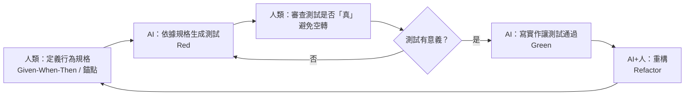

# 5.4 AI 自動生成測試

## 測試是 AI 最擅長、也最有風險的領域

第 4、5 章多次提到：「用測試作準繩」「讓 AI 先寫測試再讓它通過」。本節正面探討 **AI 自動生成測試（AI-Generated Tests）**——這可能是 AI 輔助開發中「回報最高、但也最需要警惕」的應用之一。

為什麼回報高？因為測試**寫起來枯燥、量大、慣例化**——而這正是 LLM 的舒適區。為什麼風險高？因為測試的價值在「**有沒有真正驗證行為正確**」，而 AI 很容易生產出「看起來寫了、但等於沒寫」的假測試。

## AI 生成測試的能力

AI 非常擅長生成以下類型的測試：

1. **正常路徑測試**：給定合理輸入的「快樂路徑」斷言
2. **邊界條件測試**：空值、極值、非法輸入（善用 2.4 節的思維）
3. **錯誤/例外測試**：驗證拋出正確的異常
4. **複雜物件的設定**：快速搭出測試用的假資料、fixture
5. **跨模組的整合/E2E 草稿**（5.3 節）

```python
# 人：只給「測這個函式」的指令
# AI 生成：
def test_apply_discount_boundaries():
    assert apply_discount(100, 0.0) == 100.0     # 0 折
    assert apply_discount(100, 1.0) == 0.0       # 全免
    with pytest.raises(ValueError):
        apply_discount(100, -0.1)                # 負折扣
    with pytest.raises(ValueError):
        apply_discount(100, 1.5)                 # 超額折扣
```

AI 之所以能這樣，是因為它「看過」海量測試程式碼，熟悉常見的測試模式、框架語法、邊界案例——這是它的統計優勢。

## 最大的風險：假陽性的「空轉測試」

AI 生成測試最常見的致命缺陷是**「空轉（Smoke/No-assert）測試」**——測試「執行了」，但沒有真正驗證「行為正確」，因此測試永遠綠燈，卻什麼也沒保證。

典型的空轉測試長這樣：

```python
# ❌ 空轉：只證明「呼叫了函式不會崩潰」，沒驗證行為正確
def test_apply_discount_runs():
    result = apply_discount(100, 0.1)
    assert result is not None          # 幾乎永遠成立
```

```python
# ✅ 有價值：驗證行為正確
def test_apply_discount_half():
    assert apply_discount(100, 0.5) == 50.0
```

**「空轉」的危險**在於它製造「很高覆蓋率」（5.2 節）、製造「測試全綠」的假安全感，卻讓你和團隊誤以為「品質有保障」——而真 bug 依然躺著。

為什麼 AI 容易產生空轉測試？因為「斷言什麼才算有意義」需要有**對預期結果的正確預期**——而這往往依賴於業務情境，AI 無法精準把握。它知道「該測這個函式」，但不一定知道「正確答案該是多少」。

## 如何讓 AI 產生「真正」的測試

要提升 AI 生成測試的品質，關鍵是**給 AI「可確認的正確預期」**：

### 1. 從可執行的規格出發

最好的人工輸入是「規格」而非「函式」。用 2.6 節的 **BDD/Gherkin** 描述行為，讓 AI 轉成測試——這樣「預期行為」是明確的：

```
Scenario: 使用有效折扣碼
  Given 商品單價 100 元、數量 2 件、折扣 SAVE20（9折）
  When 計算總價
  Then 結果應為 180 元
```

AI 能根據這個「明確預期」產生有意義的斷言，而非空轉。

### 2. 提供真值的「錨點」

當行為有確定的正確答案時，把答案明確給 AI（「這個函式對 (100, 0.1) 應回傳 90.0」），AI 就能鎖定正確斷言。這其實是把「正確預期」這件事，從「讓 AI 猜」變成「人類明確提供」——也符合「人負責本質性工作」的分工。

### 3. 用「Mutation Testing」檢查測試品質

一個進階但有效的方法：**變異測試（Mutation Testing）**——故意「變異」程式碼（例如把 `>` 改成 `>=`、把 `+` 改成 `-`）來製造一個「應該會被抓到的 bug」，然後看測試有沒有真的讓它失敗。如果**變異後的錯誤測試沒抓到**，代表測試品質不佳（可能空轉）。

AI 可以幫助生成變異版本，協助你檢查 AI 寫的測試是否「真的會抓錯」。這是「用 AI 檢驗 AI」的一種思路。

### 4. 人審查測試的「意義」

回歸本質：**「測什麼才有意義」是人的責任**。AI 生成測試後，人至少要問：
- 這些斷言真的驗證了「行為正確」嗎？還是只在確認「不會崩」？
- 有沒有測到關鍵的**業務邏輯與邊界**（而非只覆蓋了快樂路徑）？
- 有沒有不合理地耦合到內部實作，將來一改就跑？（5.2 節）

## TDD + AI：強強聯手的協作模式

把 5.2 節的 TDD 與 AI 結合，會產生很有效的協作模式：



**關鍵**：這套協作把「測什麼」（人的規格）與「寫測試/寫實作」（AI 的機械化產出）分開，而**審查測試是否真的有意義**（避免空轉）始終落在人身上。

## 本章小結

- AI 擅長生成**正常路徑、邊界、錯誤**等慣例化測試，也擅長搭配 fixture
- 最大風險：**空轉測試**——只執行了、斷言無意義，製造假安全感、高覆蓋率假象
- 提升品質關鍵：**提供可確認的正確預期**（從規格、錨點出發）
- 可用**變異測試**檢驗測試品質（用 AI 檢驗 AI）
- **「測什麼有意義」由人負責**，AI 加速「動手寫」
- 協作模式：人定規格 → AI 寫測試 → 人審查「真」→ AI 寫實作讓測試通過

## 想一想

1. 讓 AI 為一個函式生成測試，找出其中「空轉」的測試，並思考如何給 AI「正確預期」來改善。
2. 為什麼「空轉測試」比「沒有測試」更危險？它的假安全感從何而來？
3. 你認為在「人定規格、AI 寫測試」的協作中，人最不可取代的是什麼？
