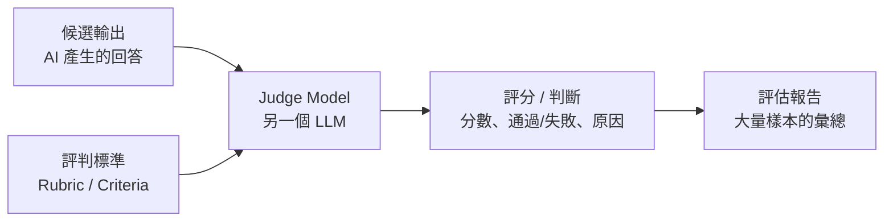

# 5.5 LLM-as-a-Judge：用模型評判模型

## 一個新問題：AI 的輸出怎麼「測」

到目前為止討論的測試，都有一個共同前提：**正確答案是可以明確斷言的**。`apply_discount(100, 0.1) == 90.0`——結果確定，測試能寫成「等於多少」。

但當系統是由 AI Agent 驅動時，情況變了。AI 的輸出往往是**開放式、非確定性**的：

- 一段客服回覆，怎麼斷言「回得好」？
- 一篇摘要，怎麼斷言「摘得準」？
- 一個 Agent 的決策過程，怎麼斷言「做得對」？
- 一條「自然難度」的回答，沒有唯一正確答案

傳統的「斷言等於某值」在這裡**失效**了。於是誕生了新的評估典範：**LLM-as-a-Judge（以 LLM 作為評判者）**——用另一個（更強的）大語言模型來評判 AI 產出的品質。

## 三種傳統測試的侷限與 LLM-as-a-Judge 的定位

| 評估方式 | 做法 | 適合 | 侷限 |
|---------|------|------|------|
| **Golden 斷言** | 比較輸出與「正確答案」 | 確定性輸出 | 無法評估開放式輸出 |
| **規則/正則檢查** | 查是否含關鍵詞、格式 | 結構性要求 | 抓不到語義品質 |
| **人為評分** | 人工檢視打分 | 高品質需求 | 慢、貴、不可擴展 |
| **LLM-as-a-Judge** | 用 LLM 依標準評分 | 開放式/語義品質 | 有偏見、需校準 |

**LLM-as-a-Judge 的優勢**：速度快、成本低、可擴展（能自動評估大量輸出）、能評判「語義品質」這種難以量化的維度。

## LLM-as-a-Judge 的運作方式

核心流程是用一個「評判模型（Judge Model）」依照**明確的評判標準**對候選輸出進行評估。它多半搭配一個**評估框架**（如 Langfuse、LangSmith、Braintrust、或自行實作的 eval harness）來管理：



一個具體的例子（評判「客服回覆是否得體」）：

```
評估任務：判斷以下客服回覆是否「清楚回應了問題、語氣友善、資訊正確」。

評判標準：
1. 相關性（1-5）：是否針對使用者問題給出直接回應
2. 正確性（1-5）：資訊是否準確、無虛構
3. 友善度（1-5）：語氣是否親切、專業

請為以下回覆逐項打分並說明理由：
[客服回覆內容]
```

Judge 會給出分數與理由。透過在**大量樣本**上執行，就能得到這個 AI 功能品質的**統計畫像**——這正是第 10 章「評估與持續進化」的基礎。

## 判斷標準：如何定義「好」

LLM-as-a-Judge 的成敗，**幾乎全取決於評判標準的品質**。常見的評判維度包括：

- **相關性（Relevance）**：是否針對問題、不偏題
- **正確性（Correctness）**：事實是否正確、有無幻覺
- **完整性（Completeness）**：是否涵蓋應該回應的要點
- **忠實度（Faithfulness/接地）**：是否忠於提供的資料（未編造）
- **可讀性/語氣（Style）**：是否符合要求的口吻與格式
- **有用性（Helpfulness）**：對使用者是否有實質幫助

**標準越具體，評分越可靠**。模糊的「好不好」會導致 Judge 評分飄忽、不可重現。一句話：**「定義清楚要評什麼『好』，Judge 才能給出可信的『好』。」**

## LLM-as-a-Judge 的風險與偏見

Judge 也是 LLM，自身也有偏見與侷限，必須謹慎對待：

1. **位置偏見（Position Bias）**：在比對兩個候選輸出的優劣時，Judge 傾向偏愛排前面的那個
2. **冗長偏見（Verbosity Bias）**：傾向把「比較長、比較花俏」的輸出評得較高，即使內容更差
3. **自我偏見（Self-Preference）**：某些 Judge 可能偏好「跟自己風格像」的輸出
4. **評判標準模糊**：標準不清，Judge 就「自由發揮」，評分不可重現
5. **無法真正理解深層事實**：Judge 也會幻覺，可能誤判內容是否正確

**緩解方法**：
- **交換順序、多次評判**（減輕位置偏見）
- **明確定義評判標準、給錨點例子**（減輕模糊）
- **人工抽查校準**：人工抽一部分樣本，確認 Judge 的評分合理，建立「人機信任」
- **對高風險場景，仍以人為最終裁決**

## LLM-as-a-Judge 在軟體工程中的應用

這種評估不只是「評估客服」，同樣深刻地應用在 AI 軟體工程本身：

- **評估 AI 生成的程式碼**：Judge 可依「正確性、可讀性、安全性、風格」評判 AI 產出的程式碼
- **評估 AI 回覆是否符合 Spec**：判斷 AI 的實作是否忠於規格
- **評估測試品質**：判斷 AI 生成的測試是否有意義（補足 5.4 節防「空轉」）
- **評估 Agent 的輸出**：評判 Agent 完成任務的品質（第 10 章）
- **作為持續品質護欄**：在 CI 中對每個 PR 的 AI 改動跑 Judge，自動把關

**關鍵提醒**：LLM-as-a-Judge 是「**評估開放式輸出的實用方法**」，但它不是「銀彈」——它有自己的偏見與侷限，需要靠**清晰標準 + 人工抽樣校準**來維持可信度。它的角色，是大幅降低「評估開放式品質」的人力成本，讓「評估」變得可行。

## 本章小結

- **LLM-as-a-Judge**：用另一個 LLM 依標準評判 AI 輸出品質
- 解決「開放式、非確定性輸出」無法用傳統斷言評估的問題
- 優勢：快、便宜、可擴展、能評語義品質
- 成敗關鍵：**評判標準的品質**（相關、正確、忠實等維度）
- 風險：**位置、冗長、自我偏見**與標準模糊；需**交換順序、人工抽查校準**緩解
- 應用：評估程式碼、Spec 遵循、測試品質、Agent 輸出，作為品質護欄

## 想一想

1. 為什麼「客服回覆」或「摘要」這類輸出無法用傳統斷言測試？這類輸出需要什麼評估方式？
2. 讓一個 LLM 當 Judge，評判另一段 LLM 產出的文字，觀察它的位置偏見與冗長偏見。
3. 你認為「評判標準」對 LLM-as-a-Judge 的成敗影響有多大？為什麼「標準模糊就評分不可靠」？
