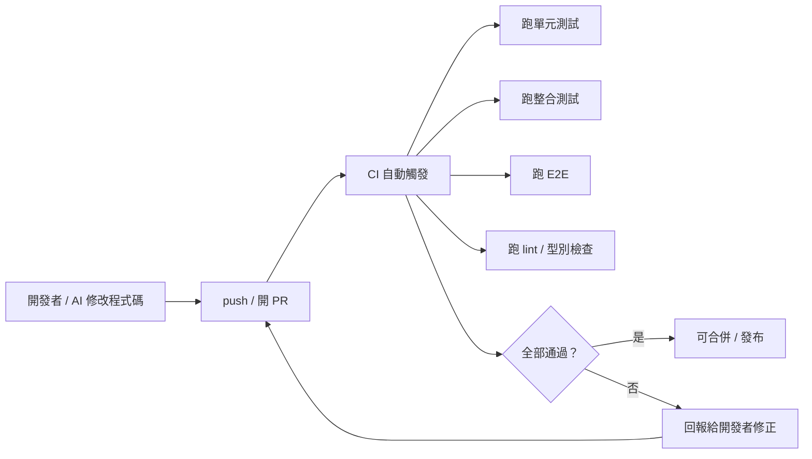

# 5.6 迴歸測試與持續驗證

## 什麼是迴歸

**迴歸（Regression）** 指的是：**系統之前正常的功能，在某次修改之後「壞掉了」。** 這是最常見、也最讓開發者頭痛的 bug 類型——你改 A，卻發現原本好好的 B 壞了。

因為軟體是互相耦合的（即使我們努力低耦合，3.1 節），任何改動都可能「悄悄影響」其他部分。**迴歸測試（Regression Testing）** 的目的，就是專門防止這種「舊功能被改壞」的情形。

## 為什麼現代開發離不開迴歸測試

迴歸測試在「持續修改」的開發模式中尤其重要。想想前面章節的場景：

- **重構（4.2 節）**：改了結構、行為不變——但怎麼確認真的不變？靠迴歸測試
- **AI 大量生成/修改程式碼（4.4 節）**：AI 改了這裡，會不會弄壞那裡？靠迴歸測試
- **多人/多 Agent 協作（12 章）**：各自改各自的，合起來會不會衝突？靠迴歸測試

**沒有一套能自動重跑的迴歸測試，任何修改都像「蒙眼走鋼索」**——你無法知道這次改動有沒有在別處埋下事故。

## 迴歸測試的兩種實踐：回歸套件與持續驗證

### 1. 回歸測試套件（Regression Suite）

把**過去所有測過的測試**累積成一套「回歸套件」，每次修改後重新跑一遍，確保舊功能沒壞。它其實不是「另一種新的測試」，而是「整套既有測試的持續重跑」——單元、整合、E2E 都包含在內（5.1 節金字塔）。

**關鍵特性**：
- **從建立那天就開始累積**：每修一個 bug、每加一個功能，都補上測試，加入回歸套件
- **要快、要自動化**：否則沒人願意在每次改動後都重跑
- **要可靠**：不能 flaky（時好時壞），否則團隊會忽略紅燈而失去信任（5.3 節）

**「bug 修完 → 補一個會抓到它的測試」** 是最好的迴歸紀律：這讓我們不只修好了眼前這個 bug，還永久防止它再回來。

### 2. 持續驗證（Continuous Verification）

迴歸測試的**自動化、持續化**，就升格為「持續驗證」。當測試被整合進 **CI/CD**（6.1 節）——每次 push、每次 PR、每次合併都自動跑測試——迴歸檢查就不再依賴「人記得跑」，而是**系統強制執行**：

**持續驗證的價值**：把「迴歸風險」的檢查從「人工、事後」變成「自動、即時」。每一次改動（尤其是 AI 產生的）都立刻被整套測試檢驗，任何「改壞」都能在合併前被攔截——這是現代品質護欄的核心（12.4 節）。

## 迴歸測試與 AI：互為因果

AI 時代，迴歸測試的價值被格外放大，理由是雙向的：

**AI 增加迴歸風險**：AI 能快速產生大量改動，而改動越多、越快，迴歸的機率與破壞面也越大。沒有迴歸測試當安全網，AI 的「快速」會變成「快速製造事故」。

**AI 提升迴歸能力**：AI 可以協助寫測試、擴充回歸套件、甚至分析「這次改動影響了哪些函式、該跑哪些測試」——讓迴歸檢查更聰明、更有針對性。

**迴歸測試也是 AI 自主迴圈的驗收標準**：如 4.4 節所述，AI 改程式後「跑測試看到綠燈」是確認「沒改壞」的關鍵一步。迴歸套件正是「AI 改完到底有沒有弄壞東西」的最可靠裁判。

## 「紅燈即時修」的紀律

持續驗證能工作，還有一個重要的**人文前提**：**紅燈要即時修，不可放任不管。**

如果紅燈（測試失敗）被長期擱置、被「先合併再說」地繞過，測試套件就失去了意義——它退化成「裝飾」，團隊也不再信任它。要維持品質護欄的可信度：

- **紅了就立即停下來修**，不要「以後再說」
- **不繞過測試**（不為了讓 CI 綠而亂改測試或刪測試——這是很危險的誘惑）
- 工具上透過「合併前必須綠燈」的**強制檢查**（required checks）來擋住「帶著紅燈合併」

## 本章小結

- **迴歸**＝改動造成舊功能損壞；**迴歸測試**專門防範
- 現代開發（重構、AI 生成、多協作）尤其依賴迴歸測試
- **回歸套件**：累積既有測試，每次修改後重跑；「修完 bug 就補測試」是最好的紀律
- **持續驗證**：把迴歸測試整合進 CI/CD，自動、即時、強制執行
- AI 時代雙向影響：AI 增加迴歸風險，也提升迴歸測試能力
- 人文紀律：**紅燈即時修、不繞過測試、合併前必須綠燈**

## 想一想

1. 為什麼「修完一個 bug，就補一個會抓到它的測試」是防止迴歸的最佳紀律？
2. 如果一個團隊「帶著紅燈合併」「紅燈可以放著不管」，測試套件會發生什麼？
3. 你認為在 AI 大量改動程式碼的時代，迴歸測試為什麼特別重要？它的角色是什麼？
