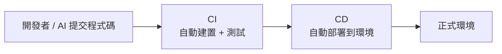
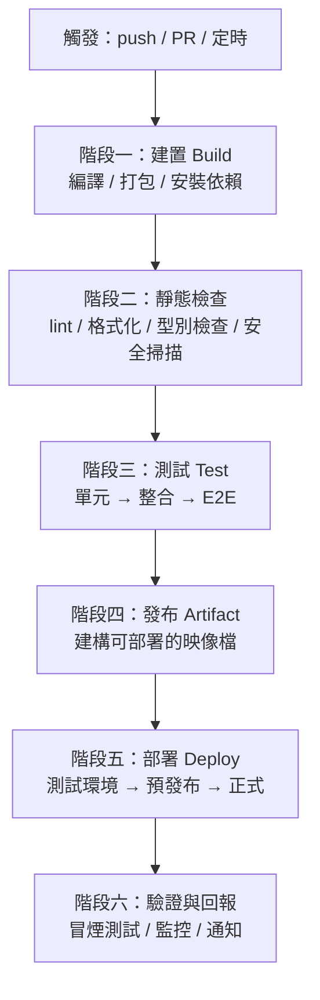

# 6.1 CI/CD 管線設計

## 從「手動部署」到「自動化管線」

過去交付軟體的典型場景是：開發者寫完程式碼 → 人工打包 → 人工跑測試 → 人工部署到伺服器 → 祈禱別出錯。這種「手工 + 焦慮」的做法，在軟體越來越複雜、釋出越來越頻繁的時代，完全無法支撐。

**CI/CD（Continuous Integration / Continuous Delivery / Continuous Deployment，持續整合／持續交付／持續部署）** 把這整個流程自動化成一條**管線（Pipeline）**，讓「交付」從「人工操作」變成「自動化流程」。



本節是 5.6 節「持續驗證」的延伸與落地——把它放入完整的交付自動化。

## 三件大事：CI、CD 與 DevOps

先釐清三個常被混用的詞：

- **CI（持續整合）**：頻繁地把所有人的程式碼**整合**到主線，並在每次整合時自動**建置（Build）**與**測試（Test）**。目的是及早發現整合衝突與錯誤。它正是 5.6 節「持續驗證」的執行場所。
- **CD（持續交付/部署）**：把「驗證通過的程式碼」自動部署到環境。**持續交付**是「準備好可部署、按下按鈕才部署」；**持續部署**是「測試通過後自動部署到正式環境」。兩者的差異在「要不要人手動按鈕」。
- **DevOps**：「Development」（開發）與「Operations」（維運）結合的文化與實踐——打破「開發只管寫、維運只管跑」的隔閡，讓同一批人負責從寫到跑的整個流程（6.2 節）。

## 一條典型 CI/CD 管線

一條完整管線，通常由「階段（Stage）」與「步驟（Step）」組成：



這個管線把「**每個設定品質關卡的階段**」串在一起：任何一個階段失敗，管線就停住並紅燈，阻止「有問題的程式碼」繼續往下流。

## 設計管線的關鍵原則

### 1. 快速回饋，關卡由快到慢

越前面的階段，應該越**快、越便宜**（建置、lint、單元測試），越能及早攔截低階問題；越後面的階段越**慢、越貴**（E2E、部屬到預發布），但越接近真實。失敗要「及早停」——避免把時間浪費在後面的昂貴階段。

### 2. 小而頻繁的合併與部署

呼應 Trunk-Based（4.3 節）與小步提交（4.4 節）：**頻繁、小批地**觸發管線，能及早發現衝突與迴歸，也能讓每次部署的變更範圍小、風險低、易回滾。

### 3. 環境一致：不可變的建置產物

建置出來的「產物（Artifact）」（如 Docker 映像）應該**不可變**——在同一個映像上測試、預發布、正式，確保「測的那個」就是「跑的那個」。這避免了「測試環境正常、正式環境壞掉」的環境差異問題。

### 4. 可重現、可回滾（Rollback）

管線要支援**回滾**：一旦新版本出問題，能迅速回到上一個可用版本。不可變映像 + 版本化的部署，是回滾的前提。

### 5. 品質護欄強制執行

把測試與檢查設成「**必過（Required）**」——不綠就不准合併、不准部署（5.6 節的紀律）。用系統強制，而不是靠人手動記得。

## 管線中的品質護欄「軍火庫」

管線裡可以放進各種「護欄」（也是 5 章、12.4 節反覆出現的主題）：

- **Lint / 格式化**：風格與常見錯誤（4.1 節）
- **型別檢查**：靜態型別錯誤
- **單元/整合/E2E 測試**：行為正確性
- **安全掃描**：依賴漏洞、密碼洩漏（13 章）
- **覆蓋率門檻**：低於標準就擋（小心誤用，5.2 節）
- **AI Reviewer**：自動審查 AI 改動（4.5 節）
- **LLM-as-a-Judge**：評估開放式/生成內容品質（5.5 節）

**設計哲學**：管線是「品質護欄的自動化執行場所」。你可以在這個「防線」上配置各種機器檢查，把「不合理與 AI 產生的錯誤」盡可能攔在正式環境之前。

## 工具與落地：GitHub Actions

實務上，管線由 CI 工具（如 GitHub Actions、GitLab CI、Jenkins 等）定義。GitHub Actions 在附錄 A.5 有完整教學，這裡先有個概念——它用一個 `workflow` 檔案描述「觸發條件 + 各階段 + 各步驟」：

```yaml
name: CI
on: [push, pull_request]
jobs:
  build-and-test:
    runs-on: ubuntu-latest
    steps:
      - uses: actions/checkout@v4
      - uses: actions/setup-node@v4
      - run: npm ci
      - run: npm run lint
      - run: npm test
      - run: npm run build
```

工具的具體語法各有不同，但**核心思想一致**：把「驗證與交付」描述成自動化、可重現、強制執行的步驟序列。

## AI 時代的 CI/CD

AI 讓程式碼產出速度暴增，也讓 CI/CD 的角色更加核心：

- **AI 的高速需要管線的「煞車」**：讓 AI 改動也走「小步提交 → CI 驗證 → 合併」的流程，用管線強制把關
- **管線本身可以被 AI 協助建構**：AI 能幫你撰寫、修復 workflow 設定、分析 CI 失敗原因
- **AI 生成內容也需要 CI 護欄**：對 AI 產生的變更加入更多驗證（測試、AI Reviewer、Judge）——正是 5.4/5.5 節的新護欄

一句話：**在「程式碼可以近乎無限快速產生」的時代，能否「可靠地、強制地驗證每一筆改動」，成了唯一的救生索——而這就是 CI/CD 的本質。**

## 本章小結

- **CI/CD** 把「建置、測試、部署」自動化成一條管線
- **CI**：頻繁整合 + 自動建置測試；**CD**：自動部署；**DevOps**：開發與維運結合的文化
- 典型階段：建置 → 靜態檢查 → 測試 → 發布 → 部署 → 驗證
- 設計原則：**快速回饋、小步頻繁、不可變產物、可回滾、強制護欄**
- 管線是「**品質護欄的自動化執行場所**」（可配置 lint/測試/AI Reviewer/Judge）
- AI 時代：管線是 AI 高速開發時代的**救生索**（煞車 + 驗證）

## 想一想

1. CI 與 CD 的差別是什麼？「持續交付」與「持續部署」差在哪？
2. 為什麼「建置產物要不可變」？「測的那個」與「跑的那個」不一致會出什麼問題？
3. 試著用 GitHub Actions（附錄 A.5）為一個小專案建立一條「lint + 測試」的管線，觀察它如何自動攔截錯誤。
