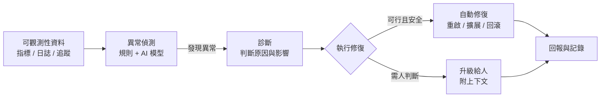

# 6.4 AI 驅動的異常偵測與自癒系統

## 從「人看著」到「系統自己反應」

傳統維運（6.3 節）靠的是：**人**看儀表板、**人**收到警報、**人**去調查、**人**去修復。這個模型有個瓶頸——**人的注意力有限、反應有延遲、深夜不一定在線**。

本節討論更先進的方向：**讓 AI 不只「看」，還能「自動偵測、自動反應、自動修復」**——即 **AI 驅動的異常偵測與自癒系統（Self-Healing）**。

## 異常偵測：從規則到 AI 模型

異常偵測回答「系統是不是不正常了」。它無外乎兩種方法：

### 1. 規則式偵測（Threshold-Based）

基於預先定義的規則：**「p99 延遲 > 1 秒 → 異常」**「錯誤率 > 5% → 異常」。簡單、可解釋、易於警報。

**侷限**：只能抓到「我們事先想到的」異常；真實世界的異常往往**非線性、時序化、難以用固定閾值描述**——例如「流量突然暴增但延遲正常」「某個時間點的規律性抖動」。

### 2. 學習式偵測（AI/ML-Based）

用 AI/ML 模型**學習「什麼是正常」**，再偵測「偏離正常」。常見方向：

- **無監督學習**：模型學出歷史資料的正常型態，偵測「統計上的異常點」（Anomaly Detection）
- **時間序列模型**：預測「接下來應該是多少」，實際值與預測值偏差過大即異常
- **日誌異常**：從日誌文字中學習「常見模式」，偵測「罕見的異常事件組合」

**AI 偵測的優勢**：能捕捉規則式**想不到**的異常模式、能處理高維度與非線性的訊號。**挑戰**：需要足夠的歷史資料、可能誤報（需要調校）、可解釋性較低（為什麼說異常）。

**務實做法**：**規則與 AI 混合**——用規則抓已知、用 AI 抓未知，兩者互補（呼應「監控 vs 可觀測性」的分工）。

## 自癒：自動反應的動作

偵測異常只是第一步，真正的價值在「**接著做對的事**」。自癒系統比喻著「人體」：生病了，免疫系統自己啟動修復，而不是等醫生。

常見的自癒動作（由操控的「自動化能力」執行）：

| 異常 | 自癒動作 |
|------|---------|
| 某服務實例掛掉 | 自動重啟 / 自動替換新實例（K8s 可做到） |
| 流量突增、資源不足 | 自動擴展（Scale Out）|
| 服務異常崩潰 | 自動回滾（Rollback）到上一個穩定版本 |
| 機器/容器異常 | 自動遷移 / 汰換 |
| 配置錯誤被偵測 | 自動恢復到已知良好的配置 |

這些動作之所以「能自動」，靠的是第 6.1、6.2 節的基礎：**有不可變的映像（可重啟/替換）、有可重現的 IaC（可重建/遷移）、有可回滾的部署（可退回前一版本）**。沒有這些自動化基礎，「自癒」就無從談起——**自癒是把「重啟/擴展/回滾」這類已被自動化的動作，加上「自動偵測觸發」的邏輯。**

## 自癒的危險：自動化的雙刃劍

自動化修復也有顯著風險，必須謹慎設計：

1. **誤診更糟**：如果 AI 誤判「正常為異常」（誤報），可能「把好的服務重啟」反而造成中斷
2. **修復本身有風險**：自動回滾到一個「看起來對但其實有 bug」的版本，可能重複出錯（回滾地獄）
3. **無限迴圈**：兩個互相觸發的「自動修復」可能互相打架，形成震盪
4. **需要「人知道」**：即使自動修復，也必須**記錄並通知人類**，不能「偷偷做了」卻無人知曉

## 關鍵設計：分級處理與人在迴路

為了控管自癒的風險，成熟系統採用**分級的自癒策略**與**人在迴路（Human in the Loop）**：

- **低風險動作**（如「重啟壞掉的唯讀快取」）：可完全自動，但**務必記錄與回報**
- **中風險動作**（如「自動擴展」「回滾到前一版」）：可自動但**需設限**（如一天最多幾次），並回報
- **高風險動作**（如「影響資料的修正」「大型遷移」）：**必須先升級給人**，由人確認後才執行

**核心原則**：**自動化修復應該「是可逆的、有上限的、且總是人可介入的」。** 把「衍生風險高的決策」保留給人，是可靠自癒設計的關鍵——這正是第 9 章要詳談的「Harness 約束與糾正」在維運領域的應用。

## 從偵測自癒到 AI Agent Ops

展望未來，AI 在維運中的角色會持續深化，形成「**AI Agent 負責維運工作**」的方向（這與第 8、9 章的 Agent/Harness 概念直接相連）：

- **AI 維運 Agent**：不只「偵測異常」，還能「調查原因（讀日誌、跑追蹤）、提出修復計畫、在授權範圍內執行修復」
- **受控的 Agent 動作**：如同 13 章的工具安全，AI 維運 Agent 對系統的「寫操作」（重啟、改配置、遷移）必須**受權限控制、可逆、有稽核**

這裡再次浮現全書的主軸：**AI 負責「看得快、猜得準、動得勤」，人類負責「定邊界、把關、負最終責任」。** 自癒系統再聰明，它的「修復動作」也該有一個人在迴路中掌握方向。

## 本章小結

- 從「人看人修」進化到「**AI 自動偵測與自癒**」
- **異常偵測**：規則式（抓已知）與學習式 AI（抓未知），兩者混合最佳
- **自癒動作**：重啟、擴展、回滾、遷移——依賴 6.1/6.2 節的自動化基礎
- **風險**：誤診更糟、修復本身有風險、無限迴圈；**務必記錄並通知人**
- **分級處理 + 人在迴路**：低風險可自動、高風險留給人
- 展望：**AI 維運 Agent** 深化自動化，但真操作須受控、可逆、有稽核
- 主軸重申：AI 負責「動」，人負責「定邊界與把關」

## 想一想

1. 「規則式」與「AI 學習式」異常偵測各有什麼優缺點？為什麼「混合」通常是好選擇？
2. 為什麼「自癒的修復動作」必須分級、並在特定風險上保留人在迴路？完全不設限的全自動會怎樣？
3. 如果你要設計一個「AI 維運 Agent」，你會給它哪些「可自動執行的動作」、哪些「必須人確認的動作」？
