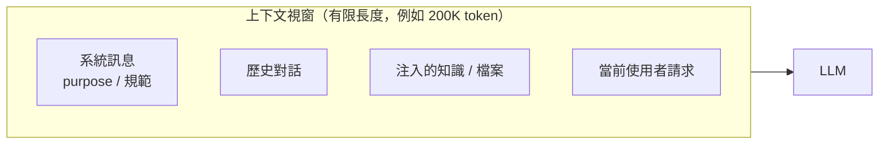

# 7.2 上下文工程：決定 AI 能力上限的關鍵

## Agent 的核心公式

要理解上下文工程，先記住本書第一個、也是最重要的公式：

> ## Agent = LLM + Context + Tools

一個 AI **Agent**（代理）之所以「能做任務」，不只是因為背後有一個強力的 **LLM**（模型），更因為它擁有兩樣關鍵資源：

- **Context（上下文）**：模型當下所看到的全部資訊
- **Tools（工具）**：模型可以呼叫並執行真實動作的能力（第 8 章）

本節聚焦三者的中間——**上下文（Context）**，以及管理它的工程方法：**上下文工程（Context Engineering）**。

## 什麼是上下文

**上下文（Context）** 就是「模型在產生輸出那一刻，所看到的全部資訊」。它通常以「訊息列表（Message List）」的方式呈現：系統訊息、使用者訊息、歷史對話、任何注入的資料。

為什麼上下文如此重要？因為**模型「只知道」它當下看到的東西**：

- 你能讓模型「精通你的領域」，唯一的方法是**把相關知識放進上下文**
- 你能讓模型「理解你的程式碼庫」，唯一的方法是**把程式碼放進上下文**
- 你無法讓模型「記得」它沒看到的東西

**一個關鍵比喻**：LLM 的參數像「天生的大腦」，而上下文像「此刻攤在桌上的資料」。大腦再好，如果桌上沒有相關資料，它也無法憑空知道你的專案秘密。**上下文決定「這一刻它能做到多好」。**

## 上下文是有限的：上下文視窗

上下文工程的第一個現實約束：模型的**上下文視窗（Context Window）**是**有限的**——一次只能看到固定長度的 token（token 是文字的計數單位，約接近一個「字/詞」的片段）。

這個「有限視窗」深刻地影響所有 Agent 設計（我們在 3.5 節就預告過）。它帶來兩個後果：

1. **你不能塞太多**：塞不下「整個專案」、「十年歷史」，必須「挑重點」放
2. **塞太多會「超過」**：超過視窗的內容會被截斷或忽略，甚至使模型表現大幅退化

## 能力上限由「上下文品質」決定

上下文工程的核心主張是：

> **決定一個 Agent 能力上限的，往往不是「模型多強」，而是「模型看到了什麼、怎麼看到的」。**

一個很強但「看不到關鍵檔案」的模型，會輸給一個普通但「上下文完美對齊」的模型。這解釋了為什麼「同樣用 GPT、有人用出天才、有人用出智障」——**差別常常在於會不會管理上下文**。

因此**上下文工程**可以定義為：**「決定『把什麼、以什麼形式、放多少、以什麼順序』放進上下文，以最大化模型輸出品質」的一門工程。**

## 上下文工程的三大難題

做好上下文工程，要先正視三大難題：

### 1. 相關性（Relevance）：放對的東西

**不是資料越多越好，而是「對的資料」越多越好。** 塞了一堆不相關的檔案，模型會被「噪音」干擾，反而忽略真正重要的資訊（第 3.5 節提過「塞太多不相關資訊，AI 會忽略細節」）。

**關鍵是「檢索」**：如何在幾千個檔案中，只挑出當前任務相關的那幾個？這需要檢索機制（RAG 的「檢索」部分，見 7.5 節）。

### 2. 聚焦（Focus）：讓關鍵資訊不被淹沒

就算放對了檔案，如果裡面攤了太多無關內容（一個大檔案的 90% 都與當前任務無關），關鍵資訊還是會被「淹沒」。這是「**針在稻草堆**」問題——上下文太大，模型就像在稻草堆裡找針，容易漏看。

### 3. 壓縮（Compression）：放得下嗎

即便選對、選少，仍可能超過視窗（例如讀了一段很長的文件）。需要**壓縮**——摘要、擷取關鍵段、分塊——讓「放得下」且「不失關鍵資訊」（7.4 節）。

## 上下文工程的關鍵原則

綜合前面，上下文工程有幾個反覆出現的關鍵原則：

1. **重質不重量**：相關且聚焦的上下文，勝過大量不相關的資料
2. **上下文是「我要模型看到什麼」的設計**：要主動「餵」，而非放任模型「亂翻」
3. **原則：提供與任務相關的 context，但不要太多**——要在「相關性」與「聚焦」間取得平衡
4. **上下文的組成會影響混合的比例**：系統訊息、歷史、知識的比例與順序都是設計變數

## 回到本書主軸

回顧第 3.5 節：「上下文限制讓模組化從建議變成必要」——因為上下文有限，我們必須把系統拆成小模組，讓 AI 處理每個任務時只面對剛好的資訊。這正是上下文工程在**軟體架構**上的落腳。

而附錄 B 的 OpenCode 等 Agent 工具，背後的核心工作，正是「不斷地為當前任務**建構出最適合的上下文**」——讀相關檔案、過濾、塞進模型。**一個 Coding Agent 的「上下文管理能力」，直接決定它程式寫得好不好。**

後四節都會在這個基礎上展開：**7.3（API 結構）、7.4（壓縮）、7.5（RAG 知識庫）**。

## 本章小結

- 核心公式：**Agent = LLM + Context + Tools**
- **上下文**＝模型當下所見的全部資訊；模型「只知道」當下看到的東西
- **上下文視窗有限**：塞太多會超過、塞太多噪音會干擾
- **上下文品質決定能力上限**：決定 Agent 的常常是「看到什麼」而非「模型多強」
- 三大難題：**相關性（放對）、聚焦（別淹沒）、壓縮（放得下）**
- 原則：**重質不重量、主動餵而非放任翻、相關與聚焦的平衡**

## 想一想

1. 為什麼「同樣的模型，有人用得好、有人用得差」？上下文工程如何解釋這種差異？
2. 「塞越多資料越好」的直覺錯在哪裡？「針在稻草堆」問題是什麼？
3. 如果你要讓一個 Coding Agent「寫一個函式」，你會把哪些資訊放進它的上下文？（試著具體列出）
