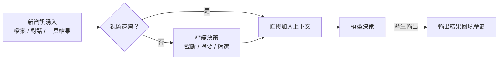

# 7.4 上下文壓縮與管理策略

## 為何非談壓縮不可

在 7.2、7.3 節我們看到：**上下文視窗是有限的，而對話歷史、讀入的檔案會不斷吃掉視窗。**

真實的 Agent 任務很容易撞上這個「牆」：
- 一個長對話的 Coding Agent，歷史累積成千上萬 token
- 讀入一個上千行的程式碼檔案，一下就占掉大片視窗
- 塞不下的話，關鍵資訊被截斷，模型表現崩潰

因此**上下文壓縮與管理（Context Compression & Management）**，是每個 Agent 系統都躲不開的實作課題。它的目標是：**在有限的視窗內，盡量保留「對當前決策最有價值」的資訊，丟棄或精簡「價值低」的資訊。**

## 經典的上下文管理策略

面對「視窗有限、資訊無限」，有幾種類型的策略，從粗到細：

### 1. 截斷（Truncation）：最簡單，最粗暴

保留最近的訊息，把最前面的舊訊息丟掉。因為「最近的內容」通常對當前決策最重要（系統訊息 + 最近的對話）。

```python
# 截斷：只保留最近的 N 條訊息（加上永遠保留的系統訊息）
ALLOWED = 20
history = messages[:1] + messages[-ALLOWED:]
```
**簡單但粗糙**：可能把「重要的舊資訊」也丟了。

### 2. 摘要（Summarization）：用「記憶的提煉」取代「原文」

用模型（或其他方法）把較舊的歷史「濃縮成摘要」。例如把前十輪對話摘要成一段，取代原文字。

```python
# 偽碼：把舊對話摘要，替換原始訊息
old = extract_old_messages(messages)          # 舊訊息
summary = llm.summarize(old, "把以下對話濃縮成重點") # 摘要
messages = [system, summary, *recent_messages] # 用摘要取代舊原文
```

**摘要的好處**是保留「語意的重點」，壞處是**可能失真**——摘要會掉細節（正是 2.4 節講的邊界條件、具體數字最容易丟）。因此「摘要取代原文」需要謹慎，關鍵資訊寧可保留原文。

### 3. 精選（Selection / Filtering）：只選高價值片段

在讀入大量資料前，**先判斷「哪些段落與當前任務相關」**，只把相關的片段放進上下文（呼應 7.2 節「相關性與聚焦」）。這是「進」的方向（決定放什麼），與「壓縮」（決定怎麼濃縮）互補。

### 4. 結構化整理（Structuring）：用更省空間的形式表達

把原本冗長的自然語言，整理成結構化、精簡的形式（如編號、表格、要點、schema）。同一個資訊，不同表達方式占的 token 數差別很大。

## 有些內容不能壓縮：保底的信念

壓縮策略要小心一件事——**不能為了省空間，把「單一真實來源」或「不可變更的規則」給壓縮掉。** 例如：

- **系統規則、安全約束**（例如「禁止存取金鑰檔」）不可被摘要弱化
- **使用者明確指定的需求**不可被「摘要」扭曲
- **關鍵的身份識別、合約、資料不變性**要保留

**原則**：**可以被壓縮的是「長而次要的參考資料」，不可以的是「必須嚴格遵守的規則與不可變的事實」。** 這就像「保險箱和貓」——厚厚的手冊可以濃縮，但「法定契約、密碼」這種「一錯即出事」的東西決不能含糊。這是 Agent 設計中「保底信念（Secure Baseline）」的概念（在第 9 章 Harness 會更深入）。

## 把「壓縮」放回 Agent 的大循環

壓縮不只是「事後的清理」，它嵌入在 Agent 的整個工作循環裡——每次讀檔、每多一輪對話，都要決定「留什麼、丟什麼、濃縮什麼」。



**實務提醒**：壓縮是「不得已而為之」，不是「多多益善」。過度壓縮同樣有害——它把有用資訊也壓掉了。**好的上下文管理，是「在視窗內維持恰到好處的資訊密度」，既放得下、又夠聚焦。**

## 呼應本書主軸

上下文壓縮與 3.5 節的架構建議環環相扣：

- 為什麼要**低耦合、模組化**？因為這樣每個任務的「相關上下文」才小、才好放、才好壓
- 為什麼要 **Spec/契約清晰**？因為這樣當 Agent 讀資料時，才能「精準判斷什麼相關、該留多少」

**換句話說：軟體架構設計得好，上下文管理就相對容易；架構亂，Agent 一讀就是一坨，壓縮也救不回。** 這是很多人忽略的、上下文工程與傳統軟體工程的深刻連結。

## 本章小結

- 視窗有限 → **上下文壓縮與管理**是每個 Agent 系統的必經課題
- 四大策略：**截斷**（保最近）、**摘要**（提煉語意）、**精選**（挑高價值）、**結構化**（省空間）
- **保底信念**：系統規則、安全約束、不可變事實**不可壓縮扭曲**
- 壓縮嵌入 Agent 工作循環，目標是「**恰到好處的資訊密度**」
- 與架構的關係：**架構好，上下文管理就容易；架構亂，壓縮也救不回**

## 想一想

1. 「摘要」與「截斷」各有什麼代價？什麼情況下摘要會「失真」造成跳漏？
2. 為什麼「系統規則、安全約束」不能為了省空間而壓縮？壓縮掉會發生什麼？
3. 你認為「視窗有限」如何反過來影響「系統該怎麼設計」？（連結 3.5 節）
