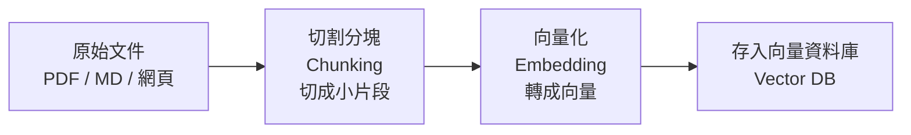
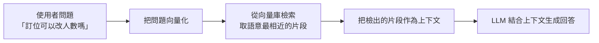

# 7.5 知識庫與 RAG：跨會話的記憶體系

## 上下文的局限：一次性的、會過期的

到目前為止，我們處理的都是「當下的上下文」——模型只看得到「這一次對話、我餵給它的那些訊息」。這帶來兩個根本局限：

1. **跨會話無記憶**：每次開新對話，模型都「忘了」上次聊過什麼（除非你重新把「記憶」放進上下文）
2. **知識靜止於模型參數**：模型的知識停留在訓練時間點，學不到「之後發生的事」（你公司的資料、最新的 API 文件）

**知識庫與 RAG** 就是為了解決這兩個問題——把「持久的、外部的知識」動態注入到每次對話的上下文裡。

## 什麼是知識庫

**知識庫（Knowledge Base / Knowledge Corpus）** 是一份「可以被檢索的外部資料集合」——例如：

- 技術文件、API 文件
- 公司的規章、產品說明
- 過往的問答紀錄
- 你的程式碼庫、Spec 文件
- 使用者手冊、FAQ

**關鍵**：知識庫是「**跨對話持久存在**」的——它不屬於某一次對話，而是「像一座資料庫，任何對話都可以去查」。

## 學習訊號與知識庫的區別

一個重要的區別，可以幫助理解知識庫的定位（也連結第 10 章）：

- **學習訊號（Learning Signal）** 是指「從經驗中得到的、會被用來改進的資訊」——例如使用者的回饋、任務成敗的記錄（10.5 節）
- **知識庫** 是把「既有的、可信的知識」整理成可供檢索的形式

簡單說：**知識庫是「查資料」，學習訊號是「記教訓」。** 兩者不同，但都可以「注入上下文」來幫助 Agent 做得更好。

## RAG 是什麼

**RAG（Retrieval-Augmented Generation，檢索增強生成）** 是「把知識庫的知識，動態檢索出來、注入上下文、輔助模型生成」的一套方法。

「Retrieval-Augmented（檢索增強）」的意思是：**用檢索結果「增強」模型的生成能力。** 模型本身不知道這些知識，但因為我們把它「檢索出來放進上下文」，模型就能「借用」它來回答。

RAG 的完整流程，包含「**寫入（Ingestion）**」與「**檢索（Retrieval）**」兩大階段：

### 階段一：寫入（Ingestion）——把知識變成可檢索的

- **切割分塊（Chunking）**：把長文件切成小片段（要切得「語意完整」又不「過大」，呼應 7.4 節的壓縮思維）
- **向量化（Embedding）**：把每個文字片段「轉成一個向量」（一組數字，代表它的語意）
- **向量資料庫（Vector DB）**：儲存這些向量與原文，支援「按語意相近度檢索」

**核心理念**：與其用「關鍵字」比對，不如用「**語意**」比對——「退貨政策」能匹配「可以退錢嗎」這種語意相近但文字不同的問題。

### 階段二：檢索 + 生成（Retrieve + Generate）——把相關知識放進上下文

**檢索的關鍵**：檢索品質（Retrieval Quality）決定 RAG 的上限。檢索得好 → 放進正確知識 → 回答準；檢索差 → 放錯知識 → 回答錯（或「寧可不放也不放錯」）。

## 為什麼 RAG 很關鍵

RAG 解決了「模型知識凍結」的根本問題，有幾個實際價值：

1. **知識即時更新**：資料庫更新，模型「立刻知道」——不需要重新訓練
2. **私有知識可用**：可以檢索「只有你們公司才有的資料」
3. **可追溯（Grounding）**：模型可以基於檢索到的「原始片段」回答，**降低幻覺**、也更容易追查「它憑什麼這樣說」（呼應 5.5 節的「忠實度/接地」）
4. **免重新訓練**：增減知識只需改知識庫，成本遠低於微調模型

**一句話**：RAG 讓 Agent「**在需要的時刻，查到需要的知識**」——它是 7.2 節「上下文品質決定能力上限」的具體實現。

## RAG 常被忽視的挑戰

RAG 不是「一把梭就成功」。實務痛點包括：

- **檢索到錯的片段**：檢索召回一大堆「像但錯」的內容，模型被誤導
- **語意模糊時的混亂**：相似的問題（「訂位時間」vs「營業時間」）可能檢回錯的知識
- **不可靠的資料源**：知識庫裡混入品質差的內容，會污染答案
- **如何保證「檢索不到就別亂答」**：這需要「接地（grounded）」的設計——模型只該基於檢索到的資料回答，資料不足就該承認

**關鍵心態**：RAG 的品質，**取決於「檢索品質」和「知識庫品質」這兩頭**，而不只是「模型多強」。好的 RAG，是「把對的知識、精準地送到模型面前」。

## RAG 與本章（7 章）的收束

把第 7 章串起來：我們從**提示工程**（1 節）出發，認識到模型能力受限於**上下文**（2 節），深入了上下文的**結構（訊息列表，3 節）**與**壓縮管理**（4 節），而 **RAG**（5 節）是「如何把「外部持久知識」動態變成好上下文」。它們共同回答了上下文工程的核心：**「如何讓模型，在對的時刻，看到對的、放得下的知識。」**

而「知識會變、需要檢索、要驗證是否命中」，正是第 10 章「評估與持續進化」的伏筆——一個 Agent 好不好，最終要用「有沒有把該查的知識查對、用對」來衡量。

## 本章小結

- **知識庫**是跨對話持久、可被檢索的外部資料集合
- **學習訊號**（記教訓）vs **知識庫**（查資料）概念不同
- **RAG**＝檢索＋增強生成：把知識庫的知識注入上下文
- 兩階段：**寫入**（切割、向量化、存向量庫）與**檢索＋生成**（語意檢索、注入、生成）
- 價值：**知識即時更新、私有知識可用、降低幻覺、免重新訓練**
- 挑戰：**檢索品質與知識庫品質**決定 RAG 上限（用語意比對，而非關鍵字）
- 收束全文：**讓模型在對的時刻看到對的、放得下的知識**

## 想一想

1. 知識庫與「對話的記憶」有什麼不同？RAG 如何解決「跨會話無記憶」的問題？
2. 為什麼 RAG「用語意比對」而不是「用關鍵字比對」？關鍵字比對的局限在哪？
3. 如果檢索到「錯誤或不相關」的資料，RAG 會發生什麼事？你該如何設計來防範？
