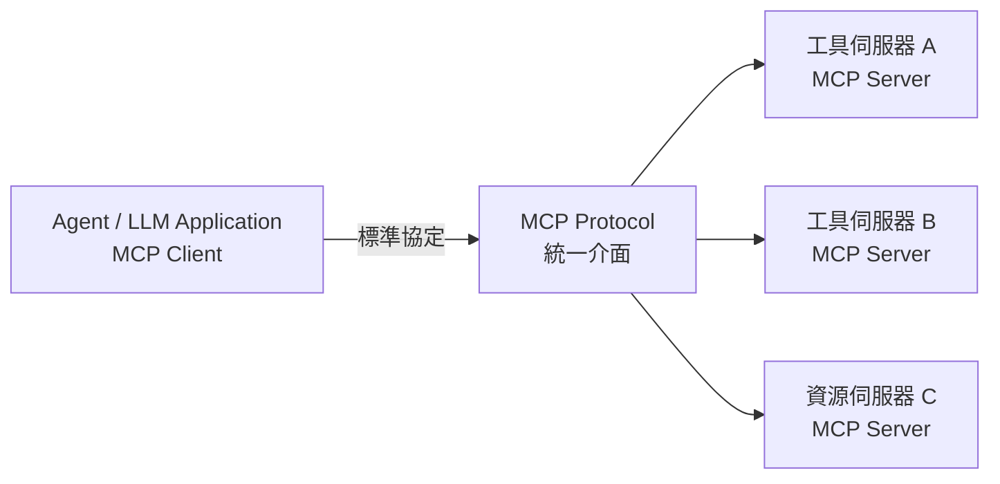

# 8.3 MCP 協定：工具互操作標準

## 工具多了之後的問題

前面兩節談了「單一工具」與「五類工具」，但還有一個務實問題沒解決：**工具的「介面」千變萬化。**

不同系統的工具，規範與呼叫方式各不相同：有的是 REST API、有的是 SDK、有的是本機命令列。當你想「讓一個 Agent 使用很多不同來源的工具」時，就得為每個來源寫不同的整合程式——**既重複又耦合**（呼應 3.1 節的低耦合 vs 高耦合）。

有沒有辦法「**標準化**」工具與 Agent 之間的通訊？這正是 **MCP** 要解決的。

## MCP 是什麼

**MCP（Model Context Protocol，模型上下文協定）** 是一個**開放標準**，定義了「LLM / Agent（Client）與外部工具（Server）」如何透過一個**統一、標準化的協定**來通訊。

把它理解成「AI 世界的 **USB 或印表機驅動**」：就像 USB 讓不同裝置「即插即用」，MCP 讓不同工具「即插即用」——**一個標準介面，對接各種工具**，Agent 不必為每種工具寫客製化整合。



MCP 由 Anthropic 於 2024 年底發起，隨後迅速成為 **AI 工具互操作的開放標準**（目前已被 OpenSeCode、Claude Code、Cursor 等廣泛支援）。

## MCP 的核心概念

MCP 的架構圍繞幾個核心角色與概念：

### Client 與 Server

- **MCP Client**：使用工具的應用程式（Agent、IDE、聊天介面）——例如 OpenCode、Claude Code
- **MCP Server**：提供工具/資源的一方——例如「訂位系統工具伺服器」「檔案系統伺服器」
- 一個 Client 可以連接**多個** Server，每個 Server 提供**多個**工具

### 三大能力類型（Primitives）

MCP 定義了三種主要的互動能力：

| 類型 | 說明 | 例子 |
|------|------|------|
| **Tools（工具）** | Agent 可呼叫並執行動作的「函式」（8.1、8.2 節） | `create_reservation` |
| **Resources（資源）** | 可被讀取的「資料/文件」，供 Agent 檢索（類比 RAG，7.5 節） | 說明文件、資料集 |
| **Prompts（提示）** | 可重用的「指令範本」，給 Agent 使用（類比提示工程，7.1 節） | 「總結這份報告」模板 |

這三者正好把本書 7、8 章的概念「黏在一個協定裡」——**工具（可執行）、資源（可讀取）、提示（可複用指令）**。

## 一個 MCP 工具定義的長相

MCP Server 提供工具時，會用結構化方式描述每個工具（可對照 8.1 節的 ACI 三面向——語意/結構/錯誤）：

```json
{
  "name": "create_reservation",
  "description": "為使用者建立餐廳訂位",
  "inputSchema": {
    "type": "object",
    "properties": {
      "restaurant_id": { "type": "string", "description": "餐廳 ID" },
      "party_size": { "type": "integer", "minimum": 1, "description": "人數" },
      "time": { "type": "string", "description": "訂位時間，格式 YYYY-MM-DD HH:MM" }
    },
    "required": ["restaurant_id", "party_size", "time"]
  }
}
```

這份結構化定義，正是 8.1 節「對 Agent 友善」的工具描述——MCP 把它變成了「標準格式」。

## MCP 的價值：解耦、互操作、生態

為什麼 MCP 很重要？它帶來的價值，正好對應軟體工程對「解耦」的追求：

1. **解耦（Decouple）**：Agent 與工具不再直接耦合，中間隔著標準協定。換工具、加工具都不用改 Agent 核心。
2. **互操作（Interoperability）**：同一套標準，讓不同廠商的工具可以被不同 Agent 使用——**生態共享**。
3. **關注分離（Separation of Concerns）**：工具提供者專注「做什麼工具」，Agent 製造者專注「怎麼用好」，兩者透過標準對接。
4. **豐富的生態**：MCP 快速催生了大量「現成的工具伺服器」（資料庫、雲端、瀏覽器、支付等），讓 Agent 開箱即用眾多能力（見附錄 B.5）。

**比喻再強化**：如同「印表機驅動程式」讓「任何軟體都能列印」、「USB」讓「任何裝置都能插拔」，MCP 讓「任何 Agent 能使用任何工具」——它是 Agent 時代的「標準插座」。

## 安全考量：MCP 與權限

MCP 讓工具「即插即用」，但也帶來安全上的重要性：**工具越多、越通用，越要謹慎控管 Agent 對它們的存取。**

- **權限的控制**（哪個 Agent 能用哪個 Server 的哪個工具）應由 Client／Harness 層管理（見附錄 B.4 的權限、13.2 節的工具安全）
- **「高風險工具」（外部動作類，8.2 節）**即使透過 MCP 提供，也要**結合人的確認與稽核**（見第 9 章 harness）
- MCP Server 自身也可能成為**注入或攻擊的入口**（13 章），要當成「不可信距離」的邊界來設計

**一句話**：MCP 解除了「整合的耦合之苦」，但**「權限與安全」仍要由使用者（平台）牢牢把持**，不可因「即插即用」而放鬆。

## 本章小結

- **MCP**（模型上下文協定）：Agent 與外部工具的**開放互操作標準**
- 概念：像「USB」——一個標準介面對接各種工具，Agent 不必為每種工具寫客製化整合
- 核心：**Client（用）與 Server（提供）**；三大能力類型 **Tools、Resources、Prompts**
- 工具以**結構化定義**描述（對應 8.1 節 ACI）
- 價值：**解耦、互操作、生態共享**
- 安全：**權限控制與安全邊界**仍由平台掌握，不因「即插即用」而放鬆

## 想一想

1. 為什麼「標準化」能解決「工具每種都要寫客製化整合」的痛苦？用 USB／印表機驅動的類比說明。
2. MCP 的 Resources（資源）與第 7 章 RAG 的知識庫，概念上有何相通？
3. 「即插即用」的工具生態，會帶來什麼安全新挑戰？權限該由誰把持？
