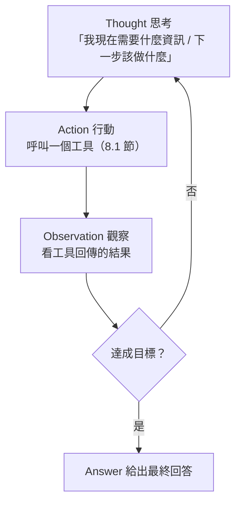

# 8.4 ReAct 迴圈：思考→行動→觀察

## 從「一次問答」到「迴圈執行」

前面章節的模型，本質上是「**一次問答**」：餵一個請求，得到一個回答。但一個**真正的 Agent** 不只是被動回答——它是**主動執行的迴圈**：反覆地「想 → 做 → 看結果 → 再想」。

這個「執行迴圈」的經典框架，就是 **ReAct**——**Re**asoning（思考）與 **Act**ing（行動）的結合。它來自一篇 2023 年的論文《ReAct: Synergizing Reasoning and Acting in Language Models》。

**ReAct 的核心**：讓模型在同一回合內，**交替地「推理」與「行動」**——先想「我現在該做什麼」，再行動（呼叫工具），觀察結果，再推理下一步。這讓模型的「思考」與「真實世界的反饋」交織，而不是閉門造車。

## ReAct 迴圈的三步

ReAct 迴圈的核心是**「思考 → 行動 → 觀察」**三步，不斷循環，直到達成目標：



### 1. Thought（思考）

模型用自然語言「思考」：**「我現在缺什麼資訊？下一步該做什麼？」** 這一步讓模型規劃，而不是莽撞行動。

### 2. Action（行動）

模型發出**呼叫工具的請求**：`create_reservation(...)`、`search_web(...)`。它不是直接給出最終答案，而是「動手做一件事」。

### 3. Observation（觀察）

工具執行後，把**結果回饋給模型**：`成功，訂位已建立，訂單編號 12345`。這個「反饋」回到上下文，成為下一步思考的依據。

**Loop（迴圈）**：重複「思考→行動→觀察」，直到資訊足夠、或任務達成，才給出最終 Answer。

## 一個具體的例子

以「幫我查一下這家餐廳明晚有沒有 4 人位」為例：

```
Thought: 我可以用餐廳搜尋工具找這家餐廳，再用訂位工具查餘位。
Action: search_restaurant(name="泰好吃")
Observation: 找到餐廳，ID=R100，評價 4.8。

Thought: 接下來查這家餐廳明晚的訂位餘量。
Action: check_availability(restaurant_id="R100", time="明晚 19:00", party_size=4)
Observation: 明晚 19:00 有 4 人位。

Thought: 有位置。我可以幫使用者建立訂位。
Action: create_reservation(restaurant_id="R100", party_size=4, time="明晚 19:00")
Observation: 成功，訂單編號 12345。

Answer: 已幫你訂好在「泰好吃」明晚 7 點的 4 人位，訂單編號 12345。
```

注意關鍵點：**每一步行動，都「吃掉」前一步觀察的結果，並據此規劃下一步**。模型不是一次給答案，而是「邊做邊調整」——這就是 Agent 與「單次問答」的區別。

## ReAct 的價值：可解釋、可除錯、可追蹤

為什麼 `思考→行動→觀察` 的結構如此重要？因為它把 Agent 的「行為過程」**攤開來了**：

- **可解釋（Explainable）**：每一步的思考與行動都留下了字面紀錄，人能看懂「它為什麼這樣做」
- **可除錯（Debuggable）**：出錯時，能回放整個迴圈，看是哪一步「想錯」或「工具回饋錯」
- **可追蹤（Traceable）**：這正是 6.3 節「Agent 的決策軌跡」，也是第 10 章「評估」的基礎

**一句話**：ReAct 的結構，讓「黑箱的 AI 決策」變成「可回放、可審查的軌跡」——這正是它能在軟體工程中（需要可靠與可問責）被看重的原因。

## Thought 與 Action 的配置：多想 vs 多動

設計 ReAct 迴圈時，有一個重要的取捨：**該「多想」還是「多動」？**

- **Think-Act（多想多想再動）**：某些 Agent **傾向多思考、少行動**——先把情境想清楚，再決定要不要動作。這在「行動成本高昂、或容易出錯」的場合更穩健。
- **Action-first（多動）**：某些 Agent **傾向盡快行動**、頻繁呼叫工具，再靠觀察修正。這在「行動便宜、能快速試錯」的場合更高效。

**沒有絕對的優劣**，而是**依任務與工具的特性來權衡**：
- 工具**貴**或**後果大**（外部動作類，8.2 節）→ 傾向**多想再動**
- 工具**便宜**、能**快速安全試錯**（如讀檔、搜尋）→ 可以**多動快試**

這可對應到框架選擇（後續 9.5 節的 Loop 工程）：迴圈的「思考/行動比例」本身，就是一個重要的設計參數。

## ReAct 與本書其他主軸

ReAct 迴圈不是孤立的，它跟很多概念互連：

- **與上下文（7 章）**：每一輪的「觀察」都會**回填進上下文**（7.4 節），讓後續思考看得到前面的結果。迴圈＝動態更新訊息列表（7.3 節）。
- **與工具（8.1-8.3）**：Action 呼叫的正是設計好的工具；工具品質決定行動成敗。
- **與 Harness（9 章）**：ReAct 迴圈是 Agent 的「內核」，而 **Harness 是包住這個迴圈、對其進行約束/驗證/糾正的外部框架**——下一章的主角。
- **與 Coding Agent（8.5 節）**：Coding Agent 正是 ReAct 迴圈在「寫程式任務」上的具體應用。

## 本章小結

- **ReAct**＝推理＋行動交織的執行迴圈
- 三步：**Thought（思考）→ Action（行動/呼叫工具）→ Observation（觀察結果）**，循環到目標達成
- 價值：**可解釋、可除錯、可追蹤**（決策軌跡）
- **思考/行動比例**是設計參數：工具貴/風險大→多想少動；工具便宜→可多動快試
- 互連：觀察回填上下文（7）、Action 用工具（8）、迴圈被 Harness 包裹（9）、Coding Agent 是其應用（8.5）

## 想一想

1. 用「思考→行動→觀察」描述一個你自己想像的 Agent 任務（例如：查詢並比較幾家飯店的價格）。
2. 為什麼「把思考與行動攤開」對軟體工程的「可問責」很重要？相比一次給答案的黑箱好在哪？
3. 當工具是「刪除資料庫紀錄」這種高後果動作時，你傾向「多想」還是「多動」？為什麼？
