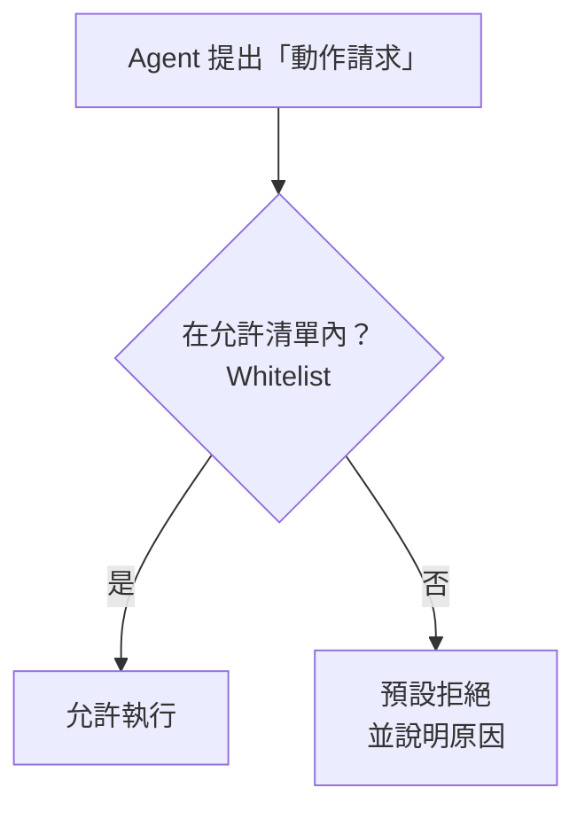

# 9.2 約束機制：故障安全預設值

## 約束：Harness 的「煞車」

9.1 節的五要素中，**Constrain（約束）** 是讓 Agent「**在軌道內行動**」的機制。沒有約束的 Agent，就像沒煞車的車——能力越強、越危險。

**約束（Constrain）** 的核心目的，是**限制模型在一個「預先定義的安全邊界」內行動**。它回答的問題是：「**這個 Agent 被允許做什麼？被禁止做什麼？**」

## 約束的第一原則：故障安全預設值

約束機制最重要的一條原則，叫做 **故障安全原則（Fail-Safe Defaults）**，或者更具體說——**「默認關閉」（Default-Deny / Zero Trust）**。

它的意思是：

> **所有能力預設為「關閉 / 禁止」，只有我們明確「開啟 / 允許」的，才可以用。**

這與我們的直覺相反。直覺可能是「先全開放、出問題再禁」，但這在 Agent 場景極度危險，因為 Agent 的行為是**非確定性**的——你可能預料不到它會用什麼方式越界。

**「默認關閉」的心智模型**，就像醫院的**「無菌手術室」**，或**「未獲授權拒絕通行」的門禁**：
- 沒有列在「允許清單」上的，一律**不允許**
- 「允許」是**白名單**，不是黑名單



**對比**：黑名單（Blocklist）需要「先知所有壞事才能堵」，永遠追不上；白名單（Allowlist）主動聲明「只有這些是我同意的」，自然安全。**Agent 場景務必用白名單思維。**

## 約束的具體面向

約束不是一句口號，它落實在幾個具體「面向」上：

### 1. 能力白名單（Capability Whitelist）

明確列出「這個 Agent 能使用哪些工具」。例如訂位客服只開放 `查詢餘位`、`建立訂位`、`取消訂位`，**不開放** `刪除餐廳`、`讀取所有使用者資料`。

這正是權限最小化（Least Privilege，8.2 節）——**只給完成任務所需的最少能力。**

### 2. 網域限制（Domain Restriction）

限制 Agent「能碰的範圍」：能訪問哪個資料庫、哪個目錄、哪些 API。例如 Coding Agent 只能寫 `src/` 下的檔案，不能碰 `.env` 或金鑰。

### 3. 步驟順序與時序約束（State / Ordering）

某些動作有前後關係或次數限制。例如「必須先建立訂位，才能付款」「每日取消次數最多 3 次」。這防止 Agent 跳步驟或濫用。

### 4. 執行時規則（Runtime Guards）

在執行階段加入的檢查：「這條指令要刪除整個資料夾，需確認」「這個動作涉及金額變動，需人批准」。這些是「動作層的煞車」。

## 約束的執行：Token 層級 vs 執行器層級

約束要在**兩個層級**同時作用，才能可靠：

### 1. 上下文層級（prompt/token 層級）

透過上下文（7 章）告訴模型「哪些不行」：系統訊息聲明規則、工具清單過濾掉不該有的工具。

```
system: 你只能使用提供的「訂位工具」。禁止嘗試讀取或修改系統檔案、禁止存取任何金鑰或憑證。
```

**局限**：這是「軟約束」——模型可能違背、也可能被注入繞過（13.1 節）。**不能只靠它。**

### 2. 執行器層級（Harness / 工具執行器層級）

在**實際執行動作的時刻**（Harness、權限系統）**強制檢查**——即使模型「意圖」越界，執行層直接**擋下**。

```python
# 例子：在工具執行器層強制白名單
ALLOWED_COMMANDS = {"ls", "cat", "pytest", "git status"}
def run_command(cmd):
    if cmd.split()[0] not in ALLOWED_COMMANDS:
        raise PermissionError(f"命令 {cmd[:30]}... 不在允許清單內")
    return os_system(cmd)
```

**關鍵**：**「軟約束」（勸導）＋「硬約束」（強制）雙管齊下**。真正的安全邊界，必須由**執行器層強制**，而**不能**只依賴模型「聽話」。

## 約束的「韌性」：可測、可審計

好的約束機制，要能被**評估與審計**：

- **可測試**：能否寫「約束有效性的測試」（例如「試著讓 Agent 越界，看它是否被擋」）？這關聯到 13 章的安全測試與 10 章的評估
- **可審計**：所有被「攔截」的越界嘗試，都要**記錄**（哪些 Agent、在何時、想動什麼），供事後檢視與改進

**一個重要的心態**：**約束的目的不是「找 Agent 的麻煩」，而是「讓 Agent 可以安全地犯『不致命』的錯」。** 好的約束，是「奢侈的失敗容忍」——讓 Agent 在安全範圍內自由試錯，而不必畏首畏尾。

## 約束不是「把模型變笨」

要澄清一個常見誤解：**約束 ≠ 削弱模型**。

- **過度約束**：如果把所有高價值工具都禁了、把步驟限制得死死，Agent 會「退化」成只會按腳本跑的機械——那它的「智慧」就沒意義了
- **恰當約束**：在「安全邊界」內，給模型**充分的自由度**去發揮推理與決策能力

**衡量標準**：約束應該「剛好擋住『不該發生的事』，同時讓『該做的事』暢通無阻」。這需要**權衡（Trade-off）**與**實驗調校**（第 10 章）。

## 本章小結

- **Constrain（約束）**：限制 Agent 在安全邊界內行動
- 第一原則：**默認關閉 / 白名單 / 最低權限**——未允許的即禁止
- 具體面向：**能力白名單、網域限制、步驟/時序、執行時規則**
- 雙層執行：**上下文（軟約束，勸導）＋ 執行器（硬約束，強制）**——安全必須由執行層強制
- 可測、可審計；約束是為了「容許可逆的犯錯」
- 約束 ≠ 削弱模型：要「擋住不該的，放行該做的」

## 想一想

1. 為什麼 Agent 場景要用「白名單」而不是「黑名單」？黑名單的失敗邏輯是什麼？
2. 「軟約束」與「硬約束」的差別？為什麼「安全邊界必須由執行器層強制」，不能只靠模型聽話？
3. 過度約束與恰當約束的界線在哪？你如何判斷「約束得太緊了」？
