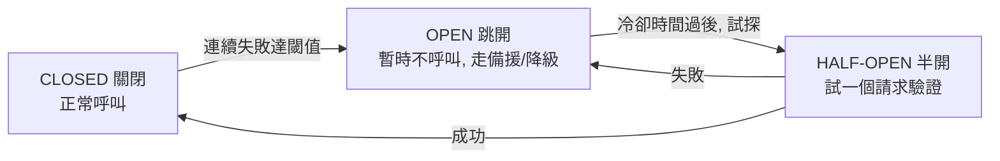
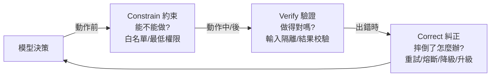

# 9.4 糾正機制：熔斷器與錯誤恢復

## 糾正：Harness 的「急救包」

`Constrain`（限制，9.2 節）與 `Verify`（驗證，9.3 節）能「擋住」很多問題，但**擋不住所有問題**——因為 Agent 是機率性的，它總會在某些時刻偏離、失敗、卡住。Harness 的最後一環，**Correct（糾正）** 就是「出了事之後怎麼辦」。

**糾正（Correct）** 處理的核心問題是：「**當 Agent 偏離軌道、執行失敗、或陷入困境時，系統如何恢復、如何重試、如何安全地中止？**」它讓 Agent「**摔倒了爬得起來**」。

## 錯誤分類：先搞清楚「壞在哪」

糾正的第一步，是**認識到錯誤有不同的種類**，而不同種類需要不同的應對。Agent 的失敗大致可分為：

| 錯誤類型 | 例子 | 能否重試 |
|---------|------|---------|
| 暫時性錯誤（Transient） | 網路逾時、伺服器暫時不可用、限流 | ✅ 重試通常有效 |
| 永久性錯誤（Permanent） | 參數非法、權限不足、規格不符 | ❌ 重試沒用，要改動作 |
| 模型邏輯錯誤 | 誤解指令、用錯工具、步驟錯 | ⚠ 需修正思考或換策略 |

**關鍵認知**：**能分辨「該重試」還是「該換做法」**，糾正才會有效。盲目重試「永久性錯誤」只會無限失敗；對「暫時性錯誤」直接放棄又太可惜。

## 幾種重要的糾正機制

### 1. 重試（Retry）與退避（Backoff）

對**暫時性錯誤**，直接重試，且通常配合**指數退避（Exponential Backoff）**——失敗後等一段時間再試，且等待時間逐步加倍，避免加重伺服器負擔。

```python
for attempt in range(MAX_RETRIES):
    try:
        return call_tool(...)
    except TransientError:
        time.sleep(2 ** attempt)   # 退避：2s, 4s, 8s...
```

過太多次仍失敗，就**放棄並回報**，而不是無限重試。

### 2. 熔斷器（Circuit Breaker）

**熔斷器**是保護「下游系統」與「Agent 自己」的機制——正如電路的保險絲（9.1 節的保險絲比喻）與熔斷器。當某個依賴連續失敗達到閾值，熔斷器「跳開」，**暫停對該依賴的呼叫**，讓系統降級或走備援，而不至於被拖垮。



**熔斷器的價值**：它防止「一個壞掉的下游」把整個 Agent 拖入不眠不休的失敗重試悲劇（對應 6.3 節分散式系統的故障隔離、6.4 節的自癒）。

### 3. 降級（Degradation）與備援（Fallback）

當主路徑失敗時，**「退而求其次」**的能力：例如主要模型掛了換備用模型、第一種工具失敗改用另一種作法、把「自動完成」降級成「請使用者提供更多資訊」。

### 4. 停止並請人介入（Stop & Escalate）

當 Agent 無法自行修正、或失敗的後果過重時，**及時停手、把情況升級給人**——這不是「失敗」，而是**負責任的設計**。它對應 8.2 節「溝通輸出類」與 13.2 節的權限設計：**讓「人在迴路」成為最後的安全網。**

## 糾正是「讓錯誤產生學習訊號」

糾正不只是「把眼前的坑爬出來」，更要有**學習與記錄**的意義（連結第 10 章）：

- **每一次糾正與失敗，都是寶貴的「學習訊號」**：這次為什麼錯、用了哪種策略救回、還能不能做得更好
- 好的 Harness 會**留存這些記錄**，供評估（第 10 章）與改進之用
- 反覆在同一個地方失敗，提示「該調整 Constrain、或該改進工具、或該加強評估」

**心態**：糾正機制不該只追求「別再犯」，而該把「錯誤」轉化為「可改進的資料」——這正是 Agent 系統「持續進化」的燃料（10.4、10.5 節）。

## 總結：Constrain → Verify → Correct 的安全鏈

把 Harness 的三大安全機制串成完整的「安全鏈」：



**它們不是三選一，而是三道防線缺一不可**：**先擋（Constrain）、後查（Verify）、最終救（Correct）**。一個完整的 Harness，靠這三道防線，把「不確定的模型」穩穩地控制在「可靠的軌道」上。

## 本章小結

- **Correct（糾正）**：Agent 出錯/卡住後的恢復機制（急救包）
- 先**分辨錯誤種類**：暫時性（可重試）、永久性（要換做法）、邏輯錯（要改思考）
- 常用機制：**重試＋退避、熔斷器、降級備援、停止升級給人**
- **熔斷器**：防止壞下游拖垮整個 Agent（對應故障隔離/自癒）
- **升級給人**是負責任的設計，不只是失敗
- 糾正留下**學習訊號**，供評估與持續進化（第 10 章）
- 三道防線：**Constrain → Verify → Correct**，缺一不可

## 想一想

1. 為什麼不能「無限重試」？「暫時性錯誤」與「永久性錯誤」的應對有何不同？
2. 「熔斷器」如何防止一個壞掉的下游把整個 Agent 拖垮？畫出它的狀態轉換。
3. 為什麼「停止並請人介入」是負責任的設計，而非失敗？高風險場景（如金流）為何必須如此？
